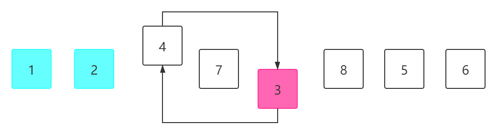
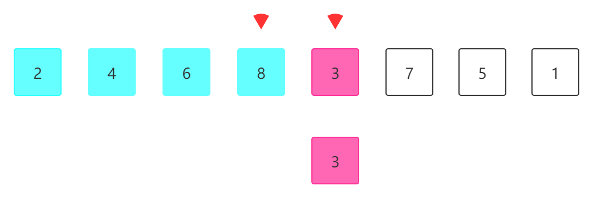
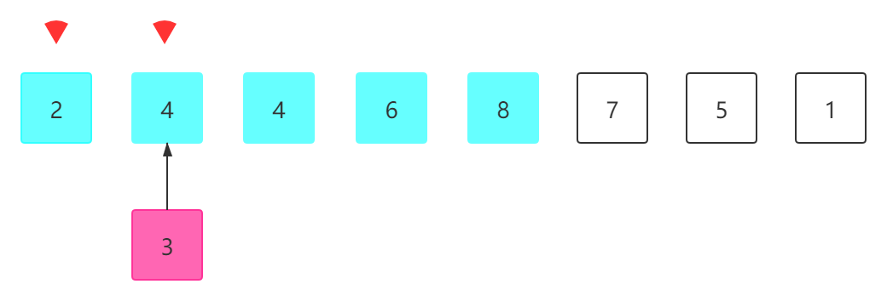

# 基本排序算法

## 01.选择排序



选择排序()，时间复杂度O(n^2)。

从序列中找到最小的元素放到第一个位置，然后找到剩余序列中最小的元素放入第二个位置，以此类推。

```java
public static int[] selectSort(int[] nums){
    //i < nums.length 最后一个元素不用遍历，它自然在正确的位置
    for (int i = 0; i < nums.length - 1; i++) {
        int minIndex = i;
        //j遍历剩余序列，将最小元素的下标赋值给minIndex
        for (int j = i + 1; j < nums.length; j++) {
            if(nums[j] < nums[minIndex])
                minIndex = j;
        }
        swap(nums, minIndex, i);
    }
    return nums;
}
//i,j表示要交换位置元素的下标
private static void swap(int[] nums, int i, int j){
    int tamp = nums[i];
    nums[i] = nums[j];
    nums[j] = tamp;
}
```

## 02.插入排序



插入排序，时间复杂度O(n^2).

我们使用下标选择现在要插入前面蓝色区域的顺序序列，从8元素开始依次比较前面的元素，当发现3比2大时，将3插入到2的后面。

具体做法：首先将3元素复制一份，将3和8对比，不符合，将8元素后移一位(8赋值给3)，3元素对比6，不符合，将6后移一位。依次操作：



当3和2对比完成，将3插入到2元素的后面。

```java
public static int[] insertSort(int[] nums){
    //i表示现在要向前插入的元素，j是顺序序列遍历下标
    int i,j;
    for (i = 1; i < nums.length; i++) {
        //tmp保存i下标的元素
        int tmp = nums[i];
        //j可以为-1
        for (j = i - 1; j >= 0; j--){
            if(nums[j] > tmp){
                nums[j + 1] = nums[j];
            }
            else if(nums[j] < tmp){
                break;
            }
        }
        nums[j+1] = tmp;
    }
    return nums;
}
```

注意边界问题，当i元素要插入到0这个位置时，j应该为-1.

插入排序在处理几乎接近顺序序列的时间复杂度上升到O(n).