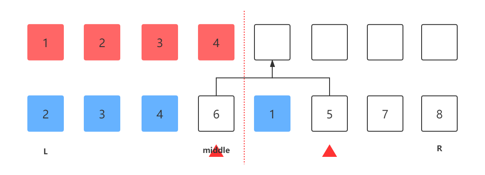
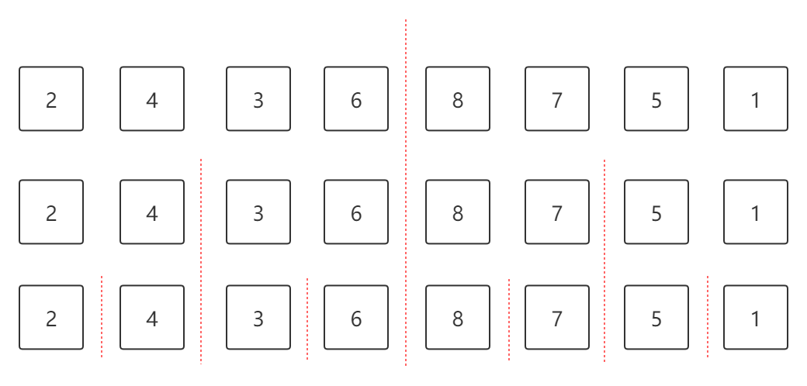
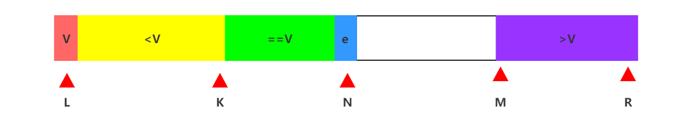

# 进阶排序算法

## 01.归并排序

### 1.1.归并操作

归并排序中有一个重要的操作叫做归并(merge)，先来看看归并算法：



归并算法是将一个序列分成两半，比如上图中``[L,middle]``和``[middle+1,R]``，同时左右两个序列本身满足顺序性，接下来将两个序列做归并操作，使得整个序列满足顺序性。

具体操作是，分别用两个下标指向两个序列的起始处，对所指向的元素做比较，较小的元素赋值到目标序列中，并使自己的下标向后移。依次执行该过程。


### 1.2.归并排序



归并排序(mergeSort)，依次将序列分成两半，直到每个序列只有一个元素，再逐层进行merge操作。

```java
public static int[] mergeSort(int[] nums){
    mergeSort(nums, 0, nums.length-1);
    return nums;
}
//对[i, j]序列进行归并排序
private static void mergeSort(int[] nums, int i, int j){
    if (i >= j)
        return;
    int middleIndex = (j - i)/2 + i;
    //将序列分成两半，每一侧分别归并排序后再merge排序一次
    mergeSort(nums, i, middleIndex);
    mergeSort(nums, middleIndex + 1, j);
    merge(nums, i, middleIndex, middleIndex + 1, j);
}
private static void merge(int[] nums, int i, int j, int n, int m){
    int[] tmp = new int[m - i + 1];
    int l = i;
    for (int k = 0; k < tmp.length; k++) {
        if(l>j){
            tmp[k] = nums[n];
            n++;continue;
        }
        if(n>m){
            tmp[k] = nums[l];
            l++;continue;
        }
        if(nums[l] < nums[n]){
            tmp[k] = nums[l];
            l++;
        }else if(nums[l] >= nums[n]){
            tmp[k] = nums[n];
            n++;
        }
    }
    for (int k = 0; k < tmp.length; k++, i++) {
        nums[i] = tmp[k];
    }
}
```


## 02.快速排序



三路快速排序算法，从序列中随机寻找一个元素并将它和第一个元素位置交换，接下来遍历剩余元素e，有三种可能，①小于v：将e元素与k+1元素交换，N和K向后移一位。②等于V：N向后移一位。③大于V：e和M-1元素交换，M向前移一位，N不变。

```java
public static int[] quickSort(int[] nums){
    quickSort(nums, 0, nums.length - 1);
    return nums;
}
//对[l, r]区间进行快排
private static void quickSort(int[] nums, int l, int r){
    if(l >= r)
        return;
    int k = l, n = l + 1, m = r + 1;
    while (n < m){
        if(nums[n] < nums[l]){
            swap(nums,k+1,n);
            k++;n++;continue;
        }
        if(nums[n] == nums[l]){
            n++;continue;
        }
        if(nums[n] > nums[l]){
            swap(nums, m-1, n);
            m--;continue;
        }
    }
    swap(nums, l, k);k--;
    quickSort(nums, l, k);
    quickSort(nums, m, r);
}
private static void swap(int[] nums, int i, int j){
    int tmp = nums[i];
    nums[i] = nums[j];
    nums[j] = tmp;
}
```

