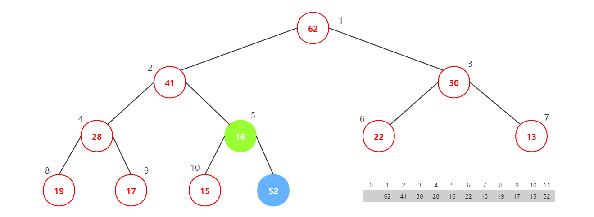

# 1.最大堆

## 01.最大堆的数据表示


#### 1.1.如上图：最大堆满足约束条件：

- 子节点比父节点小
- 最大(小)堆是完全二叉树

#### 1.2.最大堆的数据结构

使用数组表示(如果是二阶树，都可以考虑能不能使用数组表示)，下标的2倍是左节点，2倍加1是右节点。下标的计算机除2是父节点。

```java
public class MaxHeap {
    private int[] data;
    private int count;

    public MaxHeap(int capacity){
        this.data = new int[capacity + 1];
        count = 0;
    }

    public int size(){
        return this.data.length;
    }

    public boolean isEmpty(){
        return count == 0;
    }
}
```

#### 1.3.向最大堆插入元素



逻辑如下：

在数组最后插入一个元素，然后和父元素比较，如果比父元素大，就交换父元素和当前元素，依次执行该操作。

```java
public class MaxHeap {
    private int[] data;
    private int count;

    public MaxHeap(int capacity){
        this.data = new int[capacity + 1];
        count = 0;
    }

    public int size(){
        return this.data.length;
    }

    public boolean isEmpty(){
        return count == 0;
    }

    //插入元素并shiftUp
    public void insert(int item){
        this.data[count + 1] = item;
        count++;
        shiftUp(count);
    }

    private void shiftUp(int index){
        if(index == 1)
            return;
        if(this.data[index] < this.data[index/2])
            return;

        swap(index, index/2);
        shiftUp(index/2);
    }

    private void swap(int i, int j){
        int tmp = this.data[i];
        this.data[i] = this.data[j];
        this.data[j] = tmp;
    }
}
```

#### 1.4.从最大堆中取出最值元素


去除最值元素如上图。

接下来为了树继续满足最大堆的性质，我们将最后一个元素放入第一下标的位置，并执行shiftDown操作，如下图：


shiftDown操作结束后如下图：


```java
public class MaxHeap {
    private int[] data;
    private int count;

    public MaxHeap(int capacity){
        this.data = new int[capacity + 1];
        count = 0;
    }

    public int size(){
        return this.data.length;
    }

    public boolean isEmpty(){
        return count == 0;
    }

    public void insert(int item){
        this.data[count + 1] = item;
        count++;
        shiftUp(count);
    }

    //取出元素
    public int extractMax(){
        assert count > 0;
        int ret = this.data[1];
        swap(1, count);
        count--;
        shiftDown(1);
        return ret;
    }

    private void shiftUp(int index){
        if(index == 1)
            return;
        if(this.data[index] < this.data[index/2])
            return;

        swap(index, index/2);
        shiftUp(index/2);
    }

    private void shiftDown(int index){
        if(index*2 > this.count)
            return;
        if(index*2 == this.count) {
            if (this.data[index] < this.data[index * 2])
                swap(index, index * 2);
            return;
        }
        int maxChildIndex = index*2;
        if(this.data[maxChildIndex] < this.data[maxChildIndex + 1])
            maxChildIndex += 1;
        if(this.data[index] > this.data[maxChildIndex])
            return;

        swap(index, maxChildIndex);
        shiftDown(maxChildIndex);
    }

    private void swap(int i, int j){
        int tmp = this.data[i];
        this.data[i] = this.data[j];
        this.data[j] = tmp;
    }
}
```

#### 1.5.更快的构建堆


heapify的算法思路，将一个无序数组，从最后一个元素到第一个元素做遍历，每次遍历中将对应元素的父元素做shiftDown操作。