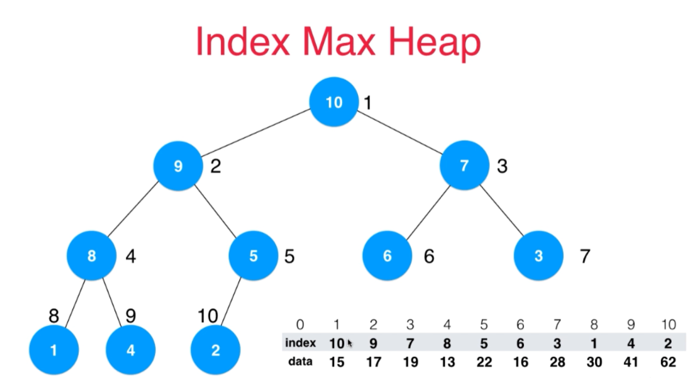

# 索引堆

在构建堆这个数据结构时，需要交换元素的位置。

- 1.如果交换元素位置本身成本很高，就可以使用索引堆来实现。

- 2.加入索引后，元素本身的位置不变，则元素本身的下标可以赋予其他意义。

## 1.索引堆的逻辑



上图便是索引堆的实现逻辑。上图一个加了索引的最大堆。

关注右下角，该数据结构由两个数组组成。分别是index数组和data数组。data数组自始至终没有改变，改变的是index数组。下标0~10对应不同的数组有不同的涵义。

- 1.对index数组，下标是最大堆的索引下标。1表示顶元素，在最大堆中表示最大的元素。s
- 2.对data数组，我们可以给下标赋予其他意义。比如进程号。

## 2.索引最大堆数据插入

逻辑和索引堆一致，图解说明看[最大(小)堆数据结构算法]()。

```java
package com.amos;

public class IndexMaxHeap {
    private int[] data;
    private int[] indexes;
    private int count;

    public IndexMaxHeap(int capacity){
        this.data = new int[capacity + 1];
        this.indexes = new int[capacity + 1];
        count = 0;
    }
    
    public void insert(int item){
        this.data[count + 1] = item;
        this.indexes[count + 1] = count + 1;
        count++;
        shiftUp(count);
    }

    private void shiftUp(int index){
        if(index == 1)
            return;
        if(this.data[indexes[index]] < this.data[indexes[index/2]])
            return;

        swap(index, index/2);
        shiftUp(index/2);
    }

    private void swap(int i, int j){
        int tmp = this.indexes[i];
        this.indexes[i] = this.indexes[j];
        this.indexes[j] = tmp;
    }
}
```

## 3.从索引最大堆中取出最大元素

```java
package com.amos;

public class IndexMaxHeap {
    private int[] data;
    private int[] indexes;
    private int count;

    public IndexMaxHeap(int capacity){
        this.data = new int[capacity + 1];
        this.indexes = new int[capacity + 1];
        count = 0;
    }

    public int size(){
        return this.data.length;
    }

    public boolean isEmpty(){
        return count == 0;
    }

    public void insert(int item){
        this.data[count + 1] = item;
        this.indexes[count + 1] = count + 1;
        count++;
        shiftUp(count);
    }

    //数据不需要擦除，count--后，原来被extract的indexes下标已经被排除在外了
    public int extractMax(){
        assert count > 0;
        int ret = this.data[this.indexes[1]];
        swap(1, count);
        count--;
        shiftDown(1);
        return ret;
    }

    private void shiftUp(int index){
        if(index == 1)
            return;
        if(this.data[indexes[index]] < this.data[indexes[index/2]])
            return;

        swap(index, index/2);
        shiftUp(index/2);
    }

    private void shiftDown(int index){
        if(index*2 > this.count)
            return;
        if(index*2 == this.count) {
            if (this.data[indexes[index]] < this.data[indexes[index * 2]])
                swap(index, index * 2);
            return;
        }
        int maxChildIndex = index*2;
        if(this.data[indexes[maxChildIndex]] < this.data[indexes[maxChildIndex + 1]])
            maxChildIndex += 1;
        if(this.data[indexes[index]] > this.data[indexes[maxChildIndex]])
            return;

        swap(index, maxChildIndex);
        shiftDown(maxChildIndex);
    }

    private void swap(int i, int j){
        int tmp = this.indexes[i];
        this.indexes[i] = this.indexes[j];
        this.indexes[j] = tmp;
    }
}

```

## 4.既要extract数据又要再insert数据

```java
package com.amos;

public class IndexMaxHeap {
    private int[] data;
    private int[] indexes;
    private int count;

    public IndexMaxHeap(int capacity){
        this.data = new int[capacity + 1];
        this.indexes = new int[capacity + 1];
        count = 0;
    }

    public int size(){
        return this.data.length;
    }

    public boolean isEmpty(){
        return count == 0;
    }

    //唯一更改的代码
    public void insert(int item){
        //当数据被extract后再插入数据需要特别处理
        if(this.indexes[count + 1]== 0) {
            this.data[count + 1] = item;
            this.indexes[count + 1] = count + 1;
        }
        else {
            this.data[indexes[count + 1]] = item;
        }
        count++;
        shiftUp(count);
    }

    public int extractMax(){
        assert count > 0;
        int ret = this.data[this.indexes[1]];
        swap(1, count);
        count--;
        shiftDown(1);
        return ret;
    }

    private void shiftUp(int index){
        if(index == 1)
            return;
        if(this.data[indexes[index]] < this.data[indexes[index/2]])
            return;

        swap(index, index/2);
        shiftUp(index/2);
    }

    private void shiftDown(int index){
        if(index*2 > this.count)
            return;
        if(index*2 == this.count) {
            if (this.data[indexes[index]] < this.data[indexes[index * 2]])
                swap(index, index * 2);
            return;
        }
        int maxChildIndex = index*2;
        if(this.data[indexes[maxChildIndex]] < this.data[indexes[maxChildIndex + 1]])
            maxChildIndex += 1;
        if(this.data[indexes[index]] > this.data[indexes[maxChildIndex]])
            return;

        swap(index, maxChildIndex);
        shiftDown(maxChildIndex);
    }

    private void swap(int i, int j){
        int tmp = this.indexes[i];
        this.indexes[i] = this.indexes[j];
        this.indexes[j] = tmp;
    }
}

```

