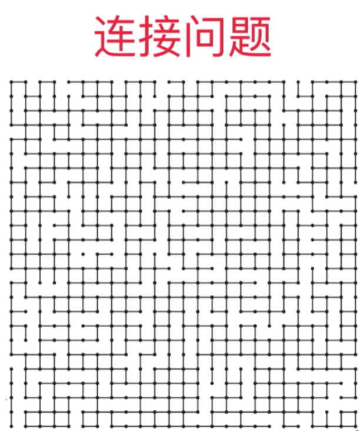
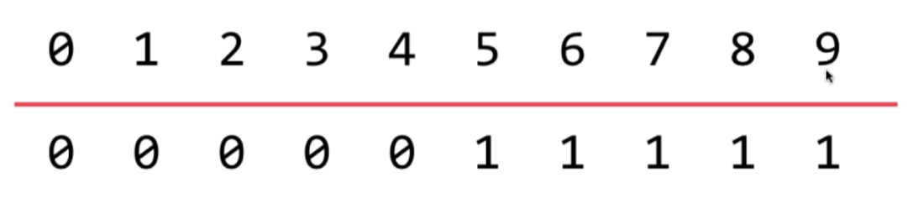
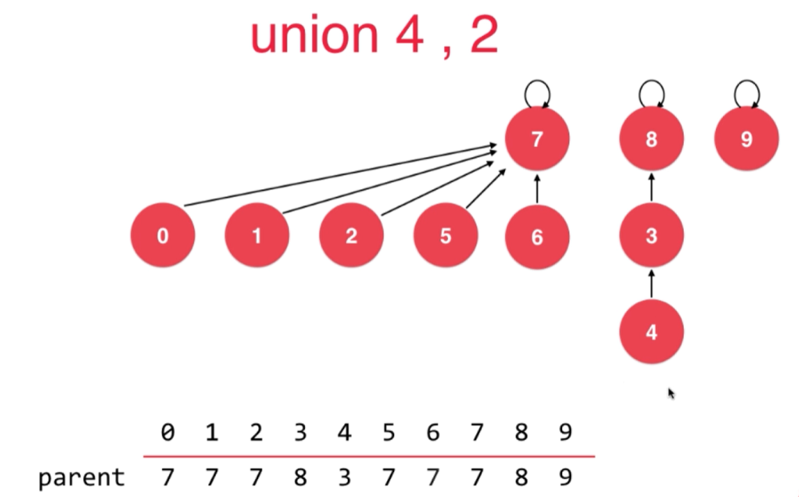
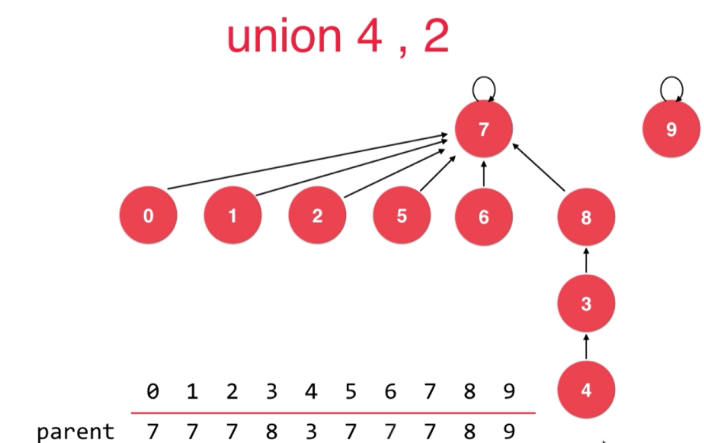

# 并查集

## 1.并查集数据结构

#### 1.1.并查集是一种高效解决链接问题的数据结构。

经典应用

- 1.在图中检查是否形成一个环z



#### 1.2.并查集对一组数据最基本的操作：

- 1.union(p, q) 将p和q所在的组链接起来
- 2.find(p)         查找p在哪一组

它可以回答两个元素是否是相连的：

- isConnected(p, q)


#### 1.3.数据结构

数据结构可以使用一个数组表示，如下：



- 1.下标0~9表示data数据的下标

- 2.值0和1表示组，上图说明0~4是相互链接的，5~9是相互链接的


#### 1.4.代码实现

```java
package com.amos;

public class UnionFind {
    private int[] id;
    private int count;

    public UnionFind(int n){
        this.id = new int[n];
        this.count = n;
        for (int i = 0; i <n ; i++){
            this.id[i] = i;
        }
    }

    private int find(int id){
        return this.id[id];
    }

    public boolean isConnected(int p, int q){
        return find(p) == find(q);
    }

    public void unionElements(int p, int q){
        int pId = find(p);
        int qId = find(q);

        if(pId == qId)
            return;

        for (int i = 0; i < count; i++) {
            if(pId == this.id[i])
                this.id[i] = qId;
        }
    }
}
```


## 2.基于rank优化并查集数据结构

#### 2.1.优化并查集数据结构

上面的版本在实现并查集时，数组的值表示该元素属于哪一个类。每次union时，如果对一个n长数组执行n次union，时间复杂度就是O(n^2).

现在换一种数据结构，同样是一个数组：



- 1.下标index同样指第几个元素
- 2.值表示自己的父元素，不再是组的分类(如上图)
  - a. 0，1，2，5，6的值都是7表示7是自己的父元素
  - b.4的父元素是3，3的父元素是8
  - c. 根元素7，8，9的父元素是自己

**此时链接的定义如下：**

- 拥有相同根元素的数据是相互连接的。


#### 2.2.连接操作的rank优化

如果我们要把两个元素连接在一起，应该让树的层级低的根连接到层级高的根。比如上图：

- a. union(4，2)操作
- b. 7根的树高是2，8根的树高是3(尽管7的元素多)
- c. 我们应该将7根接入到8下，不能反过来 如下



#### 2.3.rank优化的并查集代码

```java
public class UnionFind4 {

    private int[] rank;   // rank[i]表示以i为根的集合所表示的树的层数
    private int[] parent; // parent[i]表示第i个元素所指向的父节点
    private int count;    // 数据个数

    // 构造函数
    public UnionFind4(int count){
        rank = new int[count];
        parent = new int[count];
        this.count = count;
        // 初始化, 每一个parent[i]指向自己, 表示每一个元素自己自成一个集合
        for( int i = 0 ; i < count ; i ++ ){
            parent[i] = i;
            rank[i] = 1;
        }
    }

    // 查找过程, 查找元素p所对应的集合编号
    // O(h)复杂度, h为树的高度
    private int find(int p){
        assert( p >= 0 && p < count );
        // 不断去查询自己的父亲节点, 直到到达根节点
        // 根节点的特点: parent[p] == p
        while( p != parent[p] )
            p = parent[p];
        return p;
    }

    // 查看元素p和元素q是否所属一个集合
    // O(h)复杂度, h为树的高度
    public boolean isConnected( int p , int q ){
        return find(p) == find(q);
    }

    // 合并元素p和元素q所属的集合
    // O(h)复杂度, h为树的高度
    public void unionElements(int p, int q){

        int pRoot = find(p);
        int qRoot = find(q);

        if( pRoot == qRoot )
            return;

        // 根据两个元素所在树的元素个数不同判断合并方向
        // 将元素个数少的集合合并到元素个数多的集合上
        if( rank[pRoot] < rank[qRoot] ){
            parent[pRoot] = qRoot;
        }
        else if( rank[qRoot] < rank[pRoot]){
            parent[qRoot] = pRoot;
        }
        else{ // rank[pRoot] == rank[qRoot]
            parent[pRoot] = qRoot;
            rank[qRoot] += 1;   // 此时, 我维护rank的值
        }
    }
}
```

