# 最小生成树

## 1.图的表示

### 1.1.邻接矩阵

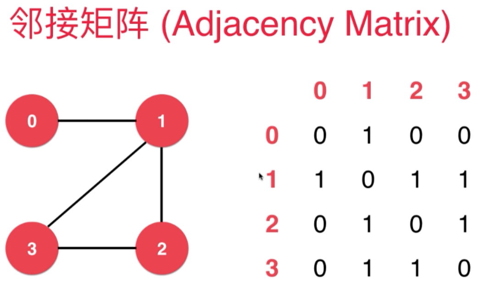

- 1.邻接矩阵是用一个二维数组表示
- 2.适合稠密图
- 3.劣势
  - 3.1.如果边比较少，则矩阵中有大量空间被浪费

### 1.2.邻接表

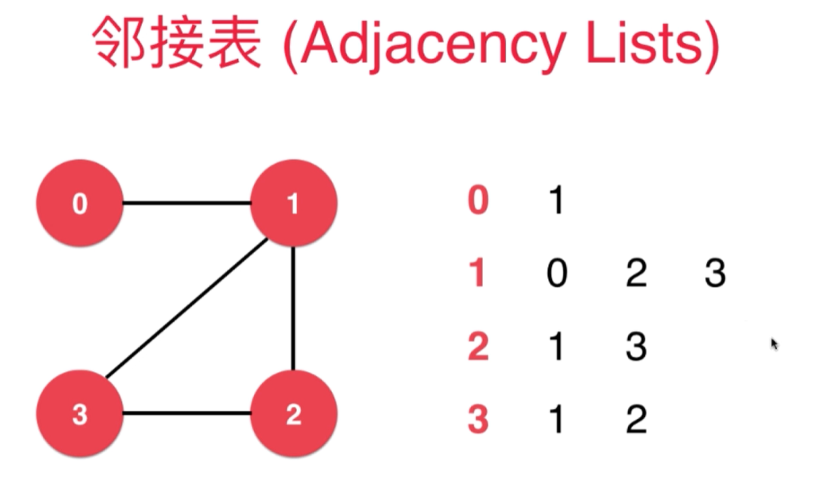

- 1.邻接表可以使用多个数组表示，如上图
- 2.适合稀疏图

### 1.3.有权图的表示

使用邻接表和邻接矩阵表示有全图的方法如下：

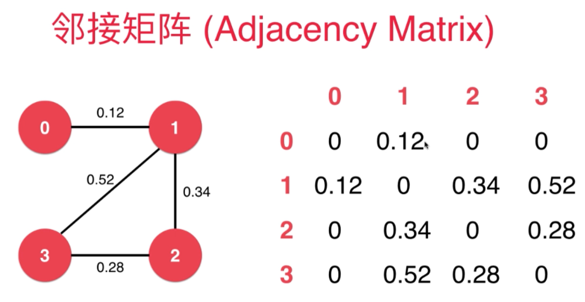

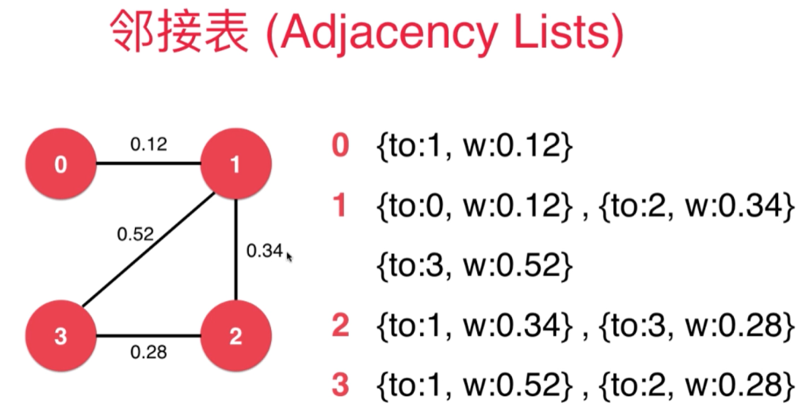

- 对于边 我们一般会设计一个类Edge表示。邻接矩阵中没有边的地方存储null。

## 2.最小生成树

### 2.1.最小生成树介绍

最小生成树的对象通常是默无向认连通图 如下：

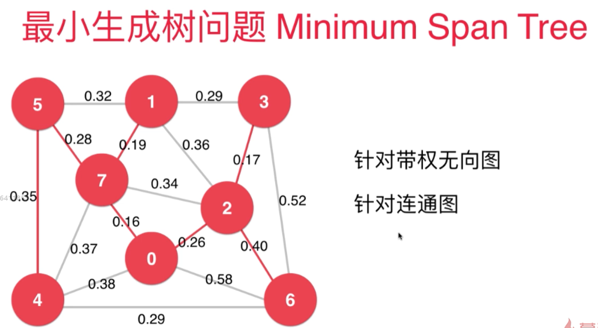

我们的目的

- 1.寻找v-1条边
- 2.连接v个顶点
- 3.总权值最小

### 2.2.最小生成树算法重点------切分定理

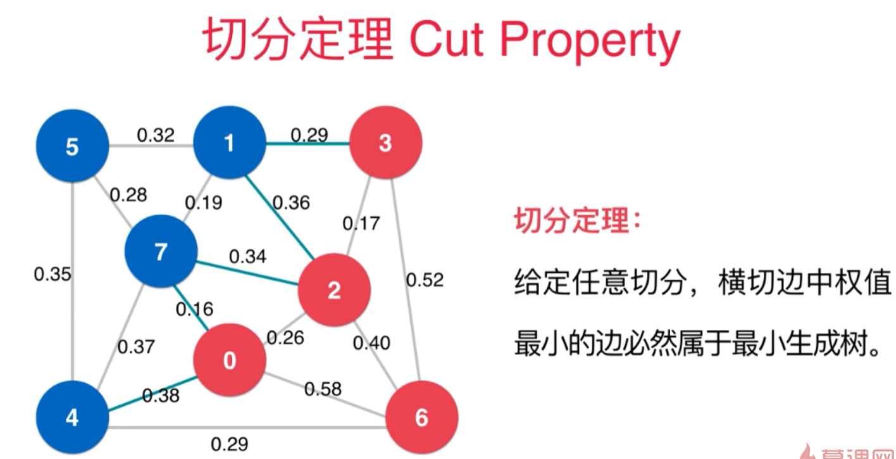

### 2.3.使用举例的方法介绍Prim最小生成树的算法

a.首先有如下图的节点和边

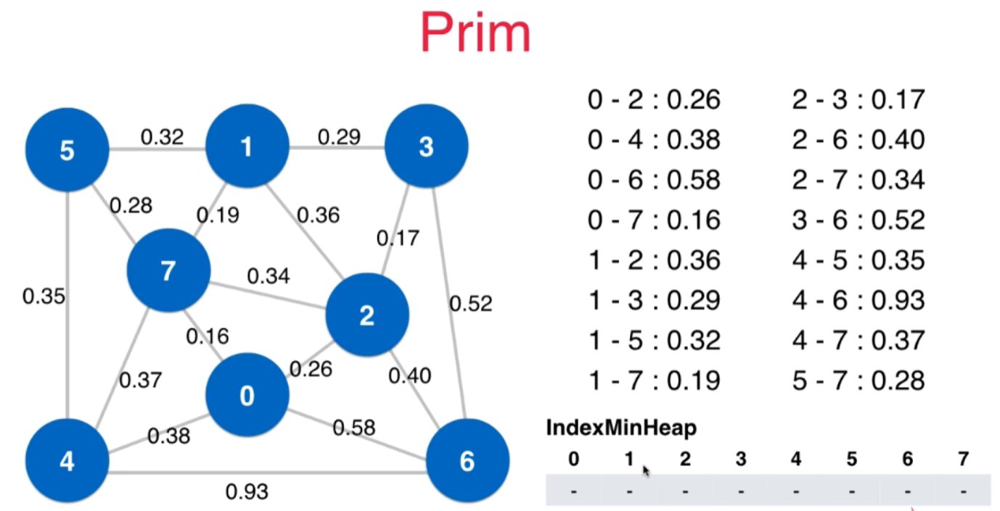

- a.1.左图是节点和边权重的可视化表示

- a.2.右上角是所有节点到节点的权重值
- a.3.右下角是一个索引最小堆(结合切分定理，找到最终最小生成树)

b.使用切分定理，第一次将数据切分成红色和蓝色两个部分，如下图

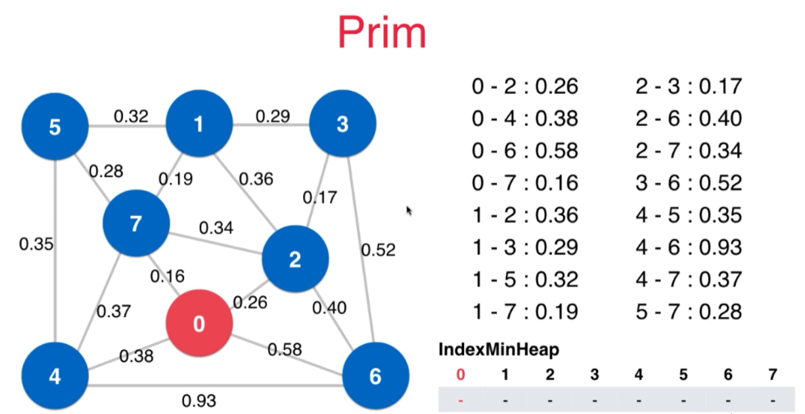

图切分成两个部分后，我们将红色和蓝色部分的 横切边(遍历元素0得到的边)放入右下角的indexMinHeap中。如下图：

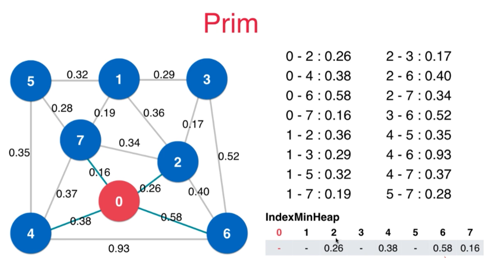

- 我们找到了连接2，4，6，7节点的边，将他们放入最小堆中，如上图

c.取出第一条最小横切边，作为最小生成树的一部分：

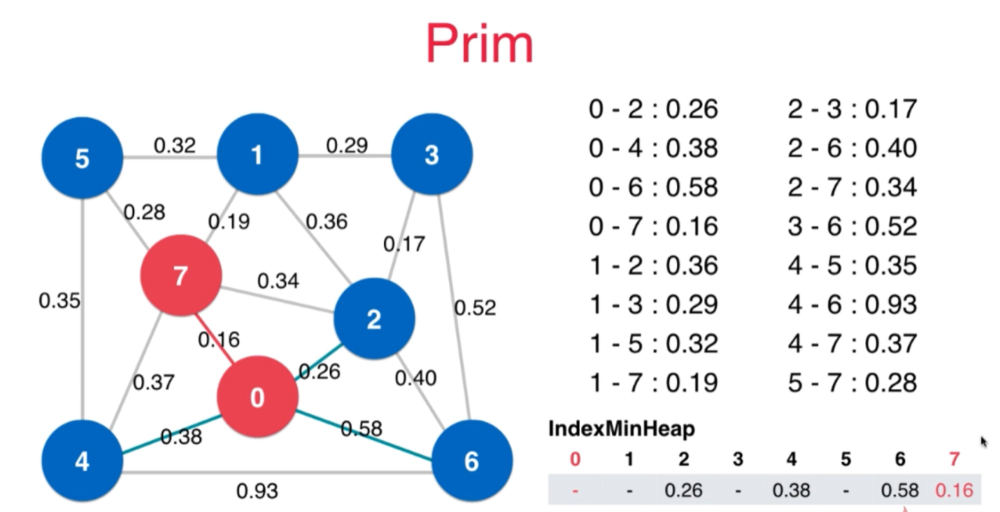

d.更新现在的横切边(遍历元素7的边)：

- d.1.观察节点1，发现它的横切边是空的，我们就直接加入
  - 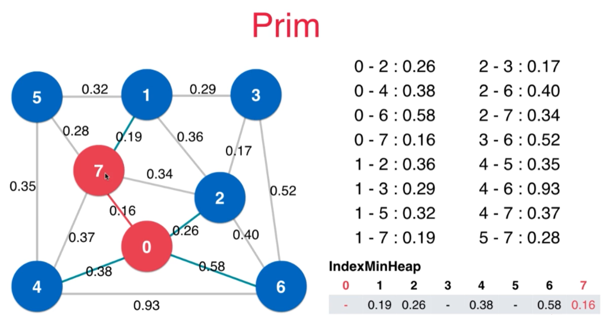

- d.2.观察节点2，发现它的新横切边比现有横切边权值大，所以它不可能是最小生成树的边之一，我们不管，直接忽略
  - 

- d.3.观察节点4，发现它新的横切边是0.37比现有的最小堆中的0.38要小，所以我们更新最小堆中的数据
  - 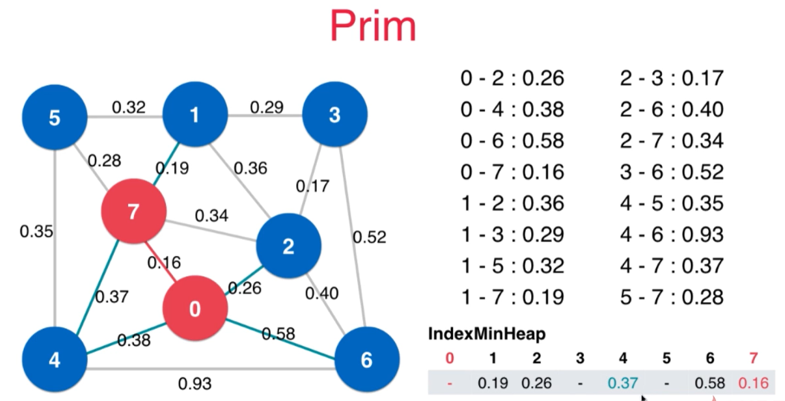

- d.4.按照上面的逻辑将所有的新横切边加入最小堆中
  - 

e.找出第二条最小横切边

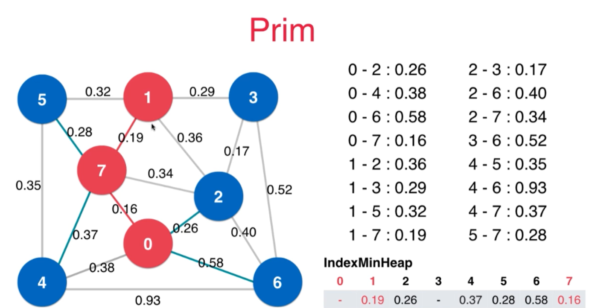

f.遍历元素1的边，并更新现有横切边

g.持续上述算法知道找到最终最小生成树

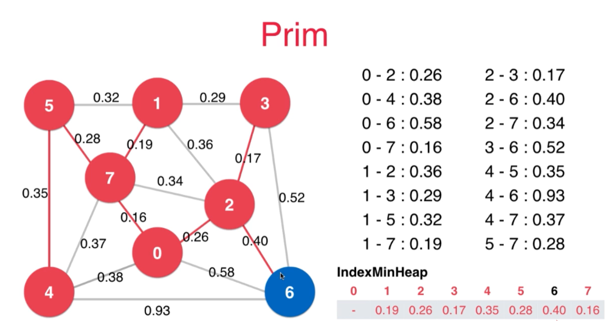

到此prim算法结束

- 1.使用索引堆，是因为我们需要更改索引堆中的元素(用较小的横切边替换原来较大的横切边)
- 2.prim算法时间复杂度O(ElogV)   
  - E是边的个数，V是节点的个数