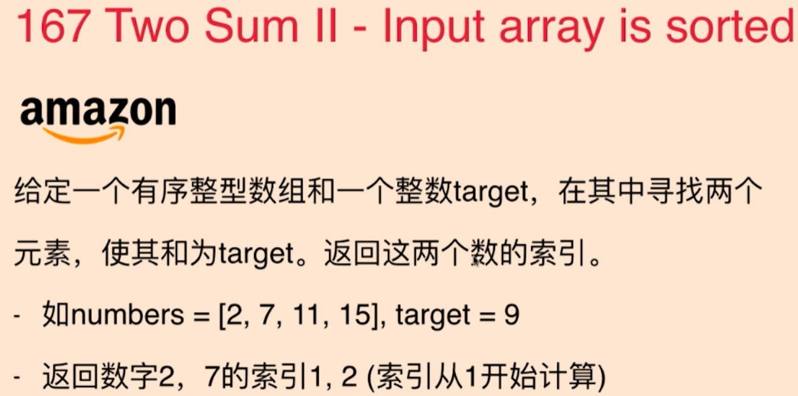
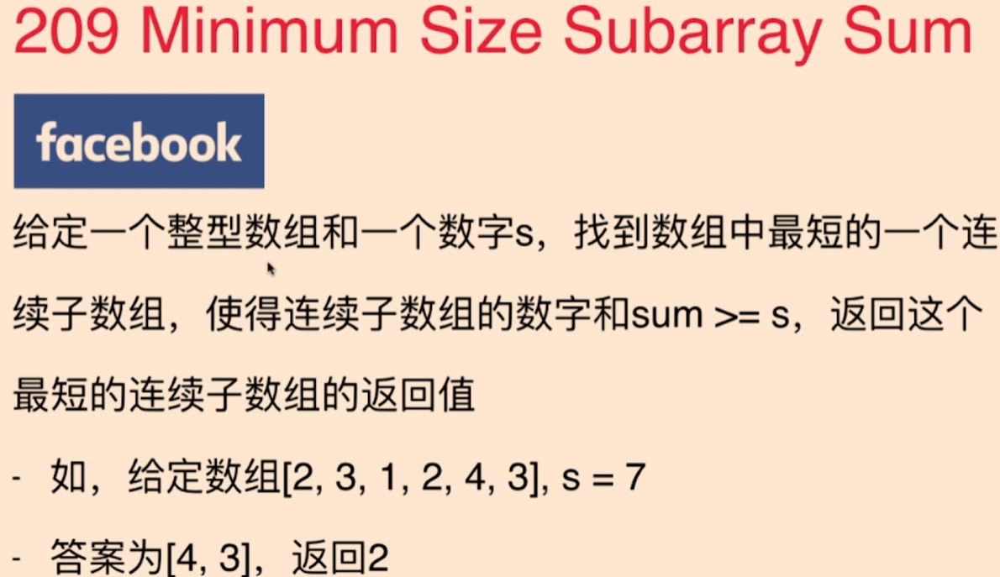
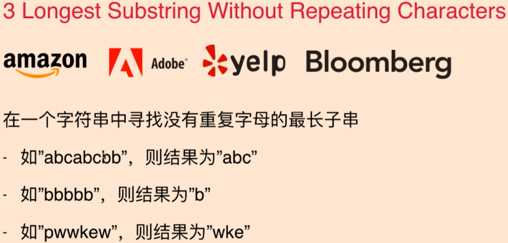

# 数组常见算法

### 1.对撞指针



```java
public static int[] towSum(int[] nums, int target){
    int i = 0;int j = nums.length-1;
    int[] targetNums = new int[2];
    while (i < j){
        if(nums[i] + nums[j] > target){
            j--;
        }else if(nums[i] + nums[j] < target){
            i++;
        }else {
            targetNums[0] = i;
            targetNums[1] = j;
            break;
        }
    }
    return targetNums;
}
```

### 2.滑动窗口



```java
    public static int[] MSSS(int[] nums, int target){
        int i = 0,j = 0;//[i, j]
        int sum = nums[i];
        Set<int[]> result = new HashSet<>();
        while (true){
            if(sum < target){
                j++;
                if (nums.length <= j)
                    break;
                sum += nums[j];
            }else {
                if(result.isEmpty()){//fist time insert result
                    int[] res = new int[2];
                    res[0] = i;
                    res[1] = j;
                    result.add(res);
                }
                int[] res = result.iterator().next();
                if ((res[1] - res[0]) > (j - i)) {
                    result.clear();
                    res[0] = i;
                    res[1] = j;
                    result.add(res);
                }else if((res[1] - res[0]) == (j - i)){
                    int[] res2 = new int[2];
                    res2[0] = i;
                    res2[1] = j;
                    result.add(res);
                }
                i++;
                sum -= nums[i - 1];
            }
        }
        return result.iterator().next();
    }
```

### 3.滑动窗口+记录



```java
    public static String lengthOfLongestSubstring(String s){
        Set<Byte> freq = new HashSet<>();
        int l = 0, r = -1; //[l, r]
        int res = 0;
        String resultS = "";

        while (r+1<s.length()-1){
            if(!freq.contains((byte)s.charAt(r+1))){
                r++;
                freq.add((byte)s.charAt(r));
                res++;
                if(res > resultS.length()){
                    resultS = s.substring(l, r+1);
                }
            }else {
                for (;s.charAt(l)!=s.charAt(r+1);l++){
                    freq.remove((byte)s.charAt(l));
                    res--;
                }
                freq.remove((byte)s.charAt(r+1));
                res--;
                l++;
            }
        }
        return resultS;
    }
```

