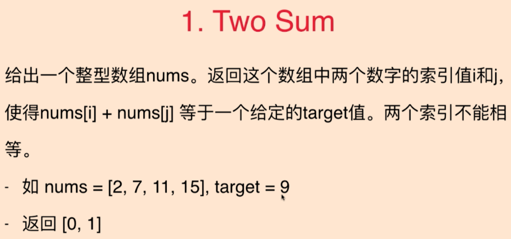
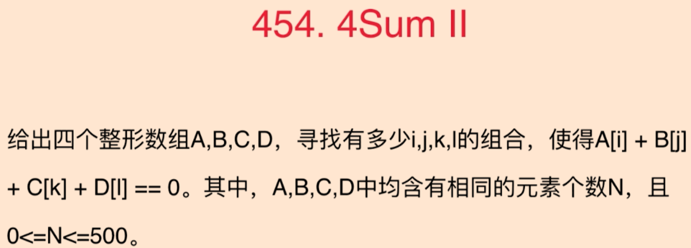
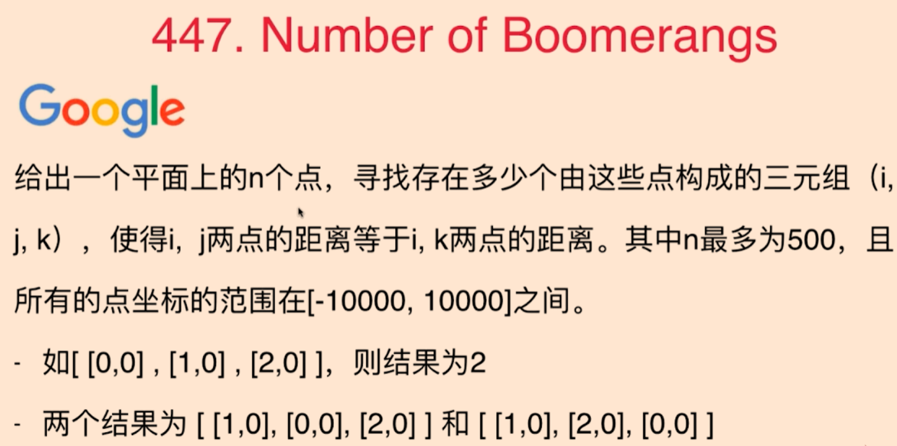

# 查找表

### 1.查找表经典问题



将所有元素放入查找表，之后对每一个元素a，查找target-a是否存在。时间复杂度O(n)

- 需要处理的问题是数组nums中如果有重复数字

```java
    public static int[] twoSum(int[] nums, int target){
        Map<Integer, Integer> record = new HashMap<>();
        for (int i = 0; i < nums.length; i++) {
            int complement = target - nums[i];
            if(record.get(complement) != null){
                int[] res = new int[2];
                res[0] = record.get(complement);
                res[1] = i;
                return res;
            }else {
                record.put(nums[i],i);
            }
        }
        return null;
    }
```

### 2.灵活选择键值



根据数据规模使用O(n^2)基本的算法可以在1s内完成。

**解题思路**

- 1.将C+D的每一种可能放入查找表中O(n^2)，遍历A和B两个数组O(n^2)。整体时间复杂度是O(n^2)
- 2.record中key记录C[i]+D[j]的值，value记录共有几组C[i]+D[j]的组合

```java
    public static int fourSumCount(int[] A,int[] B,int[] C,int[] D){
        Map<Integer, Integer> record = new HashMap<>();
        int result = 0;
        for (int i = 0;i < C.length; i++){
            for (int j = 0; j < D.length; j++) {
                int tmpTarget = C[i] + D[j];
                if(!record.containsKey(tmpTarget)){
                    record.put(tmpTarget,1);
                }else {
                    record.put(tmpTarget,record.get(tmpTarget)+1);
                }
            }
        }
        for (int i = 0; i < A.length; i++) {
            for (int j = 0; j < B.length; j++) {
                int tmpTarget = -A[i] - B[j];
                if(record.containsKey(tmpTarget)){
                    result += record.get(tmpTarget);
                }
            }
        }
        return result;
    }
```

### 3.复杂一点

