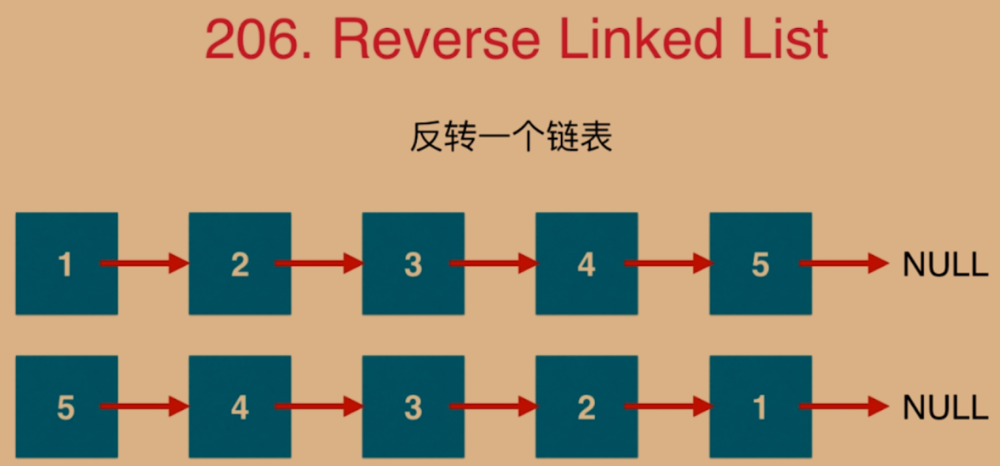
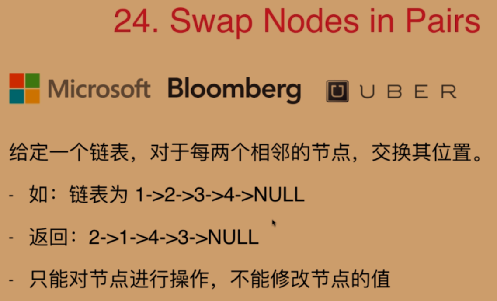

# 在链表中穿针引线

## 01.反转一个链表



```java
public class Main {
    public static void main(String[] args) {
	// write your code here
    }
    public NodeList reverseList(NodeList head){
        NodeList pre, cur, next;
        pre = null;
        cur = head;
        next = head.next;
        while (true){
            cur.next = pre;
            if(next == null){
                return cur;
            }
            pre = cur;
            cur = next;
            next = next.next;
        }
    }
}
class NodeList {
    int val;
    NodeList next;

    public NodeList(int val){
        this.val = val;
        this.next = null;
    }
}
```

## 02.复杂一点的穿针引线



```java
public class Main {
    public static void main(String[] args) {
	// write your code here
    }
    public NodeList reverseList(NodeList head){
        NodeList pre, cur1, cur2, next, result;
        pre = null;
        cur1 = head;
        cur2 = head.next;
        next = cur2.next;
        result = cur2;

        while (true){
            cur2.next = cur1;
            cur1.next = next;
            pre.next = cur2;
            if(next == null || next.next == null){
                break;
            }
            pre = cur1;
            cur1 = next;
            cur2 = next.next;
            next = cur2.next;
        }
        return result;
    }
}
class NodeList {
    int val;
    NodeList next;

    public NodeList(int val){
        this.val = val;
        this.next = null;
    }
}
```

