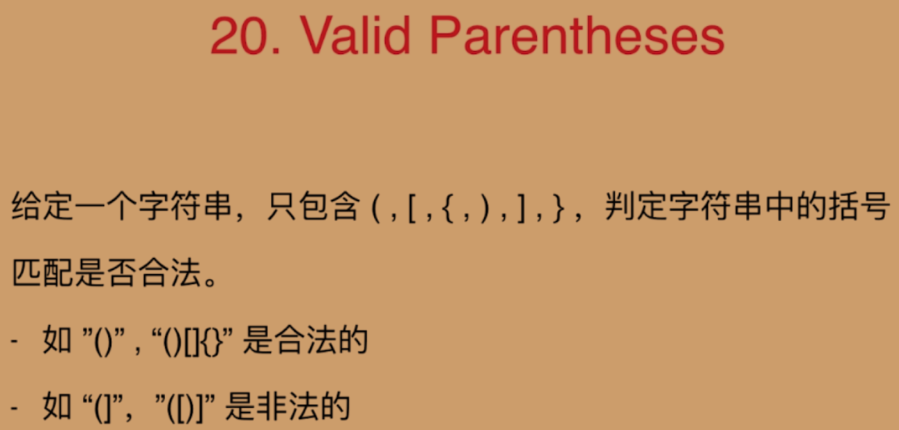
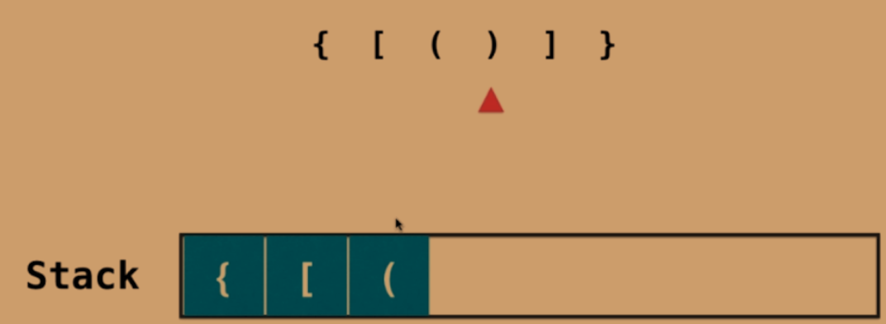
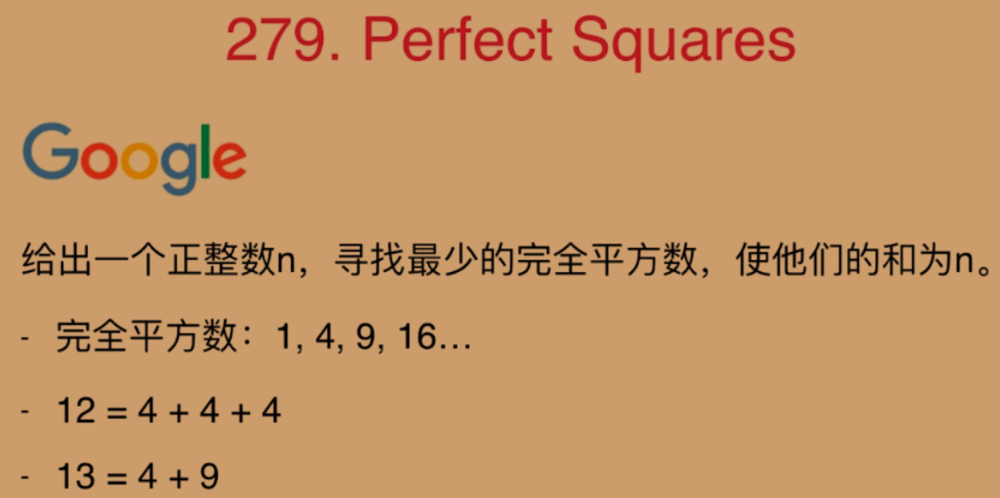
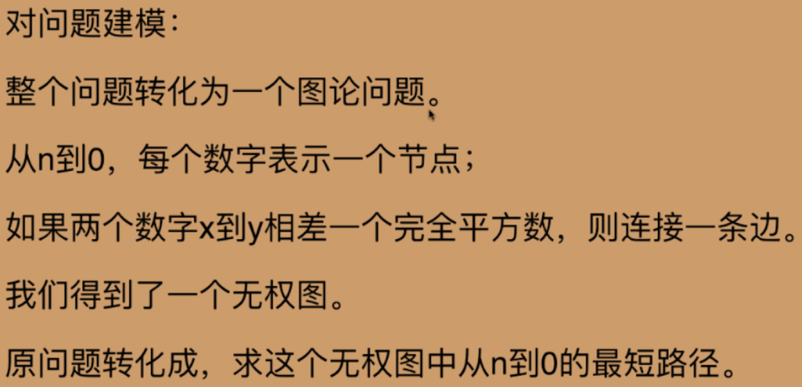

# 栈和队列

## 01.栈的基础使用



解法：



```java
    public boolean isValid(String s){
        Stack<Character> stack = new Stack<>();
        for (int i = 0; i < s.length(); i++) {
            if(s.charAt(i) == '(' || s.charAt(i) == '[' || s.charAt(i) == '{'){
                stack.push(s.charAt(i));
            }else {
                if(stack.empty())
                    return false;

                Character c = stack.pop();

                Character match = null;
                if(s.charAt(i) == ')')
                    match = '(';
                else if(s.charAt(i) == ']')
                    match = '[';
                else if(s.charAt(i) == '}')
                    match = '{';

                if (c != match)
                    return false;
            }
        }
        if(!stack.empty())
            return false;
        return true;
    }
```


## 02.队列的应用



思路：不能使用贪心算法

