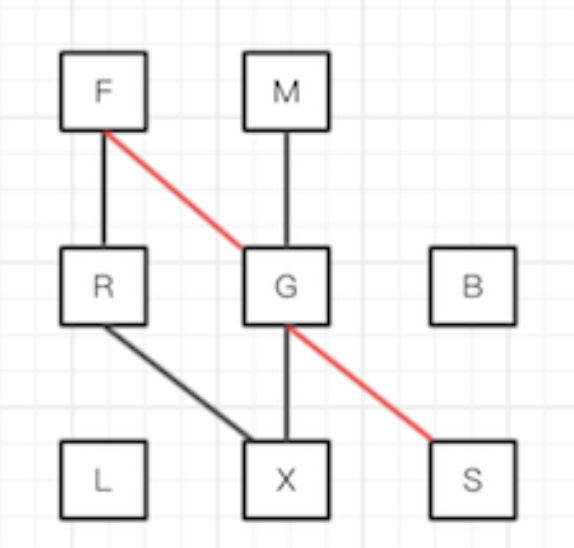

# sku算法实现
应用：[https://github.com/SunriseOYR/SKUDataFilter](https://github.com/SunriseOYR/SKUDataFilter)

## 01.关于SKU
>> 维基百科: 最小库存管理单元（Stock Keeping Unit, SKU）是一个会计学名词，定义为库存管理中的最小可用单元。
>> 最小库存管理单元就是“单品” 最小库存单元是指包含特定的自然属性与社会属性的商品种类，在零售连锁门店管理中通常称为“单品”。对于一种商品而言，当他的品牌、型号、配置、花色、容量、生产日期、保质期、用途、价格、产地等属性与其他商品存在不同时，就是一个不同的最小存货单元。

通俗来讲，一个SKU 就是商品在规格上的一种组合，比如说，一件衣服 有红色 M号的 也有蓝色 L号的 ，不同的组合就是不同的SKU

## 02.问题与思路
我们所说的SKU 组合算法，就是对商品规格组合的一种筛选和过滤。即 根据已选中的一个或多个属性过滤出 剩余属性的 可选性，以及选完所有属性之后对应的 结果（库存、价格等）

这里的问题就有两个

- 1.根据已选中的一个或多个属性过滤出 剩余属性的 可选性
- 2.根据选中的所有属性查询对应的结果（库存、价格等）
第二个问题较简单，只需要遍历一遍SKU，找到对应的结果即可，重点在第一个

简单举个例子

**商品规格  ：
```
款式 ： F    M
颜色 ： R    G    B
尺寸 ： L    X    S    
```

SKU:  
```
M,G,X  -  66元，10件
F,G,S  -  88元，12件
F,R,X  -  99元，15件  
```
我们把 一组满足条件的属性 叫做条件式 ，那么这里就有三个条件式 用个图来表示他们之间的关系 （红线为F-G-S）


这里的属性的状态只有两种 可选和不可选。（已选是属于可选) 那么B、L自始至终就为不可选状态

**当我们选中某个属性时**，比如G -- 那么对应的
可选择属性即为 ： G本身； 兄弟节点（同类可选属性可切换） R（B已淘汰）； 对应条件式中的其他节点 M、X、F、S；

乍一看，除了条件式外的都可选，这是因为故意弄成这个条件式以便于后面的讲解。

实际上我们是通过遍历他的兄弟属性， 遍历他所在的条件式，拿出对应的属性。在多个条件式中会有重复的属性，为了过滤重复的值可以利用集合来添加保存的（NSSet,NSMutableSet）

**当我们选中多个属性**， 比如 F、 R， 由于已选属性之间的相互牵制、这里情况就要复杂的多了

根据上面的分析，我们通常都会想到，遍历各自的兄弟节点，以及条件式，最后各自所取的属性值 去一个交集

（ps1：有的小伙伴可能看不懂，最终可选属性，最傻的办法就是你把可选属性带入条件式里面满足条件即可，兄弟属性在替换之后满足条件式也是可选，比如选中R、他会替换原先的G,也满足已选中属性X,即为可选）

（ps2：排列顺序为：本身、可选兄弟属性、条件式）

F-可选：F、M、R、X、G、S R-可选：R、G、F、X 交集：F、R、G、X 手动验证，完全OK

**But** 这种方法有漏洞

选择 G、X G-可选：G、R、F、S、M、X X-可选：X、S、F、R、M、G 交集：G、X、R、S、R、F、M 手动验证，错误 - F应该为不可选

>> 手动原因：F既在G的条件式F-G-S中，又在X的条件式F-R-X中，但是却不同时满足G、X

>> 这里首先要搞明白 问题绝对不会出现在已选属性的兄弟属性上,因为兄弟节点，在任何一个兄弟属性存在的条件式中 其他兄弟属性都不会出现，有F的条件式就不会有M。所以问题还是在条件式中。当有多个属性被选中时，判断一个非可选属性的兄弟属性是否可选，必须要满足所有可选属性的条件式。那么整体结论即**判定某个属性的可选性：该属性要么同时满足所有已选属性的条件式，要么和已选中的某个属性是兄弟属性**

## 03.算法优化
基于上面的思路，再来说一下算法的优化

### 3.1.降低已选属性的遍历
将上诉理论应用到实际代码中，一般是这样的，再求可选属性集合时：每次一个新的属性操作（选中、取消、切换)，都会根据上诉结论 分别为每一个已选属性的筛选出对应的 可选属性，然后在做交集。 这样的话，每次一个新的属性操作，都可能会把的已选属性重复查询一遍。

优化方案构想-**每次新的属性操作，只筛选当前属性的可选属性，然后在已选属性的基础上进行增删操作。** 看到构想，感觉也不是很难，下面是实际情况—— 实际操作分为三种情况：

- 1、选中新属性
- 2、切换兄弟属性
- 3、取消已选中属性

第一种情况，和我们前面的思路吻合，**只需要将筛选出新属性对应的可选属性集合，然后与当前的 可选集合 求得 交集即可**

后面两种情况，都含有一个取消操作（切换兄弟属性、需要取消上一个兄弟属性），取消操作，意味着，你要把该属性所过滤掉的可选属性，还回来，也就是恢复取交集前的 原集合。那问题的关键即为**如何找到这些被该属性过滤掉的可选属性集合或是直接恢复原集合。**

恢复：可以通过找到所有的原可选集合，并记录下来，然后根据取消属性的匹配原集合恢复(这里不能单纯的记录选中操作的可选集合，因为取消的顺序不一样) 查找过滤掉的可选集合：操作等同于重新计算可选集合

以上两种方案都不可行。这里就不多做赘述，实际操作起来，遍历查询的次数更多了，不仅达不到优化的效果，还增加了算法的复杂程度（这里如果小伙伴有更好的想法，欢迎讨论）。那么最终结论是：在对属性有新操作时，只有新增属性可以基于当前可选属性集合过滤，其他情况需要重新计算

### 3.2.优化条件式
如果说上一个优化方案较为笼统的话，那这里就是整个优化所在的关键了,同时也是SKUDataFilter 的核心

认真看了整篇文章就会发现，整个算法思路的核心，在于条件式，不管是查询结果，还是查询可选属性集合，实际上都是依赖于条件式的，我们在查询某个属性时候可选，实际上是要遍历他所在的条件式列表，这个列表又要求我们去遍历所有的条件式，判断这个属性是否在条件式中，拿到列表之后，获取非兄弟属性又要遍历这个属性，是否同时满足所有已选属性的条件式。那么我们整个算法循环次数最多的地方便是判断某个属性是否存在于某个条件式中

```
**商品规格  ：
为规格属性加一个坐标，记录他们的位置

    0    1    2
0   F    M
1   R    G    B
2   L    X    S    
```
```
SKU:  用下标表示条件式
M,G,X  -  66元，10件 --- (1，1，1)
F,G,S  -  88元，12件 --- (0，1，2)
F,R,X  -  99元，15件 --- (0，0，1)
```
在上一个例子中，为每个属性加一个坐标，如L表示为（0, 2） 条件式中用坐标的某一部分表示

这样一来

判断某个属性是否存在于某个条件式： 正常的操作是遍历条件式中的属性，分别和该属性做判断(containsObject方法 本质上也是在做遍历) 。

而这里只需要一次判断就够了 ，**设该属性的坐标为（x,y）判断条件式里的第y个值是否等于x即可** （这里的判断取决于条件式存入的是x、还是y）

如 判断M(1,0) 是否在F-G-S(0,1,2)条件式中 即条件式的第0个值是否等于1就OK了（程序猿都是从0开始数的）

比如说，总共有5个条件式，每个条件式中有5个属性，你要找出某个满足某个属性的所有条件式 如果你不去中断遍历，就要判断25次，这种方式只需要判定5次就够了，所以它的优化性实际上是非常高的。

实际上，真正神奇之处就在于**这样的下标条件式可以清楚的 知道他所拥有的 任何一个属性 的坐标，进而知道属性的值**