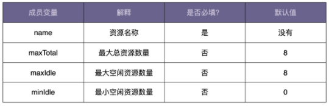

# 建造者模式
https://time.geekbang.org/column/article/199674
另外一个比较常用的创建型设计模式，**Builder 模式**，中文翻译为建造者模式或者构建者模式，也有人叫它生成器模式。

## 01.为什么需要Builder模式

假设有这样一道设计面试题：我们需要定义一个资源池配置类 ResourcePoolConfig。这里的资源池，你可以简单理解为线程池、连接池、对象池等。在这个资源池配置类中，有以下几个成员变量，也就是可配置项。现在，请你编写代码实现这个 ResourcePoolConfig 类。

只要你稍微有点开发经验，那实现这样一个类对你来说并不是件难事。最常见、最容易想到的实现思路如下代码所示。因为 maxTotal、maxIdle、minIdle 不是必填变量，所以在创建 ResourcePoolConfig 对象的时候，我们通过往构造函数中，给这几个参数传递 null 值，来表示使用默认值。
```java
public class ResourcePoolConfig {
  private static final int DEFAULT_MAX_TOTAL = 8;
  private static final int DEFAULT_MAX_IDLE = 8;
  private static final int DEFAULT_MIN_IDLE = 0;

  private String name;
  private int maxTotal = DEFAULT_MAX_TOTAL;
  private int maxIdle = DEFAULT_MAX_IDLE;
  private int minIdle = DEFAULT_MIN_IDLE;

  public ResourcePoolConfig(String name, Integer maxTotal, Integer maxIdle, Integer minIdle) {
    if (StringUtils.isBlank(name)) {
      throw new IllegalArgumentException("name should not be empty.");
    }
    this.name = name;

    if (maxTotal != null) {
      if (maxTotal <= 0) {
        throw new IllegalArgumentException("maxTotal should be positive.");
      }
      this.maxTotal = maxTotal;
    }

    if (maxIdle != null) {
      if (maxIdle < 0) {
        throw new IllegalArgumentException("maxIdle should not be negative.");
      }
      this.maxIdle = maxIdle;
    }

    if (minIdle != null) {
      if (minIdle < 0) {
        throw new IllegalArgumentException("minIdle should not be negative.");
      }
      this.minIdle = minIdle;
    }
  }
  //...省略getter方法...
}
```
现在，ResourcePoolConfig 只有 4 个可配置项，对应到构造函数中，也只有 4 个参数，参数的个数不多。但是，如果可配置项逐渐增多，变成了 8 个、10 个，甚至更多，那继续沿用现在的设计思路，构造函数的参数列表会变得很长，代码在可读性和易用性上都会变差。在使用构造函数的时候，我们就容易搞错各参数的顺序，传递进错误的参数值，导致非常隐蔽的 bug。

- 我们刚刚讲到，name 是必填的，所以，我们把它放到构造函数中，强制创建对象的时候就设置。如果必填的配置项有很多，把这些必填配置项都放到构造函数中设置，那构造函数就又会出现参数列表很长的问题。如果我们把必填项也通过 set() 方法设置，那校验这些必填项是否已经填写的逻辑就无处安放了。
- 除此之外，假设配置项之间有一定的依赖关系，比如，如果用户设置了 maxTotal、maxIdle、minIdle 其中一个，就必须显式地设置另外两个；或者配置项之间有一定的约束条件，比如，maxIdle 和 minIdle 要小于等于 maxTotal。如果我们继续使用现在的设计思路，那这些配置项之间的依赖关系或者约束条件的校验逻辑就无处安放了。
- 如果我们希望 ResourcePoolConfig 类对象是不可变对象，也就是说，对象在创建好之后，就不能再修改内部的属性值。要实现这个功能，我们就不能在 ResourcePoolConfig 类中暴露 set() 方法。

## 02.建造者模式实现
为了解决这些问题，建造者模式就派上用场了。
我们可以把校验逻辑放置到 Builder 类中，先创建建造者，并且通过 set() 方法设置建造者的变量值，然后在使用 build() 方法真正创建对象之前，做集中的校验，校验通过之后才会创建对象。除此之外，我们把 ResourcePoolConfig 的构造函数改为 private 私有权限。这样我们就只能通过建造者来创建 ResourcePoolConfig 类对象。并且，ResourcePoolConfig 没有提供任何 set() 方法，这样我们创建出来的对象就是不可变对象了。

```java
public class ResourcePoolConfig {
  private String name;
  private int maxTotal;
  private int maxIdle;
  private int minIdle;

  private ResourcePoolConfig(Builder builder) {
    this.name = builder.name;
    this.maxTotal = builder.maxTotal;
    this.maxIdle = builder.maxIdle;
    this.minIdle = builder.minIdle;
  }
  //...省略getter方法...

  //我们将Builder类设计成了ResourcePoolConfig的内部类。
  //我们也可以将Builder类设计成独立的非内部类ResourcePoolConfigBuilder。
  public static class Builder {
    private static final int DEFAULT_MAX_TOTAL = 8;
    private static final int DEFAULT_MAX_IDLE = 8;
    private static final int DEFAULT_MIN_IDLE = 0;

    private String name;
    private int maxTotal = DEFAULT_MAX_TOTAL;
    private int maxIdle = DEFAULT_MAX_IDLE;
    private int minIdle = DEFAULT_MIN_IDLE;

    public ResourcePoolConfig build() {
      // 校验逻辑放到这里来做，包括必填项校验、依赖关系校验、约束条件校验等
      if (StringUtils.isBlank(name)) {
        throw new IllegalArgumentException("...");
      }
      if (maxIdle > maxTotal) {
        throw new IllegalArgumentException("...");
      }
      if (minIdle > maxTotal || minIdle > maxIdle) {
        throw new IllegalArgumentException("...");
      }

      return new ResourcePoolConfig(this);
    }

    public Builder setName(String name) {
      if (StringUtils.isBlank(name)) {
        throw new IllegalArgumentException("...");
      }
      this.name = name;
      return this;
    }

    public Builder setMaxTotal(int maxTotal) {
      if (maxTotal <= 0) {
        throw new IllegalArgumentException("...");
      }
      this.maxTotal = maxTotal;
      return this;
    }

    public Builder setMaxIdle(int maxIdle) {
      if (maxIdle < 0) {
        throw new IllegalArgumentException("...");
      }
      this.maxIdle = maxIdle;
      return this;
    }

    public Builder setMinIdle(int minIdle) {
      if (minIdle < 0) {
        throw new IllegalArgumentException("...");
      }
      this.minIdle = minIdle;
      return this;
    }
  }
}

// 这段代码会抛出IllegalArgumentException，因为minIdle>maxIdle
ResourcePoolConfig config = new ResourcePoolConfig.Builder()
        .setName("dbconnectionpool")
        .setMaxTotal(16)
        .setMaxIdle(10)
        .setMinIdle(12)
        .build();
```

## 03.建造者模式与工厂方法的区别
- 1.建造者模式是让建造者类来负责对象的创建工作。而工厂方法不是
- 2.建造者让使用方可以自定义类的配置