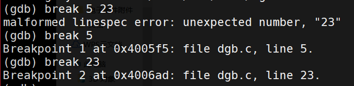

# GDB调试器的使用

## GDB主要实现以下3个方面的功能<br>
- 1.启动被调试的程序
- 2.使被调试的程序停在指定的位置
- 3.当程序停住时，可以检查程序此时的状态，如变量的值

为了实现以上3个功能，可以使用如下5条命令进行操作。<br>
- 1.启动程序。
- 2.设置断点。断点可以是函数，也可以是函数名或条件表达式，也可以是行数。
- 3.查看信息。可以查看与可执行程序相关的各种信息。
- 4.分布运行。程序一步一步运行。
- 5.改变环境。可以在程序运行时改变程序运行环境和变量的值。

## GDB调试器的基本功能和常用命令


### 1.启动调试命令
eg:实现输入年月日后，判断这是一年中的第几天。<br>

```C
//filename:gdb.c
#include<stdio.h>
main()
{
	int day,month,year,sum,leap;
	printf("\nplease input year,month,day\n");
	scanf("%d,%d,%d",&year,&month,&day);
	switch(month)
	{
		case 1:sum=0;break;
		case 2:sum=31;break;
		case 3:sum=59;break;
		case 4:sum=90;break;
		case 5:sum=120;break;
		case 6:sum=151;break;
		case 7:sum=181;break;
		case 8:sum=212;break;
		case 9:sum=243;break;
		case 10:sum=273;break;
		case 11:sum=304;break;
		case 12:sum=334;break;
		default:printf("data error");break;
	}
	sum=sum+day;
	if(year%400==0||(year%4==0&&year%100!=0))
		leap=1;
	else
		leap=0;
	if(leap==1&&month>2)
		sum++;
	printf("It is the %dth day.",sum);
}
```

进入GDB调试界面``gdb gdb.o``可以使用run命令运行程序，当程序调试结束后
可以使用quit退出调试工具。也可以用Ctrl+D退出。如下图。<br>
<br>

### 2.使用断点及其功能

设置断点是为了让程序停在此处，方便查看程序的运行状态和变量的值，也可以单步执行代码。<br>
- 1.在GDB调试器中使用break命令可以设置断点，例如：

    ```
    //运行到某行停止
    break 行号
    //运行到某函数停止
    break 函数名
    //运行到符合if条件语句停止
    break 行号/函数名 if 条件
    ```

    在程序第5行和第23行设置断点<br>
    <br>

- 2.设置完断点可以使用run命令运行程序，程序会停在第5行。


    <br>

- 3.在调试完成后我们可以使用continue
    程序不必一条一条执行下去。
- 4.enable可以启用断点，disable的可以让断点暂时失效

    <br>

- 5.当不再使用某些断点时可以使用delete命令和clear命令清除断点。

    这两个命令的区别在与clear清除断点需要表面断点所在的行号。而delete需要表面断点的编号。<br>
    <br>


### 3.检查数据的功能和命令


eg:冒泡排序从小到大排<br>

```C
#include<stdio.h>
void BubbleSort(int *pData,int count)
{
	 int temp,i,j;
	 for(i=0;i<count;i++)
    for(j=count-1;j>i;j--)
    {
	   if(pData[j]<pData[j-1])
	   {
		    temp=pData[j];
		    pData[j]=pData[j-1];
		    pData[j-1]=temp;
	   }
    }
}
int main()
{
	 int i;
	 int Data[]={10,9,8,7,6,5};
	 BubbleSort(Data,6);
	 for(i=0;i<6;i++)
   printf("%d",Data[i]);
	 printf("\n");
	 return 0;
}
```
- 1.显示变量的值<br>
主要有两个命令print和display。<br>
  - 1)print命令
    ``print 变量名/或表达式``<br>
    对$符合：<br>
    ```
    //表示给定序号的前一个序号
    print $
    //再前一个序号
    print $$
    ```

    print命令还可以对变量赋值，并且还可以打印内存中从某一部分开始的一块连续空间的内容。<br>
    ```
    //对变量赋值
    print var=10
    //打印连续空间
    print 开始表达式@要打印连续空间大小
    ```
    <br>
  - 2)display命令
    与print命令不同的是，每当程序遇到断点时，都会显示变量的值。<br>
    disable display 可以让显示暂时失效，enable display可以使其恢复。<br>
    delete display 可以使其彻底失效。<br>

- 2.查看变量或函数的类型
  包括表达式的值和表达式的数据类型<br>
  可以使用命令whatis和ptype<br>
  两者的区别：whatis只显示数据类型，ptype可以给出类型的定义(如类和结构体变量)<br>

- 3.修改变量的值
  set命令:``set variable i=4``

- 4.查看内存
  在GDB中提供了可以查看内存的x命令，命令x的使用形式如下：<br>
  ``x/<n/f/u> <addr>``<br>

  n、f、u为x命令的可选参数 addr是起始地址<br>
  n代表一个正整数，表示显示内容的个数<br>
  f代表输出格式，通常输出格式由其数据类型决定，但在特殊条件下也可以改变它的输出格式。<br>
  f的输出格式有以下几种：<br>
  ```
  x：十六进制输出
  d：有符号十进制输出
  u：无符号十进制输出
  o：八进制格式
  t：二进制格式
  c:字符格式
  f：浮点格式
  ```

  u代表从当前地址开始向后请求的字节数。通常GDB会默认4个字节。<br>
  u表示的字节数有以下几种形式<br>
  ```
  b：字节
  h：双字节
  w：4字节
  g：8字节
  ```

  这几个参数n、f、u和addr可以理解为从addr地址开始以f格式显示n个u数值

  <br>

### 检查源代码的内存和汇编

使用 info line （行号或函数名）命令，可以查看程序运行时所
指定的源代码。<br>
<br>
disassemble命令可以查看源程序当前执行时的汇编代码<br>
<br>

### 4.单步调试
- next 不进入的单步调试
- step 进入的单步调试，如果在莫函数内部，想要退出使用``finish``
