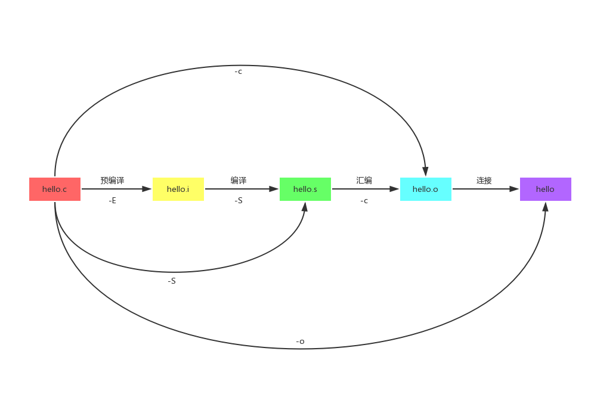

# gcc编译器使用
### 编译过程
<br>
命令查看方法在下面会提到<br>
### 一些重要参数
```
-v 查看版本
-I 后面跟头文件的目录（如果在同一级目录可以省略）

-E 程序停止在预编译后(hello.i)
-S 编译后形成汇编文件后停止(hello.s)编译最耗时，因为要检查语法错误。
-c 相对于上一步将汇编语言翻译成机器语言(hello.o)，加上-c参数后不进行连接生成可执行文件。

-o 重命名
-g 包含调试信息，方便gdb的调试
-On n=0~3 编译优化n越大编译优化越高
-Wall 提升更多警告信息
-nm 查看符号（函数名或变量）对函数如果实现显示T未实现显示U
objdump 将可执行文件转成汇编

```
