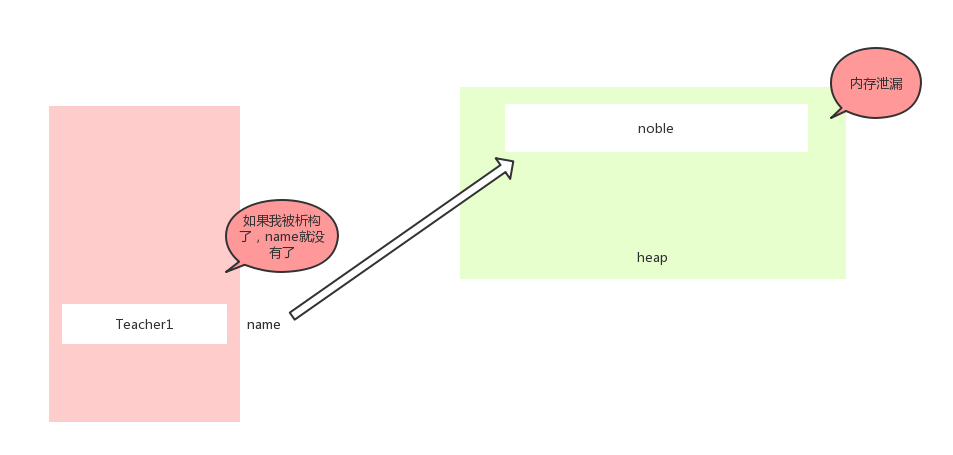
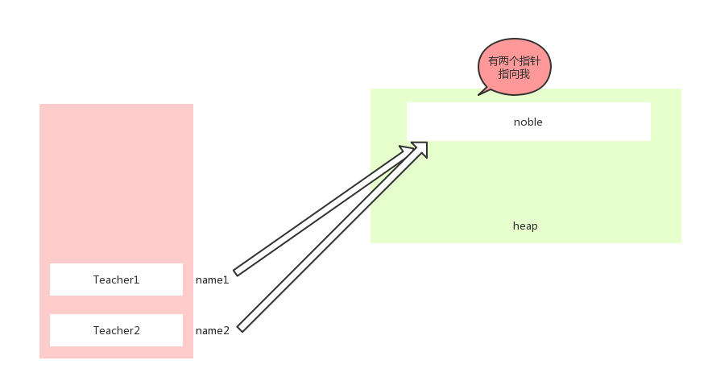

# 1.构造函数

## 1.构造函数时干什么？
构造函数的设计目的是为了方便初始化类的内部变量。<br>
## 2.语法规范
类名+括号，下面的代码是用来函数重载的方式实现private变量赋值的自由性。<br>
考虑下面定义：<br>
```cpp
#include <iostream>
using namespace std;
class Test
{
public:
	//无参数的构造函数
	Test()
	{
		m_x = 0;
		m_y = 0;
	}
	//带参数的构造函数
	Test(int x, int y)
	{
		m_x = x;
		m_y = y;
	}
	//一个参数的构造函数
	Test(int x)
	{
		m_x = x;
		m_y = 0;
	}
	Test(const Test & another)//拷贝构造函数
	{
		m_x=another.m_x;//这不算的访问了another的private变量吗
		m_y=another.m_y;
	}
private:
	int m_x;
	int m_y;
	char *p;
};
int main(void)
{
  Test t1; //调用无参数的构造函数
  Test t2(3);//有一个参数
  Test t3(1,2);//有两个参数
	Test t4(t3);//调用拷贝构造函数
	Test t5=(t4);//同上
	Test t6；//调用无参构造函数
	t6 = t5; //使用 ``=``赋值 在这个过程中没有调用拷贝构造函数
  return 0;
}
```

上述代码反应了构造函数的作用和语法，用来初始化类的内部变量<br>
构造函数除了上述方式还有其他方式。拷贝构造函数和等号操作。这些方法都被编译器封装，如果我们自己不实现，他使用的是默认的。<br>
拷贝构造函数：<br>
```cpp
...
	Test(const Test & another)
	{
		m_x = another.m_x;
		m_y = another.m_y;
		cout << "调用了拷贝构造函数" << endl;
	}
...

	int main()
	{
		Test t1(10,30);
		Test t2(t1);//使用拷贝构造函数初始化
		Test t3 = t2;//使用拷贝构造函数初始化
	}
```
<br>等号操作函数：<br>
```cpp
...
	void operator = (const Test &t)
	{
		cout << "调用了=号操作符" << endl;
		m_x = t.m_x;
		m_y = t.m_y;
	}
...
	int main()
	{
		Test t1;//使用没有参数的构造函数
		Test t2 = t1;//使用等号操作函数
	}
```
以上这些方法如果开发者没有自己实现，它使用的是编译器默认的函数。一些详细细则会在本文的后面给出展示。<br>


# 2.析构函数
## 1.析构函数的意义
析构函数是为了在一个实例化的类的生命周期结束后(比如:局部变量)自动执行的代码区域。
## 2.语法规定
考虑如下代码<br>

```cpp
#include <iostream>
using namespace std;
Test()
{
  m_x = 0;
  m_y = 0;
  p = (char*)malloc(100);
  strcpy(p, "123");
}
~Test()
{
  if (p != NULL) {
    cout << "free heap" << endl;
    free(p);
    p = NULL;
  }
	//等号操作符
void operator = (const Test &t)
{
	m_x = t.m_x;
	m_y = t.m_y;
}
private:
  int m_x;
  int m_y;
  char *p;
}
void test1()
{
	Test t1; //调用无参数的构造函数
	t1.printT();
	return;//在执行这句代码前，会执行``~Test()``
}
int main(void)
{
	test1();
	return 0;
}
```
如上述定义 ``~Test`` ``~``+类名+()就是析构函数的定义。<br>

# 3.析构函数和构造函数的实现方法
如果一个main中有多个类的实例化，并且这个类中有构造函数，同时也有析构函数，那么这些实例在执行析构函数的顺序是：<br>
先被实例化的对象最后执行它的析构函数，类似出栈的顺序，后进先出。<br>
## 1.一些复杂的情景
考虑下面代码：<br>
```cpp
#include <iostream>

using namespace std;

class Test
{
public:
	//默认构造函数。 就是一个无参数的构造函数，
	Test(int x, int y)
	{

		m_x = x;
		m_y = y;
		cout << "调用了有参数的构造函数" << endl;
	}

	//无参数的构造函数
	Test(){
		m_x = 0;
		m_y = 0;
		cout << "调用了无参数的构造函数" << endl;
	}


	//拷贝构造函数 ，想通过另一个Test对象 another 将本对象进行拷贝
	Test(const Test & another)
	{
		m_x = another.m_x;
		m_y = another.m_y;
		cout << "调用了拷贝构造函数" << endl;
	}

	//等号操作符
	void operator = (const Test &t)
	{
		cout << "调用了=号操作符" << endl;
		m_x = t.m_x;
		m_y = t.m_y;
	}

	void printT()
	{
		cout << "x : " << m_x << ", y : " << m_y << endl;
	}

	//提供一个析构函数
	~Test()
	{
		cout << "~Test（）析构函数被执行了" << endl;
		cout << "(" << m_x << ", " << m_y << ")" << "被析构了" << endl;
	}

private:
	int m_x;
	int m_y;
};


//拷贝构造函数的第一个场景
void test1()
{
	Test t1(1, 2);
	Test t2(t1);
	//通过t1 给t2 进行赋值

	t2.printT();
}

//拷贝构造函数的第二场景
void test2()
{
	Test t1(1, 2);
	Test t2;
	t2 = t1; //调用的不是拷贝构造函数，调用的是 =号操作符，也能够完成将t1的值给t2 但不是调用t2的拷贝构造函数。
}


void func(Test t) //Test t = test1::t1; //会调用局部变量t的拷贝构造函数
{
	cout << "func begin..." << endl;
	t.printT();
	cout << "func end..." << endl;

}

//场景三
void test3()
{
	cout << "test3 begin ..." << endl;
	Test t1(10, 20); //创建了一个t1的对象。通过t1的有参数的构造函数
	func(t1);

	cout << "test3 end..." << endl;
}


int func(void)
{
	int a = 10;
	return a;
}
//场景四
Test func2()
{
	cout << "func2 begin..." << endl;
	Test temp(10, 20); //调用temp的带参数构造函数
	cout << "func2 end.." << endl;
	return temp; // 有一个临时的匿名对象 = temp ，把temp的数据给到了临时的匿名对象,  ,会调用这个临时匿名
						//对象的拷贝构造函数， 将temp穿进去。
}

void test4()
{
	cout << "test4 begin " << endl;
	func2();

	//匿名对象在此被析构了， 如果一个临时的匿名对象，没有任何变量去接收它，编译器认为这个临时匿名对象没有用处。
	//编译器会立刻销毁这个临时的匿名对象
	cout << "test4 end" << endl;
}

void test5()
{
	cout << "test5 begin ..." << endl;
	Test t1 = func2();//如果有一个变量去接收这个临时的匿名对象， 编译器认为这个匿名对象转正了，就不会立刻给他销毁。
							//t1 = 匿名的临时对象 为什么不会发生拷贝构造
							//	此时的t1 去接收这个匿名的临时对象不是 重新创建一个t1 而是给这个匿名对象起个名字就叫t1
							//一旦这个匿名对象有了自己的名字，编译器就不会立刻给这个匿名对象销毁了，
							//就当普通局部变量处理了

	cout << "test5 end..." << endl;

	//在此时析构的t1
}

void test6()
{
	cout << "test6 begin..." << endl;
	Test t1; //调用t1的无参数构造函数
	t1 = func2(); //调用的=号操作符 ,,t1 = 匿名对象。 调用了t1的=号操作符。
						//此时匿名没有被转正，匿名没有自己的名字， 匿名对象这个内存没有自己的别名， 编译器就会立刻销毁。
	cout << "test6 end..." << endl;
}

int main(void)
{
	test3();
	test4();
	test5();
	test6();
	return 0;
}
```
## 2.默认构造函数和析构函数
之前我们已经说过，如果开发者不实现拷贝函数和析构函数，编译器会使用自己的默认函数。<br>
默认函数原型类似下面的定义：<br>
```cpp
#define  _CRT_SECURE_NO_WARNINGS
#include <iostream>
using namespace std;
class Obj
{
public:

	Obj() {
		//默认的无惨构造函数
	}
	Obj(const Obj& b)//默认的拷贝构造函数
	{
		m_b = b.m_b;
		p = b.p;
	}
	~Obj()
	{
		//默认的析构函数
	}

	//如果显示的写了一个普通构造函数， 会隐藏默认的无惨构造函数
	//如果显示的写了一个拷贝构造函数 ，会隐藏默认的无参构造函数和默认的拷贝构造函数
	//如果显示的写了一个析构函数， 会隐藏默认的析构函数

private:
	int m_b;
	char *p;
};

int main(void)
{
	Obj a(10); //当你不提供任何构造函数的时候， 系统会有一个默认的构造函数
	Obj a2 = aObj;  //调用了aObj2的拷贝构造函数
	//A a2(aObj);
	return 0;
}
```
## 3.深拷贝浅拷贝问题
如果使用编译器默认的上述函数，当我们的private变量中有指针字符串时或结构时，有可能发生浅拷贝，内存泄漏等的危险。<br>
考虑下面代码：<br>
```cpp
#include <iostream>
using namespace std;
class Teacher
{
public:
	//有参数的构造函数
	Teacher(int id, char *name)
	{
		cout << "调用了Teacher 的构造函数" << endl;
		//是给id 赋值
		m_id = id;

		//给姓名赋值
		int len = strlen(name);
		m_name = (char*)malloc(len + 1);
		strcpy(m_name, name);
	}

	//显示写一个拷贝构造函数
	//通过显示拷贝构造函数提供了深拷贝的动作
	Teacher(const Teacher &another)
	{
		m_id = another.m_id; //给id赋值

		int len = strlen(another.m_name);
		m_name = (char*)malloc(len + 1);

		strcpy(m_name, another.m_name);
	}
	~Teacher() {
		//在构造函数中， 已经开辟了内存 所以为了防止泄露
		//在析构函数中，在对象销毁之前，把m_name的内存释放掉
		if (m_name != NULL) {
			free(m_name);
			m_name = NULL;
			cout << "释放掉了m_name" << endl;
		}
	}
private:
	int m_id;
	char *m_name;
};

int main(void)
{
	Teacher t1(1, "zhang3");

	//如果不提供一个显示的拷贝构造函数， 通过系统自带的默认拷贝构造函数
	Teacher t2(t1); //会调用t2的拷贝构造函数，将t1的值拷贝给t2

	return 0;
}
```

假如没有自定义的析构函数~Teacher在对象的生命周期结束后是不能销毁heap创建的空间的，会发生泄漏问题。<br>
<br>

<br>当没有拷贝定义函数时，会发生浅拷贝<br>
<br>
在上述情况中会发生奔溃，设想同一地址被释放两次。<br>
