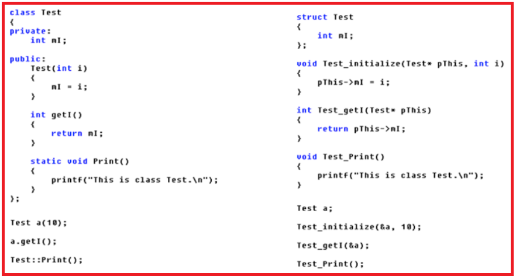

# 静态成员变量

## 1.概述
静态成员变量，就是在类的定义内部，被static修饰的变量。<br>
这个静态变量被所有的该类定义的对象共享。<br>

## 2.语法和实现
```c
#define  _CRT_SECURE_NO_WARNINGS
#include <iostream>

using namespace std;

class Noble
{
public:
	Noble(int a, int b)
	{
		m_a = a;
		m_b = b;
	}
	int getc()
	{
		cout << m_c << endl;
		return m_c;
	}
	static int print_c();//静态函数的实现在类的外部
	static int m_c;
private:
	int m_a;
	int m_b;
};
int Noble::m_c = 0;//在类的外部初始化，这一步是必须的不能省略
int Noble::print_c() {//在外部实现类的静态函数
	cout << "c>>:" << m_c << endl;
	return m_c;
}
int main(void)
{
	Noble n1(1,2),n2(3,4);
	n1.getc();
	n2.getc();
	n1.m_c = 20;
	cout << "after change C" << endl;
	n1.getc();
	n2.getc();//仅仅使用对象n1更改了m_c的值，结果n2对象的m_c也发生变化，说明m_c是共享的
	Noble::print_c();
	system("pause");
	return 0;
}
```

总上：<br>
- 1.static成员变量实现了同类对象间的信息共享
- 2.static成员只能在类的外部初始化
- 3.static成员可以通过类名访问，也可以使用对象访问
- 4.__静态成员函数只能访问静态数据成员__ 原因：非静态成员函数，在调用时this指针被当做参数传进。而静态成员函数属于类，而不属于对象，没有this指针。<br>
- 5.静态成员函数的意义，不在于数据共享，数据沟通，而在于管理静态数据成员，完成对静态数据成员的封装。<br>

# this指针
## 1.this指针概述
类的函数和静态变量占类的空间吗？<br>
```cpp
#include<iostream>
using namespace std;

class C1
{
public:
    int a;//4
    int b;//4
    int c;//4
private:
};

class C2
{
public:
    int a;//4
    int b;//4
    int c;//4

    static int m;//4

    int getC() const {//4   const修饰this指针
        return c;
    }
    void setC(int val){//4
        c=val;
    }

private:
};

struct S1
{
    int a;//4
    int b;//4
    int c;//4
};

struct S2
{
    int a;//4
    int b;//4
    int c;//4
    static int d;//4
};

int main()
{
    cout<<"C1>>:"<<sizeof(C1)<<endl;//12
    cout<<"C2>>:"<<sizeof(C2)<<endl;//24?
    cout<<"S1>>:"<<sizeof(S1)<<endl;//12
    cout<<"S2>>:"<<sizeof(S2)<<endl;//16?
}

```
结果程序的输出是：<br>
```
C1>>:12
C2>>:12
S1>>:12
S2>>:12
```

这说明在类中静态变量和函数都不占用空间，那么就出现一个问题：一个类可以定义好几个对象，而每个对象的函数都是不共用的，那么每个对象是怎么找到自己对于的函数的呢？<br>

<br>

上图信息总结如下：<br>
- 1.C++类对象中的成员变量和成员函数时分开存储的
- 2.C++中类的普通成员函数都隐式的包含一个指向当前对象的this指针
- 3.静态成员函数、静态成员变量属于整个类，而不属于某个对象
- 4.静态成员函数和普通成员函数的区别
  - 1.静态成员函数不包含指向具体对象的this指针
  - 2.普通成员函数包含一个指向具体对象的this指针


我们用下面这段代码做更详细说明：<br>
```cpp
#include<iostream>
using namespace std;

class Test
{
public:
    Test(int a,int b)//====>Test(Test *this,int a,int b)
    {
        this->a=a;
        this->b=b;
    }
    void printT()
    {
        cout<<"a>>:"<<a<<endl;
        cout<<"b>>:"<<b<<endl;
    }
protected:
private:
    int a;
    int b;
};

int main()
{
    Test t1(2,3);//====>Test(&t1,2,3);
    t1.printT();//=====>printT(&t1);
    return 0;
}
```

从上面的代码我们可以看到this指针的作用和运行原理，我们可以使用this指针解决函数形参和类的属性变量名相同的情景。<br>

__注意：__<br>
类的成员函数可以通过const修饰。<br>
注意const关键字应该放在函数名的后面，可以参照上面的上面的代码。<br>

## 2.this指针的使用
this指针是指向该对象的指针，所以我们可以在成员函数的返回值返回``*this``来返回该对象本身。这样做的价值是使成员函数可以当做左值使用。<br>

考虑下面的代码：<br>

```cpp
#define  _CRT_SECURE_NO_WARNINGS
#include <iostream>

using namespace std;

class Test
{
public:
	Test()
	{
		this->a = 0;
		this->b = 0;
	}

	Test(int a, int b)
	{
		this->a = a;
		this->b = b;
	}

	void printT()
	{
		cout << "a = " << a << ", b = " << b << endl;
	}

	int getA()
	{
		return this->a;
	}

	int getB()
	{
		return this->b;
	}

	//成员函数
	Test TestAdd01(Test &t1, Test &t2)
	{
		Test temp(t1.getA() + t2.getA(), t1.getB() + t2.getB());
		return temp;
	}

	Test TestAdd02(Test &another)
	{
		//Test temp(this->a + another.getA(), this->b + another.getB());
		Test temp(this->a + another.a, this->b + another.b);

		return temp;
	}


	void TestAdd03(Test &another)
	{
		this->a += another.a;
		this->b += another.b;
	}


	Test & TestAdd04(Test &another)
	{
		this->a += another.a;
		this->b += another.b;

		//返回自己
		return *this;
	}//temp引用 = *this

private:
	int a;
	int b;
};

//提供一个方法来实现两个Test对象相加
//全局函数
Test TestAdd(Test &t1, Test &t2)
{
	Test temp(t1.getA() + t2.getA(), t1.getB() + t2.getB());

	return temp;
}//此时会析构temp

int main(void)
{
	Test t1(10, 20);
	Test t2(100, 200);

	Test t3 = TestAdd(t1, t2); //调用了一个全局函数

	t3.printT();

	Test t4 = t1.TestAdd01(t1, t2);
	t4.printT();

	Test t5 = t1.TestAdd02(t2); //创建临时的开销

	t5.printT();

	t1.TestAdd03(t2);
	t1.printT();

	(t1.TestAdd04(t2)).printT(); //t1的别名

	return 0;
}
```
