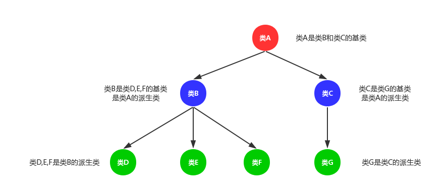
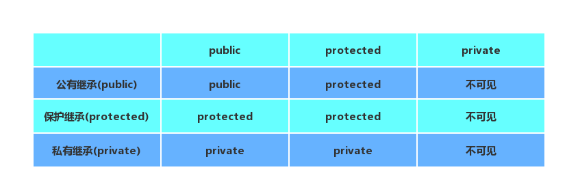
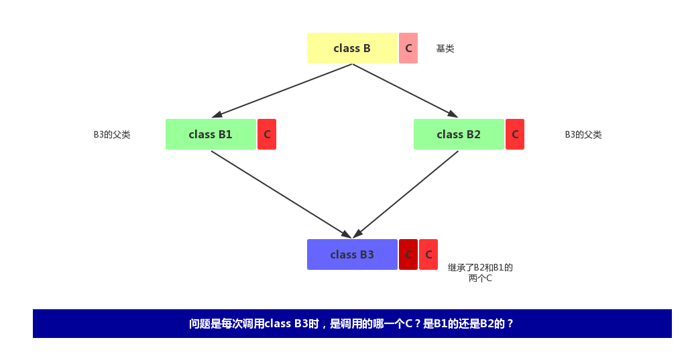

# 继承和派生
在C++中可重用性是通过继承这一机制来实现的。
## 1.概述
类的继承是新的类从已有类哪里得到已有属性。<br>
类的派生就是从已有的类产生新的类。<br>
原有的类称为基类或父类，新产生的类称为派生类或子类。<br>
继承和派生是对同一事实的不同描述方法，如类B继承类A，或类A派生了类B。<br>
<br>

- 1.全盘接收，除了构造函数和析构函数。
- 2.基类有可能会冗余，所以类是需要设计的
- 3.派生类有自己的特性，所以派生类是有意义的

## 2.继承的类型
public，private和protected继承类型说明。首先继承类型使用的关键字和和类的成员属性类型是一样的词语，但是他们是完全不同的东西，不要理解错误。<br>
<br>
(1)我们使用公有继承：子类继承基类的public成员属性和protected成员属性，其中基类的public成员属性在子类中也是public成员属性，类的内部和外部都可以访问，基类中protected成员属性在子类中是protected成员属性，只能在类的内部访问。而private成员属性不可在子类中访问，不管是类的内部，还是类的外部。<br>

(2)我们使用保护继承：子类继承基类的public成员属性和protected成员属性。其中基类成员属性不管是public还是protected成员属性，在子类中都变成protected成员属性，只能在子类的内部访问，不能在子类的外部访问。基类中的private成员属性不可在子类中访问。<br>

(3)我们使用私有继承：子类继承基类的public成员属性和protected成员属性。其中基类成员属性不管是public还是protected成员属性，在子类中都变成private成员属性，当该子类做基类时，新的派生类不可访问该子类继承过来的所有属性。<br>

__注意：__<br>
基类中的private属性虽然不能被派生类访问，但他占用派生类的空间，也就是说在派生类中，基类的private属性是存在的。<br>

```cpp
#include <iostream>
#include<string>
using namespace std;

class A
{
public:
    int pub_A;
protected:
    int pro_A;
private:
    int pri_A;
};

class B:public A//public模式继承
{
    void fun()
    {
        pub_A;//public成员
        pro_A;//protected成员
        //pri_A;不可访问
    }
};

class C:protected A//protected模式继承
{
    void fun()
    {
        pub_A;//protected成员
        pro_A;//protected成员
        //pri_A;不可访问
    }
};

class D:private A//private模式继承
{
    void fun()
    {
        pub_A;//private成员
        pro_A;//private成员
        //pri_A;不可访问
    }
};

int main()
{
    return 0;
}

```

## 3.类型兼容性原则
子类继承了基类除构造和析构之外的所有成员，所以父类可以解决的问题，子类一般都可以解决。<br>
类型兼容模式包括以下内容：<br>
- 1.子类可以当做父类对象使用
- 2.子类可以给父类初始化和赋值
- 3.父类的指针和引用可是指向子类

```cpp
#include <iostream>
#include <string>
using namespace std;

class Parent
{
public:
    void printP()
    {
        cout<<"Parent..."<<endl;
    }
};

class Child:public Parent
{
public:
    void printC()
    {
        cout<<"child..."<<endl;
    }
};

void print1(Parent *p)
{
    p->printP();
}

void print2(Parent &p)
{
    p.printP();
}

int main()
{
    Child c1;
    c1.printC();

    Parent *p=NULL;
    //父类指针可以指向子类对象
    p=&c1;
    p->printP();//执行父类函数

    Parent *p=NULL;
    //父类指针可以指向子类对象
    p=&c1;
    p->printP();//执行父类函数

    Child c2;
    Parent p2;

    print1(&p2);
    print1(&c2);//父类指针指向子类对象

    print2(p2);
    print2(c2);//父类引用指向子类对象

    //用子类初始化父类对象

    Child c3;
    Parent p3=c3;
    return 0;
}
```

## 4.初始化父类成员
- 1.在子类对象构造时，需要调用父类构造函数对其继承过来的成员变量进行初始化
- 2.在子类对象析构时，需要调用父类析构函数对其继承过来的成员进行清理

```cpp
#include <iostream>
#include <string>
using namespace std;

class Parent
{
public:
    Parent(int a)
    {
        this->a=a;
        cout<<"Parent()..."<<endl;
    }

    void printP()
    {
        cout<<"Parent..."<<endl;
    }

    ~Parent()
    {
        cout<<"~Parent()..."<<endl;
    }

private:
    int a;
};

class Child:public Parent
{
public:
    Child(int a,int b):Parent(a)
    {
        cout<<"Child()..."<<endl;
        this->b=b;
    }

    void printC()
    {
        cout<<"child..."<<endl;
    }

    ~Child()
    {
        cout<<"~Child()..."<<endl;
    }

private:
    int b;
};

void test()
{
    Child c1(1,2);
}

int main()
{
    test();
    return 0;
}
```

程序输出：<br>

```cpp
Parent()...
Child()...
~Child()...
~Parent()...
```

由此我们看到构造和析构函数的执行顺序，在构造时，先调用父类在调用子类，而在析构时相反，先析构子类再析构父类。<br>


## 5.多继承
继承多个基类。<br>
语法如下：<br>

```cpp
#include <iostream>
#include <string>
using namespace std;

class A
{
public:
    void printA()
    {
        cout<<"A..."<<endl;
    }
};

class B
{
public:
    void printB()
    {
        cout<<"B..."<<endl;
    }
};

class C:public A,public B
{
public:
    void printC()
    {
        printA();
        printB();
        cout<<"C..."<<endl;
    }
};

int main()
{
    C c1;
    c1.printC();
    return 0;
}

```

## 6.虚拟继承virtual
试想这样的问题，在多继承中，如果是同一个基类的两个派生类同时被继承，那么新产生的派生类会有这样的问题，两个用于共同基类的父类用于相同名称的成员，那么当对新派生类调用这些成员时，是调用两个父类中的哪一个成员呢？<br>

<br>

为了解决这样的问题，于是出现了虚拟继承的概念。<br>
虚拟继承使用关键字virtual。<br>

```cpp
class B
{
public:
  int b
};

class B1:virtual public B{private int b1;};
class B2:virtual public B{private int b2;};

class C:public B1,public B2
{
private:
  float d;
};

```
