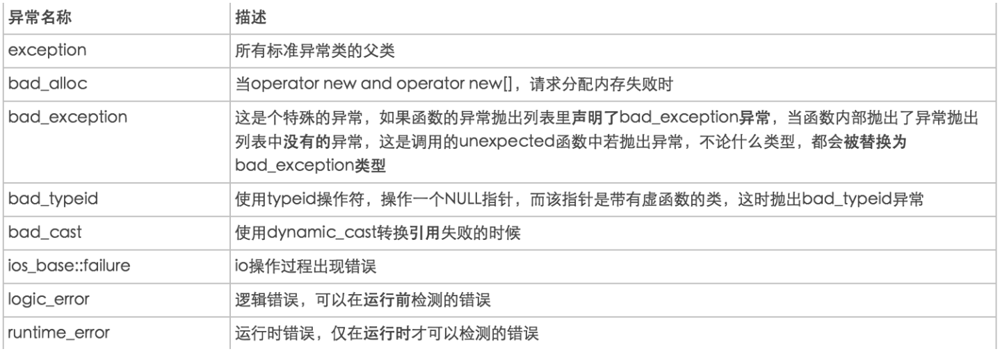
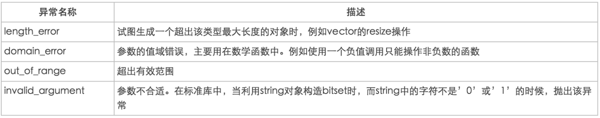
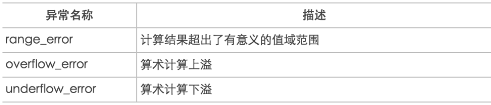

# 异常
异常语法处了C语言，其他很多语言都支持异常处理。<br>
异常处理的语法，使得底层函数可以着重于问题的解决而不必把精力浪费在异常的问题处理上。<br>
C++的异常处理使得异常的引发和异常处理不必在同一函数。<br>

## 1.语法
我们通过以下代码熟悉异常抛出和接受语法：<br>
```cpp
#include <iostream>

using namespace std;
void divide(int,int);
int main()
{
    try{
        divide(1,0);
    }
    catch(int e)//也可以使用catch(...)捕获任何类型
    {
        cout<<"error: b="<<e<<endl;
    }

    return 0;
}
void divide(int a,int b)
{
    if(b==0)
    {
        throw b;
    }
    cout<<"a/b="<<a/b<<endl;
}

```
当``throw``函数被执行后，相当于函数退出，所以后面的语句``cout<<"a/b="<<a/b<<endl;``不会执行。<br>

## 2.栈解旋
在异常抛出后即执行了throw函数后，当前栈空间都会被释放。这就叫栈解旋。<br>

## 3.异常接口的说明
抛出的异常是什么类型，可以在函数定义时表明。<br>
```cpp
void func()throw(int);
```
上面这个函数定义表示该函数只会抛出int类型异常。如果我们不写类似的声明，则表示默认可以抛出所有类型。<br>

## 4.异常类型和异常变量的生命周期
首先我们知道：<br>
- 1.throwd异常是有类型的，可以是数组、字符串、类
- 2.throw有类型，而catch严格按照类型进行匹配

为了让throw出来的异常有意义并有实用价值，我们使用抛出类来解决问题。<br>

假如我们抛出的不是类而是其他的类型，我们可以思考一下有哪里不方便的地方。<br>

#### 1.抛出数字异常
数字异常在处理过程非常方便，但是数字本身不具备意义，如果要在程序之外记录大量数字的异常意义是非常繁琐的。<br>

#### 2.抛出字符串异常
字符串本身可以具备意义，但是不方便异常处理。<br>

#### 3.抛出类
类可以自定义方法，所以可以具备意义，同时方便处理异常，是非常不错的选择。<br>

但问题到这里还没有完，我们怎么抛出类，并怎么接受呢？<br>
#### 1.方案一：
抛出类本身，并用类本身接收<br>
```cpp
class Error{};
.....
throw Error();
.....

try{
  .......
}
catch(Error e){
  ......
}
```
上述代码模板是有问题的，当我们详细查看内存中的运行模式时会发现在执行``throw Error()``语句时会临时创建一个临时类，并把这个类拷贝构造给``catch(Error e)``中的``e``这会发生浅拷贝问题。<br>

#### 2.方案二
抛出类的指针，并用指针接收<br>
```cpp
class Error{};
.....
throw &Error();
.....

try{
  .......
}
catch(Error *e){
  ......
}
```
通过检测发现类已经被析构了，所以e是一个野指针。。<br>

#### 3.方案三
抛出new的指针，并用指针接收<br>
```cpp
class Error{};
.....
throw new Error();
.....

try{
  .......
}
catch(Error *e){
  ......
  delete e;
}
```
要手动加一个delete的操作
<br>

#### 4.方案四
使用引用<br>
```cpp
class Error{};
.....
throw new Error();//throw Error();也没问题
.....

try{
  .......
}
catch(Error &e){
  ......
}
```
这个方案没问题。<br>

## 5.标准异常库
C++标准异常库``<stdexcept>``都会继承一个基类``exception``所以只有我们catch这个基类就可以接收所有的异常。<br>
同时继承``exception``基类的异常都有一个``what()``方法<br>
<br>
<br>
<br>

案例1：<br>
```cpp
#include<iostream>
#include<stdexcept>
using namespace std;

class Teacher
{
public:
  Teacher(int age)//构造函数，通过异常机制处理错误
  {
    if(age>100)
    {
      throw out_of_range("over age range!");
    }
    this->age=age;
  }
private:
  int age;
};
int main()
{
  try
  {
    Teacher t1(102);
  }
  catch(exception &e)
    {
        cout<<e.what()<<endl;
    }

}

```
``what()``输出的是字符串``over age range!``<br>
