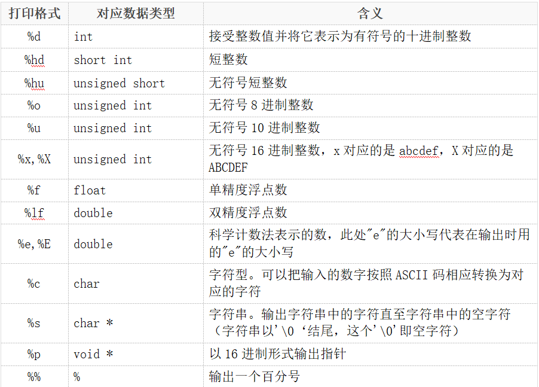
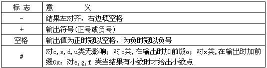
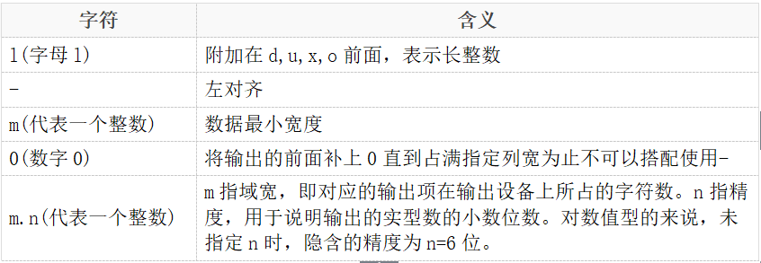
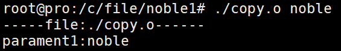

# 顺序程序设计
## printf函数 输出格式：
<br>

<hr>
printf附加格式：<br>
<br>

<br>

## main()函数参数
考虑下面代码：<br>
```C
#include<stdio.h>
#include<unistd.h>

int main(int argc,char *argv[])
{
        printf("-----file:%s------\n",argv[0]);
        printf("parament1:%s\n",argv[1]);
        return 0;
}
```
输出结果如下：<br>
<br>
