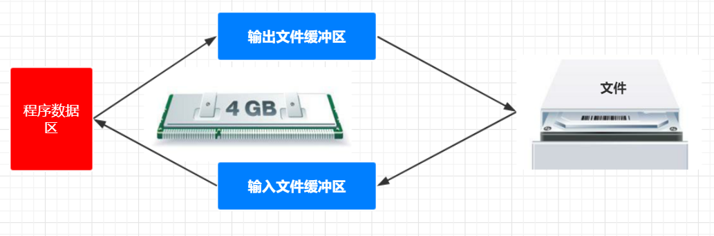
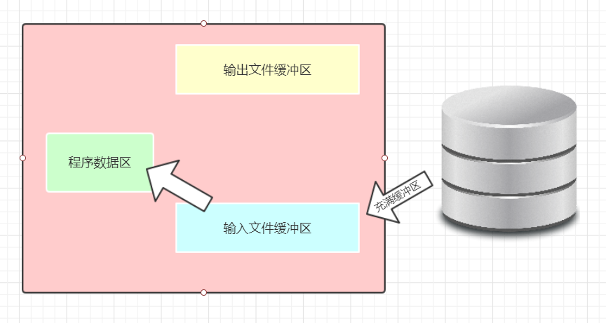
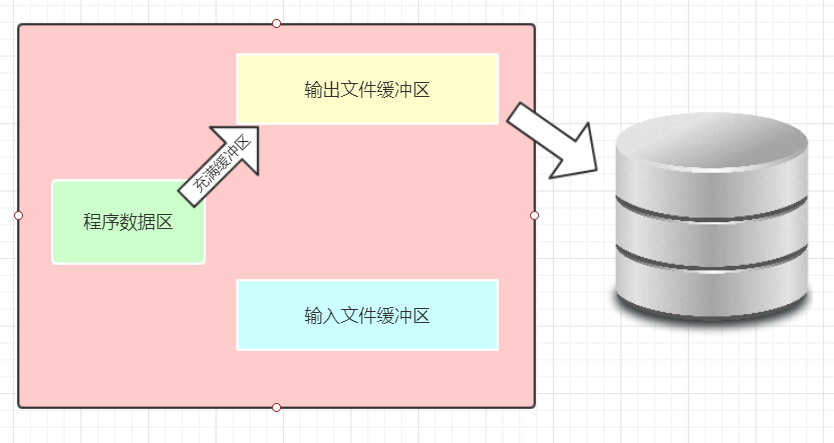

# 文件操作
- 1包含头文件
- 2定义FILE指针
- 3打开文件
- 4读写操作
- 5关闭文件

## 1.文件分类

#### 按文件的逻辑结构：
- 记录文件： 由具有一定的记录组成（定长和不定长）
- 流式文件： 由一个个字符（字节）数据顺序组成


#### 按存储介质：
- 普通文件： 存储介质文件（磁盘，磁带等）
- 设备文件： 非存储介质（键盘，显示器，打印机等）


#### 按数据的组织形式：（重点）
- 文本文件： ASCII文件每个字节存放一个ASCII码的文件
- 二进制文件： 数据按其在内存中的存储形式原样存放


## 2.流概念
流是一个动态的概念，可以将一个字节形象地比喻成一滴水，
字节在设备、文件和程序之间的传输就是流，类似于水在管道中的传输，
可以看出，流是对输入输出源的一种抽象，也是对传输信息的一种抽象。
通过对输入输出源的抽象，屏蔽了设备之间的差异，使程序员能以一种通用的方式
进行存储操作，通过对传输信息的抽象，使得所有信息都转化为字节流的形式传输，
信息解读的过程与传输过程分离。<br>
C语言中，I/O操作可以简单的看做是从程序移进或移出字节，这种搬运的过程便成为流
（steam）。程序员只需要关心是否正确地输入了字节数据，以及是否正确地输入了
要读取字节数据，特定I/O设备的细节对程序员是透明的。<br>

## 3.文件处理的方法
- 1）文件缓冲区<br>
ANSI C标准采取“缓冲文件系统”处理数据文件，所谓缓冲文件系统
是指系统自动地在内存区为程序中每一个正在使用的文件开辟一个文件缓冲区，
从内存向磁盘输出数据必须先送到内存中的缓冲区，装满缓冲区后才一起送到磁盘。
如果从磁盘向计算机读取数据，则一次从磁盘将一批数据输入到内存缓冲区（充满缓冲区）
，然后再从缓冲区逐个地将数据送到程序数据区（给程序变量）<br>
- 2)输入输出流<br>
输入输出是数据传送的过程，数据如流水一样从一处流向另一处，因此常将输入输出形象
地称为流（stream），即数据流。表示了信息从源到目的的流动。<br>
<br>
输入操作时，数据从文件流向计算机内存---文件的读取<br>
<br>
输出操作时，数据从计算机内存流向文件---文件的读取<br>
<br>

无论是用word打开或保存文件，还是C程序中的输入输出都是通过操作系统
进行的。“流”是一个传输通道，数据可以从运行环境流入程序中，或从程序流至运行环境<br>

## 4.文件句柄
```c
typedef struct
{
  short         level;        //缓冲区“满”或“空”的程度
  unsigned      flags;        //文件状态标志
  char          fd;           //文件描述符
  unsigned char hold;         //如无缓冲区不读取字符
  short         bsize;        //缓冲区的大小
  unsigned char *buffer;      //数据缓冲区的位置
  unsigned      ar;           //指针，指向当前的指针
  unsigned      istemp;       //临时文件，指示器
  short         token;        //用于有效性检查
}FILE；
```

## 5.C语言文件指针
__在C语言中用一个指针变量指向一个文件，这个指针成为文件指针__<br>
声明FILE结构体类型的信息包含在头文件"stdio.h"中<br>
一般设置一个指向FILE类型的指针变量，然后通过它来引用这些FILE类型变量，通过文件指针就可以对它所指的文件进行操作。<br>
定义文件的指针一般操作是：<br>
<br>__FILE* 指针变量标识符;__<br>
其中FILE应为大写，它实际是由系统定义的一个结构，该结构中含有文件名、文件状态和文件，当前位置等信息。在编写源文件时程序员不需要关系FILE结构的细节。<br>
<br>__FILE* fp;__<br>
表示fp是指向FILE的文件指针变量，通过fp即可找存放在某个文件信息的结构变量，然后按结构变量提供的信息找到该文件，实施对文件的操作。习惯上也叫fp为指向一个文件的指针。<br>

## 6.文件操作的API

fgetc()　　　　　fputc() 按字符读写文件<br>
fgets()　　　　　fputs() 按字符串读写文件<br>
fread()　　　　　fwirte() 按块读写文件（大文件操作）<br>
fprintf　　　　　　　　　按格式化读写操作<br>

## 7.标准的文件读写

__1.文件的打开fopen()__<br>
文件的打开操作表示将给用户指定的文件在内存分配一个FILE结构区，并将该结构的指针返回给用户程序，以后用户程序就可以用此FILE指针实现对文件的各项操作。当使用打开函数fopen()时，必须给出文件名，文件操作方式（读或写，下面的表格会列出各项操作符），如果该文件名不存在，就意味着创建（只对写文件有效，读文件时会报错），并将文件指针指向该文件的开头。<br>
``FILE *fopen(const char *pathname, const char *mode);``<br>
当用``fopen()``打开一个文件时，成功返回一个FILE指针，失败返回NULL指针。<br>
 <br>

```c
FILE *fp;
if((fp=fopen("text","w+"))==NULL){
  fprintf(stderr,"Fail to open file!");
}
...
fclose(fp);
```
这个表格详细归类了文件类型<br>
<br>

__2.关闭文件函数fclose()__<br>
文件打开后执行操作完成后要关闭文件，这是因为操作系统支持打开文件的数量是有限制，如果无限制的打开文件又不关闭，到达一定数目后就不能再打开任何文件，系统可能会卡死，类似内存泄漏。而且文件内容也可能受损。<br>
``int fclose(FILE *stream);``<br>
表示文件关闭成功返回0，失败返回非0<br>

> 这是第一次出现 ``FILE *stream``
> 在使用``stream``时要注意，它处理指定文件流外还有一些宏可供使用：<br>
> stdin,stderr,stdout<br>
> 分别对应标准输入，标准错误，标准输出


__文件的读写__<br>
- 1）读写文件中字符的函数
一次只能读写一个字符：<br>
```c
int fgetc(FILE *stream);
int fputc(FILE *stream);
```
其中fgetc()函数把 流指针 指向的字符输出。如：<br>
``ch=fgtec(fp)``<br>
将文件的 流指针fp 指向的字符输出给ch，如果fp流指针已经指向文件的末尾，即遇到文件结束标志EOF（其对应值-1）则返回-1，在程序中可以通过判断ch是否==-1来决定是否已到文件的末尾。例如：<br>
```c
#include<stdio.h>
int main()
{
  FILE *fp=NULL;
  char ch=0;
  if((fp=fopen("noble.txt","r+"))==NULL){//如果fp==NULL表示打开文件失败
    fprintf(stderr,"file opend fail!\n");
    return -1;
  }
  for(;(ch=fgetc(fp))!=EOF;){//当ch==EOF表示遇到结束标志
    fputc(ch,stdout);
  }
  fclose(fp);
  return 0;
}
```
上面的程序用到了fput()函数，该函数将ch变量保存的字符输入到特定的 流指针去 此处是stdout也就是标准输出，所以内容会打印到屏幕。<br>
- 2）读写文件的字符串函数。<br>
```c
char *fgets(char *string,int n,FILE *stream);
int fprintf(FILE *stream,char *format,...);
int fputs(char *sting,FILE *stream);
```
其中fgets()函数把指定字符个数的字符串，从流指针fp读到string的数组中。例如：<br>
``fgtes(buffer,9,fp);``<br>
把fp指向的8个字符读取到buffer中。buffer可以是栈数组也可以是堆开辟的空间。<br>
___注意：___ fgets()在读到'\n'时就停止，不管是不是达到指定个数，并在末尾加上'\0'<br>
fgets()函数执行完毕后返回一个指向该字符串的指针。如果读到文件结尾或出错，均返回一个NULL指针。可以用feof()函数检查是否到达文件结尾。下面的程序读取noble.txt文件的第一行并打印出来：<br>
```C
#include<stdio.h>
int main()
{
  FILE *fp=NULL;
  char str[64]={0};
  if((fp=fopen("noble.txt","r+"))==NULL)
  {
    fprintf(stderr,"fail to open file!\n");
    return -1;
  }
  for(;!feof(fp);)
  {
    if(fgets(str,sizeof(str),fp)!=NULL){
      printf("%s",str);
    }
  }
  return 0;
}
```
fputs() writes the string s to stream, without its terminating null byte ('\0').
<br>
fprintf()和printf()相似唯一的区别是fprintf()指向字节流fp，而printf()输出屏幕。<br>

## 8.清除和设置文件缓冲区
``int fflush(FILE *stream);``<br>
fflush()函数将清除由stream指向文件缓冲区里的内容，常用于写完一些数据后，立即用该函数清除缓冲区，以免误操作，破坏原来的数据。<br>

## 9.文件的随即读写函数

```c
#include<stdio.h>
int fseek(FILE *stream,long offset,int whence);
//返回值：成功返回0，出错返回-1，并设置errro

long ftell(FILE *stream);
//返回值：成功返回当前读写位置，出错返回-1并设置error

void rewind(FILE *stream);
```

fseek的whence和offset参数共同决定了读写位置移动到了何处，whence参数的含义如下：<br>
__SEEK_SET__<br>
>从文件开头移动offset个字节


__SEEK_CUR__<br>
>从当前位置移动offset个字节


__SEEK_END__<br>
>从文件末尾移动offset个字节

offset可正可负，为正时向后移动，为负是向前移动。当文件移动位置向前移动超过了文件的起始位置，则出错，当文件向后移动的位置超过的文件的末尾，并再次写入时文件的尺寸将变大，不管offset向后移动了多少位，写入的数据和文件结尾处的间隔字符都是0。<br>

```c
#include<stdio.h>
#include<stdlib.h>
int main()
{
  FILE *fp=NULL;
  if((fp=fopen("noble.txt","r+"))==NULL)
  {
    fprintf(stderr,"open file error!\n");
    return -1;
  }
  if(fseek(fp,10,SEEK_SET)!=0){
    fprintf(stderr,"error:Seek file noble.txt\n");
  }
  fputc('k',fp);
  fclose(fp);
  return 0;
}
```
## 10.文件二进制块读写函数
```c
#include<stdio.h>
size_t fread(void *ptr,size_t size,size_t nmemb,FILE *stream);
size_t fwrite(const void *ptr,size_t size,size_t nmemb,FILE *stream);
//返回值：读或写的次数nmemb，成功返回nmemb，
//出错或读到文件末尾是返回小于nmemb的值，可能为0
```

fread和fwrite用于读写记录，这里的记录是指遗传固定长度的字节，比如一个int、一个结构体或一个定长数组。
- 1.参数size指出一个单体的大小长度，
- 2.nmemb表示要读写的次数。

fread将数据从fp读出连续存放在ptr中，而fwrite把ptr中的size*nmemb个字节写到文件fp中。<br>
下面的例子由两个程序组成，一个程序把结构体存储到文件中，另一个把结构体从文件中读出来。<br>

```c
#include<stdio.h>
#include<stdlib.h>
struct record {
  char name[10];
  int age;
};
int main()
{
  struct record array[2] = {{"Li",28},{"Tom",24}};
  FILE *fp = fopen("noble.txt","w+");
  if(fp==NULL){
    fprintf(stderr,"fail open file!\n");
    return -1;
  }
  fwrite(array,sizeof(struct record),2,fp);
  fclose(fp);
  return 0;
}
```

```c
#include<stdio.h>
#include<stdlib.h>
struct record {
  char name[10];
  int age;
};
int main()
{
  struct record array[2];
  FILE *fp = fopen("noble.txt","r+");
  if(fp==NULL)
  {
    fprintf(stderr,"fail open file!\n");
    return -1;
  }
  fread(array,sizeof(struct record),2,fp);
  printf("name1:%s  Age1:%d\n",array[0].name,array[0].age);
  printf("name2:%s  Age2:%d\n",array[1].name,array[1].age);
  fclose(fp);
  return 0;
}
```
