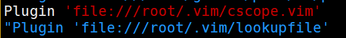
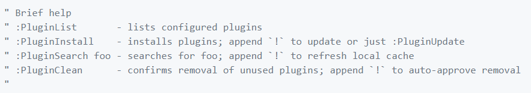

# C/C++ VIM编辑器的配置和使用
## 1.Vundle的使用和配置
官网说明：
[https://github.com/VundleVim/Vundle.vim](https://github.com/VundleVim/Vundle.vim)<br>
``Vundle``是一款``VIM``的插件管理器。<br>
### 1.搭建方式
#### 1.里程碑一
把git仓库脱下来：<br>
``git clone https://github.com/VundleVim/Vundle.vim.git ~/.vim/bundle/Vundle.vim``<br>

#### 2.里程碑二
将官方网站上的``.vimrc``中的内容复制到自己家目录中的``.vimrc``中。然后就配置OK了。<br>


编写方式在.vimrc中写的很清楚。类似如下：<br>
<br>

在vim编辑器中可以参考一下命令：<br>
<br>

命令详解：<br>
- 1.``PluginList``会列出当前安装和需要安装的插件列表
- 2.``PluginInstall``命令会安装在.vimrc中编写的插件
- 3.``PluginClean``会删除在.vimrc中没有包含的插件


__错误：__<br>
``E117: Unknown function: vundle#end``<br>
原因可能是两种：<br>
- 1.``rtp``路径出现错误
- 2.``Windows``编码不能在``Linux``下运行

对于第一种错误在这个网站上有很好的阐述：<br>
[overflow](https://stackoverflow.com/questions/25444680/unknown-function-vundlebegin)<br>

第二种错误我们可以使用``dos2unix``工具转换<br>
使用命令：``[root@noble ~]# dos2unix .vimrc``<br>
然后试试看说不准就解决了。<br>


## 2.tags使用
官方说明：
[https://packagecontrol.io/packages/CTags](https://packagecontrol.io/packages/CTags)<br>
### 第一个里程碑 安装
在Linux系统中：<br>
For Debian-based systems(Ubuntu,Mint,etc.):<br>
``sudo apt-get install exuberant-ctags``<br>
For Red Hat-based systems (Red Hat,Fedora,CentOS):<br>
``yum install ctags``<br>
### 第二个里程碑 使用
官方说明：
[https://courses.cs.washington.edu/courses/cse451/10au/tutorials/tutorial_ctags.html](https://courses.cs.washington.edu/courses/cse451/10au/tutorials/tutorial_ctags.html)<br>
在自己的项目根目录下使用命令``ctags -R *``<br>
这条命令会递归的扫描所有文件然后管理此项目。<br>

__两条重要的命令__<br>
- 1 ``Ctrl ]`` 在vim编辑器中当光标在一个函数上时，该命令跳转到该函数的定义上
- 2 ``Ctrl t`` 在上一命令结束后 使用该命令 光标跳回原来的地方

## 3.cscope的使用
### 1.创建cscope文件
有一个不错的博客：<br>
[https://blog.easwy.com/archives/advanced-vim-skills-cscope/](https://blog.easwy.com/archives/advanced-vim-skills-cscope/)<br>
在代码的更目录执行命令``cscope -Rbq``，就会生成cscope.out数据库文件<br>
生成的3个文件中cscope.out是最基本的文件。<br>
对参数的解释：<br>
- 1.-R 递归连接每个目录下面的子文件
- 2.-b 当前仅执行，不进入cscope的工作界面
- 3.-q 生成cscope.in.out和cscope.po.out文件，加快cscope的检索速度
- 4.-k 在生成索引数据库时，不搜索/usr/include目录
- 5.-i 当我们创建的cscope.files是用的其他名称，使用这个参数指定
- 6.-l 在-l参数的后面加目录路径，之后头文件的查找都在这个目录中
- 7.-u 扫描所有文件，重新生成索引文件
- 8.-P 加上绝对路径

__特别的：__<br>
- 1.cscope在生成数据库中，在你的项目目录中未找到的头文件，会自动到/usr/include目录中查找。如果你想阻止它这样做，使用"-k"选项。<br>
- 2.cscope在缺省情况下只检索C程序文件(.c和.h)，cscope也支持C++和JAVA但是必须要在项目的根目录下的cscope.files文件中包括这些C++或JAVA的路径。我们一般用find命令创建cscope.files文件。当cscope发现当前目录存在cscope.files文件时，就会建立cscope.files文件中包含文件名的数据库，所以不用加-R参数。<br>
```shell
find . -type f > cscope.files
cscope -bq
```

### 2.对cscope的使用
打开我们的代码源文件(vim打开)。执行命令：<br>
```
:cscope
```
我们可以查看帮助。<br>
我们执行``:cscope add <数据库名>``可以把刚刚生成的cscope数据库加入到连接中这样我们就可以使用cscope命令查找功能了。<br>
``:cscope find``查找命令由如下参数：<br>
```
s: 查找C语言符号，即查找函数名、宏、枚举值等出现的地方
g: 查找函数、宏、枚举等定义的位置，类似ctags所提供的功能
d: 查找本函数调用的函数
c: 查找调用本函数的函数
t: 查找指定的字符串
e: 查找egrep模式，相当于egrep功能，但查找速度快多了
f: 查找并打开文件，类似vim的find功能
i: 查找包含本文件的文件
```


## 4.lookupfile插件使用
### 1.lookupfile安装
更多介绍：<br>[易水博客](https://blog.easwy.com/archives/advanced-vim-skills-lookupfile-plugin/)<br>
``lookupfile``是一个非常出色的文件查找插件，支持通配符，在大型项目和文件较多的环境中有非常大的用武之地。<br>
lookupfile源码下载链接：<br>
[https://www.vim.org/scripts/script.php?script_id=1581](https://www.vim.org/scripts/script.php?script_id=1581)<br>
lookupfile还需要genutils的支持。<br>
[https://www.vim.org/scripts/script.php?script_id=197](https://www.vim.org/scripts/script.php?script_id=197)<br>
我们把上面两个包下载的源码解压到``~/.vim/``目录下面就算安装成功。<br>
然后我们在vim中执行命令``:helptags ~/.vim/doc``命令，生成help文件索引，然后就可以使用``:help lookupfile``命令查看``lookupfile``插件的帮助文件了。<br>
**到此为止 安装结束**<br>

### 2.lookupfile配置
我们为了更高的工作效率，需要自动化执行数据库的生成工作，完成下面的操作：<br>
编写脚本命名为``genfiletags``：<br>
```shell
#!/bin/sh
# generate tag file for lookupfile plugin
echo -e "!_TAG_FILE_SORTED\t2\t/2=foldcase/"> filenametags
find . -not -regex '.*\.\(png\|gif\)' -type f -printf "%f\t%p\t1\n" | sort -f>> filenametags
```
把它放到环境变量中去，这样当我们每次要使用lookupfile就不用再执行复杂的操作了，直接在项目或工程的根目录执行``genfiletags``命令即可。<br>

然后为了让使用lookupfile更加方便还有一些配置在以后慢慢实现[http://blog.51cto.com/laokaddk/595271](http://blog.51cto.com/laokaddk/595271)<br>

## 5.代码自动补全
对``C/C++``非常优秀的``YouCompleteMe``是首推。<br>
[https://github.com/Valloric/YouCompleteMe#installation](https://github.com/Valloric/YouCompleteMe#installation)<br>
搭建步骤非常简单。在官方github上写的非常详细。<br>

#### 里程碑一
使用``Vundle``来管理``YouCompletMe``，所以把``Plugin 'Valloric/YouCompleteMe'``写入到``.vimrc``中，然后安装。<br>

#### 里程碑二
把支持工具安好：<br>
```
apt-get update
sudo apt-get install build-essential cmake
sudo apt-get install python-dev python3-dev
```

#### 里程碑三
编译安装：<br>
```
cd ~/.vim/bundle/YouCompleteMe
./install.py --clang-completer
```
**注意：** ``--clang-completer``表示支持C/C++语义。<br>
