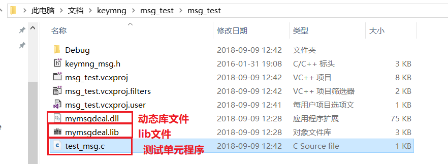

# 3.函数库
函数库的作用：代码复用<br>
自己可以通过函数库积累程序<br>
## 1.静态库
运行时会把静态库完整的加载到可执行程序<br>
比如：我的可执行程序是4k，但是用到一个a.h的3M静态库，那么编译完成后的程序大小就是3M+4K。<br>
- 优点：静态库有程序定义，编译后可以本地化所以函数，寻址速度快
- 缺点：占内存大
- 使用场景：多用于核心程序，保证程序的实效性。
- 制作：
  - 1.``gcc -c +源文件名``　　　　　　　　　　　　 -->编译得到*.o文件
  - 2.``ar rs lib_xxx_.a +上一步编译生成的.o文件``　 -->得到静态库
    - r更新、s建立索引
  - 3. ``gcc main.c -L ./ -l name -o main.o`` 　　-->使用静态库
- 使用：L：指定静态库所在目录；l：指定静态库的名字；I：指定头文件所在目录。

## 2.动态库
动态库又叫共享库，在程序运行时，动态库拷贝一份到内存。<br>
- 优点；节省空间，同时利于更新
- 缺点：程序运行时实际调用函数时才会调用，所以有些慢。<br>
- 使用场景：对速度要求不是很高的程序
- 制作：
  - 1.``gcc -fPIC -c +源文件``（-fPIC:将绝对地址变为相对地址，是指偏移量）
  - 2.``gcc -shared -o lib_xxx_.so +上一步形成的.o文件``
  - 3.``gcc main.c -L ./ -l name -o main.o`` 　　-->使用动态库
- 运行 .main.o 出错
  原因是在查找自定义动态库时未找到，以下是解决方法
  - 环境变量法：配置环境变量``LD_LIBRARY_PATH``
    注意该变量的使用方法：``LD_LIBRARY_PATH=./ a.out``
  - 将自己的动态库放到 /lib/目录下---不要用这种方法，用户级的文件不要放到系统级别目录
  - 更改配置文件：将自己的lib.so文件路径加入到``/etc/ld.so.conf``文件中，使用``sudo ldconfig -v`` 动态更新``/etc/ld.so.cache``文件（2进制）ubuntu和centos6-7都有

### 动态库名称设置
这里涉及程序管理知识<br>
动态库是可能会更新的，那么会有一个版本号，但是用户在使用和或者程序要使用是不关心版本号的，所以动态库会有一个soname和linkname。<br>
创建动态库（加soname）：``gcc -shared -W1,-soname,lib_xxx_.so.1 -o lib_xxx_.so.1.1 +file.o文件``<br>
创建连接：``ln -s lib_xxx_.so.1.1 lib_xxx_.so``<br>

__注意：__ 当动态库和静态库重名都存在时，默认先找动态库。<br>

## 3.最好地策略
最好地策略是就使用动态库，不要使用静态库。<br>

## 4.函数库连接的5个秘密

#### 1.动态库文件的扩展名是".so"，静态库的文件扩展名是".a"。

#### 2.链接libthread.so文件库，在编译时加上``- lthread``
在链接时，我们没有告诉编译器函数库或文件的位置，仅仅加了一个``-lname``。实际上函数库的名字是``libname.so``，我们在编译时增加的参数省略了``lib``和扩展名``.so``，在``name``前面加了一个``l``<br>

#### 3.编译器期望在一些特定的位置找到函数库
我们没有给编译器任何路径的信息，那么编译器是在哪里找到函数库的呢？实际上是通过一些环境变量的值确定的。如``LD_LIBRARY_PATH``和``LD_RUN_PATH``，编译器会去某些目录查找函数库，比如``/usr/lib``目录中。<br>
我们在编译时，可以通过增加参数``-l``增加查找函数库的路径(在上述有实例说明如何使用)，也可以修改环境变量的值，但对于安全性和可扩展性的考虑，不建议使用后者。<br>

#### 4.编译时使用的连接参数
认清一个现实：我们在源文件中每个用``#include``包含的函数库都有可能需要在连接时加上特定的连接函数。如我们使用了``#include<thread.h>``头文件，就必须在编译时增加``-lthread``参数。<br>
下表是一般常见的函数库名和连接参数已经函数头的表格信息，你会发现函数头和源文件名不相同，这是C语言的一个混乱之处。<br>

|#include文件名|库文件名|需要用到编译选项|
|-------------|--------|---------------|
| <math.h>   | /usr/lib/libm.so  | -lm  |
| <math.h>   | /usr/lib/libm.a  | -dn -lm  |
| <stdio.h>   | /usr/lib/libc.so  | 自动连接  |
| "/usr/openwin/include/X11.h"  | /usr/openwin/lib/libX11.so  | -L/usr/openwin/lib -1Xll  |
| <thread.h>   | /usr/lib/libthread.so  | -lthread  |
| <curses.h>   | /usr/lib/libcurses.a  | -lcurses  |
| <sys/socket.h>   | /usr/lib/libsocket.so  | -lsocket  |


#### 5.静态库的连接符号要求比较严格
在静态库中先链接哪个静态库是有区别的，考虑如下事件：<br>
```
cc -lm main.c
cc main.c -lm
```
对于第一个命令，可能会出现问题是：<br>
```
Undefined   first referenced
symbol      in file
sin         main.o
......
```

这种问题可以使用动态库来避免。<br>

## 错误解决方案
### 错误一
在编译时出现关键字不可查找的错误：<br>
如下报错：<br>
```shell
ld: underfined symbol
  _xdr_reference
*** Error code 2
```

我们可以使用nm工具查找所有lib库，看看_xdr_reference的定义在什么地方。<br>
但要注意排除存在该关键字但被``UNDEF``修饰的文件，它的意思是声明不是定义。<br>

# Windows下的动态库
在win下动态库以``.dll``结尾，同时又``.lib``文件用来查询动态库和应用程序连接。<br>

## 1.Windowns下创建动态库
我们使用``Visual Studio 2017``工具：<br>
### 里程碑一: 创建工程
使用向导：<br>
<br>

创建DLL空项目：<br>
<br>

### 里程碑二：导入源代码
<br>

### 里程碑四：生成解决方案
我们按键``F7``生成解决方案，但要记得在我们的源代码中需要被用户调用的函数前面需要加上``__declspec(dllexport)``，源文件和头文件都要加，否则不会生成``.lib``文件。<br>

<br>

我们查看一下我们创建的动态库：<br>
<br>
要注意：动态库在当前源文件的上一级目录中的``Debug``中。<br>

至此我们的动态库就创建成功了，动态库的名称不能随意更改，否则``lib``文件就找不到对应的``dll``文件了。<br>

## 2.Windows下调试动态库

### 里程碑一： 导入文件
在``Visual Studio 2017``创建一个空项目，然后把动态库和lib文件还有动态库的头文件共3个文件放到测试程序代码源代码的目录中。<br>
<br>

导入头文件。<br>
<br>

### 里程碑二： 配置属性
打开属性控制窗口：<br>
<br>
<br>

把我们的lib文件的名字输进去：<br>
<br>

当我们点击应用按钮后，再次编译运行就没有问题了。<br>

不过到此问题还没有完全解决完毕。<br>
我们运行一下vs生成的``.exe``文件：<br>
<br>

### 里程碑三： 优化
上述问题的发生是因为操作系统找不到动态库造成的，也就是环境变量的问题。<br>
我们把动态库llb文件放到exe文件的相同路径下：<br>
<br>

再次运行发现没有问题了。<br>

至此Windows下动态库的生成和使用就介绍完毕。<br>

### 在Windows VS中调试动态库
调试动态库是一件比较麻烦的事情，动态库源代码我们进不去，要找到动态库的错误代码行很麻烦，同时每次我们调试更改动态库后，就要进入动态库项目再次生成动态库，然后拷贝动态库到指定目录，进入调试项目，如此反复。<br>
Visual Studio应用程序帮我们解决了部分问题，我们可以开两个VS窗口，打开两个项目，一个是动态库生成的项目，另一个动态库的调试项目。<br>
当我们在调试项目中遇到动态库的函数时，可以按F11直接进入动态库的对应源码中，给我们带来一定的方便。<br>2
