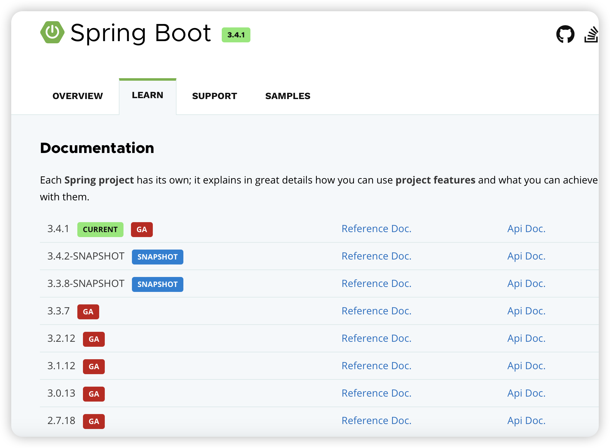

## SpringBoot版本

官网：https://spring.io/projects/spring-boot#learn



3.4.1.RELEASE

```
3-主版本
4-次版本(新特性，保证兼容)
1-增量版本(bug修复等)
GA-稳定版本
SNAPSHOT-快照，不如GA稳定
```

## JDK版本

截止2024.

目前，中国互联网行业 **Java 8** 和 **Java 11** 是主流版本，**Java 17** 正在被一些前沿团队尝试使用。如果是新项目开发，建议优先选择 Java 11 或 Java 17，以便利用性能和生态优势；对于老项目，Java 8 仍然是安全、稳定的选择。

### **如何选择合适的 Java LTS 版本？**

1. **选择 Java 8**：
   - 老旧系统维护，升级成本较高。
   - 依赖大量使用 Java 8 开发的第三方库。
2. **选择 Java 11**：
   - 新项目开发，关注性能和生态。
   - 需要一些现代特性（如 `var`、HTTP Client）。
3. **选择 Java 17**：
   - 新系统建设，追求性能优化和简洁语法。
   - 需要更强的面向对象特性（如 Sealed Classes）。
4. **选择 Java 21**：
   - 高并发、高性能需求。
   - 希望尝试最新的语法和 JVM 优化。

## 创建SpringBoot应用

常用3种：

```
Idea
SpringBoot
Maven(不推荐)
```

