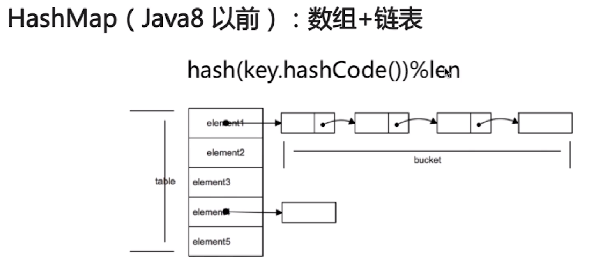
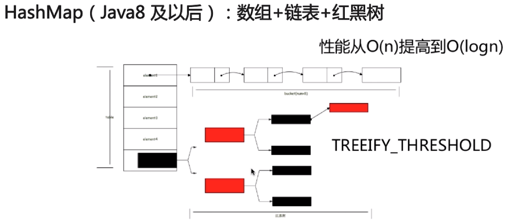

# Collection体系

## 1.HashMap()

### 1.1.Java8以前
HashMap(Java-8)之前: 使用数组+链表实现.<br>
<br>
在最极端的情况下:所有的Hash算法得出的结果都相同,时间复杂度编程O(n)<br>

### 1.2.Java8之后
为了解决最极端情况:<br>
Java8之后通过设置``TREEIFY_THRESHOLD``值,当一个``bucket``中的元素超过它时,就将该``bucket``转换成红黑树,可以让时间复杂的变成``O(logn)``<br>
```java
static final int TREEIFY_THRESHOLD = 8;
```
<br>

### 1.3.java8HashMap每个节点
```java
static class Node<K,V> implements Map.Entry<K,V> {
    final int hash;
    final K key;
    V value;
    Node<K,V> next;
```
可以看到每个Node完整保存了key和value,同时还有一个hash和next.<br>

### 1.4.HashMap的put方法逻辑
- 1.若HashMap未被初始化,则进行初始化操作
- 2.对Key做hash值,依据hash计算下标
    ```java
    if ((p = tab[i = (n - 1) & hash]) == null)
    tab[i] = newNode(hash, key, value, null);
    ```
- 3.若未发生碰撞,则直接放入桶中
- 4.若发生碰撞,则以链表的方式链入后面
- 5.若链表的长度超出阈值,且hashMap元素超过最低树化容量,则将链表转为红黑树
- 6.若节点已经存在,则用新值替换旧值
- 7.容桶满了(默认容量16*扩容因子0.75),就需要resize(扩容两倍后重排)

## 2.LinkedHashMap()
