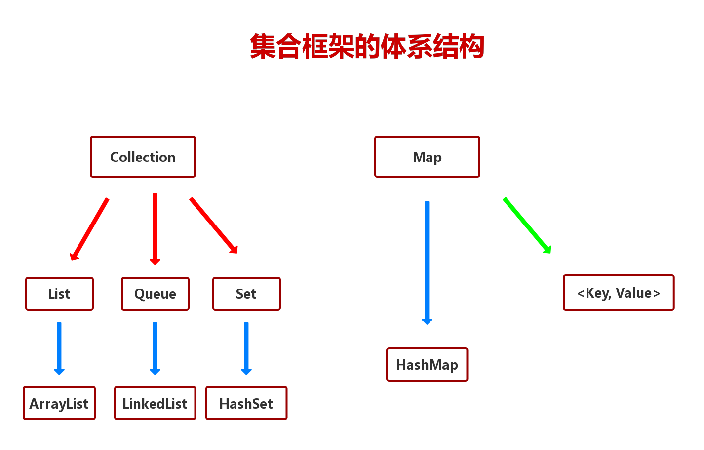

# java集合框架体系结构

## 1.简述
java中框架体系主要是Collection和Map两种<br>
Collection以集合形式存储数据,Map则以键值对方式存储数据<br>

<br>

## 2.List
- 1.List是元素有序并且可以重复的集合,称为序列
- 2.List可以精确的控制每个元素的插入位置,或删除某个位置的元素
- 3.List的两个主要实现类是ArrayList和LinkedList

### 2.1.ArrayList
- 1.ArrayList底层是由数组实现的
- 2.动态增长,以满足应用程序的需求
- 3.在列表尾部插入或删除数据非常有效
- 4.更适合查找和更新元素
- 5.ArrayList中的元素是可以为null

#### 2.1.1.ArrayList方法
ArrayList继承List和Conllection,所以我们先看父类的方法<br>
```java
/**
* Collection中的方法:
*/
boolean add(E e);        //在集合中插入一个元素
void clear();            //清除集合中的所有元素
boolean isEmpty();       //判断集合是否为空
Iterator<E> iterator();  //迭代器
boolean remove(Object o);//将指定元素移除
int size();              //返回集合中元素的个数
Object[] toArray();      //将集合元素所谓数组参数返回
<T> T[] toArray(T[] a);  //同上,类型有开发者指定
```
```java
/**
* List中的方法:
*/
E get(int index);          //返回指定下标的元素
int indexOf(Object o);     //返回第一个匹配指定对象的下标
int lastIndexOf(Object o); //返回最后一个匹配指定对象的下标
E set(int index, E element);//替换指定下标的对象
```
```java
/**
* ArrayList中的方法:
*/
boolean contains(Object o);        //判断一个类是否在集合中
void sort(Comparator<? super E> c);//排序
```

## 3.set集

### 3.1.HashSet集
- 1.HashSet是Set的一个重要实现类,称为哈希集
- 2.HashSet的元素无序并且不可以重复
- 3.HashSet中只允许一个null元素
- 4.HashSet具有良好的存取和查找性能

在HashSet中要注意的是,使用迭代器来取集合中的内容<br>
```java
Iterator it = set.iterator();
while(it.hasNext()){
    System.out.print(it.next()+"  ");
}
```

**当set集合中包含的对象是自定义对象,那么我们需要为该对象重写equals和hashCode方法**<br>
```java
public class Cat(){
    private String name;
    private int age;

    .................

    @Override
    public int hashCode(){
        ........
    }

    @Override
    public boolean equals(Object obj){
        if(this==obj)
            return true;
        if(obj.getClass()==Cat.class){
            Cat cat = (Cat)obj;
            return cat.getName().equals(name)&&cat.getAge().equals(age);
        }
        return false;
    }
}
```

### 3.2.HashSet.remove函数
在使用HashSet.remove函数要注意,查询的同时,不能执行删除操作.<br>
```java
/**
* 下面这段代码运行会出错
* ConcurrentModificationException
*/
for(Car car : set){
    if(car.id > 5)
        set.remove(car);
}
```
可以做以下更改:<br>
```java
HashSet<Cat> set1 = new HashSet<Cat>();
for(Car car : set){
    if(car.id > 5)
        set1.add(car);
}
set.removeAll(set1);
```

## 4.Map
- 1.Map中的数据是以键值对(Key-Value)的形式存储的
- 2.Key-value以Entry类型的对象实例存在
- 3.可以通过key值快速的查找value
- 4.一个映射不能包含重复的建

### 4.1.HashMap
- 1.基于哈希表的Map接口的实现
- 2.允许使用null值和null键
- 3.key值不允许重复
- 4.HashMap中的Entry对象是无序排列的

### 4.2.HashMap的常用方法

```java
/**
* 先看Map接口的常用方法
*/
void clear();              //清空集合的所有元素
Set<Map.Entry<K,V>> entrySet() //将Map的键值对元素保存到Entry中,再将所有的Entry放到Set集合并返回这个Set集合
V get(Object key);         //通过key来查询Value的值
boolean isEmpty();         //判断Map集合中是否有元素
Set<K> keySet();           //将map集合中的所有key打包成set类型返回.
V put(K key, V value);     //添加元素
V remove(Object key);      //通过key来删除元素
default V replace(K key, V value);//替换value
default boolean replace(K key, V oldValue, V newValue); //替换元素
int size();            //返回集合元素的个数
```

```java
/**
* HashMap的常用方法
*/
```

## 5.集合排序
### 5.1.对存储在List中的整形进行排序
```java
List<Integer> list = new ArrayList<Integer>();
Collections.sort(list);
```

### 5.2.对存储在List中的String进行排序
```java
List<String> list = new ArrayList<String>();
Collections.sort(list);
```

### 5.3.对自定义对象进行排序
- 1.实现一个比较器Comparator
- 2.使用Collection.sort(Object obj, Comparator comparator);进行排序

```java
public class ObjComparator implements Comparator{
    
    //实现接口中的方法
    public int compare(Object o1, Object o2) {
		// 返回值为0表示相等,小于零表示小于,大于零表示大于
		return 0;
	}
}
```