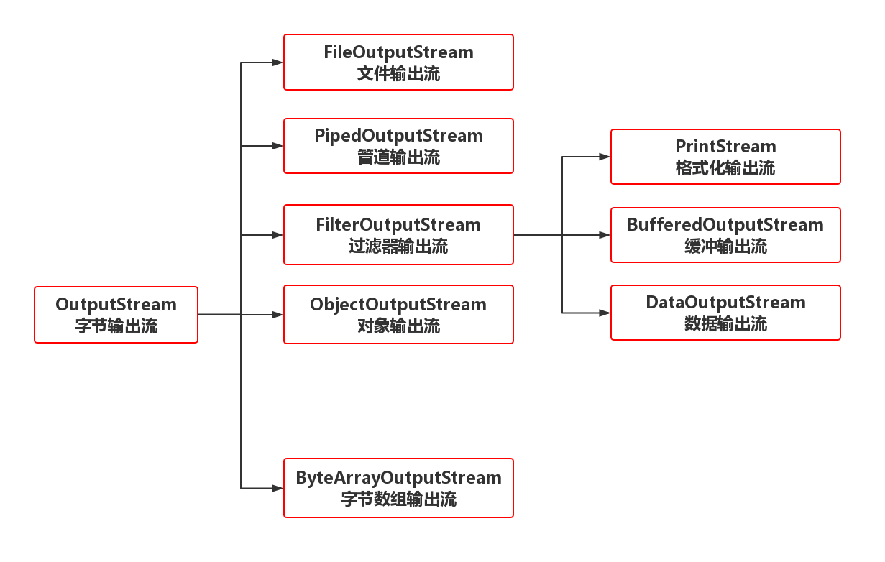
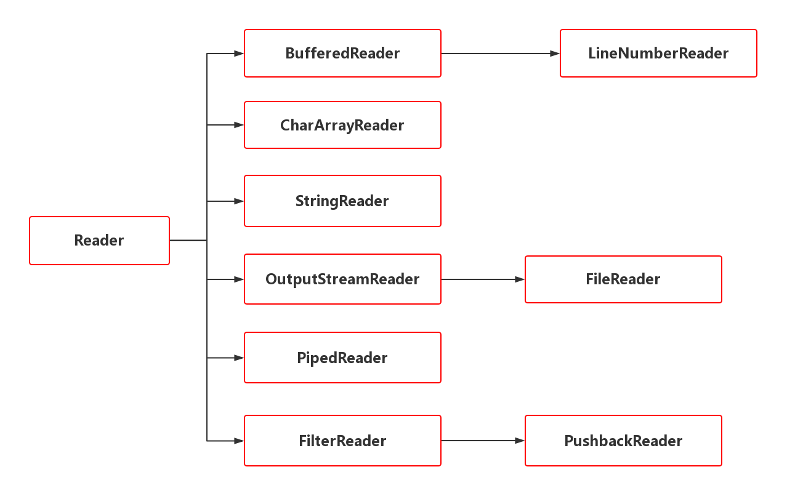
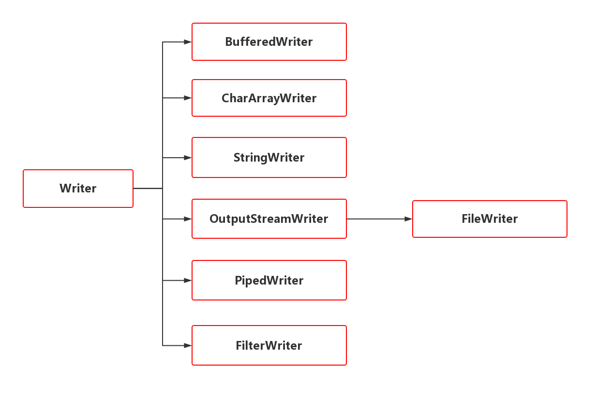

# Java中的文件操作和IO操作
 
## 1.JavaIO解释
在Java中IO有以下分类：<br>
- 1.面向字节
  - 1.字节输入流 读取数据 ``InputStream``
  - 2.字节输出流 写入数据 ``OutputStream``
- 2.面向字符
  - 1.字符输入流 读取数据 ``Reader``
  - 2.字符输出流 写入数据 ``Writer``

### 1.2.Stream流
Stream流可以理解为字节流，来区分字节流Writer和Reader。<br>
**输入流:**<br>
<br>

**输出流:**<br>
<br>

#### 1.2.1.FileInputStream
FileInputStream是文件输入流,我们看一下它的构造函数<br>
```java
FileInputStream(File file);
FileInputStream(String name);
FileInputStream(FileDescriptor fdObj);//FileDescriptor是文件描述符
```
前两个构造都是传入文件路径,最后一个是传入文件描述符.我们可以使用文件描述符来表达标准输入输出和错误输出<br>
```java
/**
* FileDescriptor
*/
static FileDescriptor err;
static FileDescriptor in;
static FileDescriptor out;
```

##### 1.2.1.1.FileInputStream常用函数之---read()
```java
int read();//读取一个字符
int read(byte[] b);//将读取的字符存入b字节数组
int read(byte[] b, int off, int len);//将读取的数据存储到b数组的以off下标开始的地方,最多读取len个字符
```

##### 1.2.1.2.FileInputStream常用函数之---close()

#### 1.2.3.FileOutputStream
看看它的构造方法<br>
```java
FileOutPutStream(File file);
FileOutputStream(FIle file, boolean append);//append 为true表示追加
FileOutPutStream(String file);
FileOutputStream(String file, boolean append);
FileOutputStream(FileDescriptor fdObj);//文件描述符~
```

##### 1.2.3.1.FileOutputStream常用方法-----write()
```java
public void write(int b);
public void write(byte[] b);
public void write(byte[] b,int off, int len);
```
##### 1.2.3.2.FileOutputStream常用方法---close()

#### 1.2.3.BufferedInputStream和BufferedOutputStream
缓冲输入输出流,相比于FileInputStream和FileOutputStrem来说可以提高很大的性能<br>
构造方法:<br>
```java
BufferedInputStream(InputStream in);
BufferedOutputStream(OutputStream out);
```
通过构造函数我们可以将缓冲流和其他字节输入输出流结合使用,来提高效率<br>

### 1.3.字节流
**输入流:**<br>
<br>
**输出流:**<br>
<br>

#### 1.3.1.字节转换流
- 1.InputStreamReader
- 2.OutputStreamWriter

我们先来看看构造方法:<br>
```java
InputStreamReader(InputStream in);
OutputStreamWriter(OutputStream out);
```

字节转换流是Reader和Writer的子类,所以可作为BufferedWriter和BufferedReader的构造参数<br>
```java
//常用方式:
BufferedWriter bw = new BufferedWriter(new OutputStreamWriter(new FileOutputStream("e:\\a.txt")));
```

## 2.标准输入输出流
```java
/**
* java.lang.System类
*/
static PrintStream	err;
static InputStream	in;
static PrintStream	out;
```


# File类文件操作相关

### 1.常见构造方法
```java
File(String pathname);
File(String parent, String child);
File(File parent, String child);
```

### 2.FIle类的功能

#### 1.创建
```java
boolean	createNewFile();//Atomically creates a new, empty file named by this abstract pathname if and only if a file with this name does not yet exist.

boolean	mkdir();//Creates the directory named by this abstract pathname.

boolean	mkdirs();//Creates the directory named by this abstract pathname, including any necessary but nonexistent parent directories.
```

#### 2.删除文件
删除文件夹时，其下不能有子文件或子目录。<br>
```java
boolean	delete();//Deletes the file or directory denoted by this abstract pathname.
```

#### 3.获取相关信息
```java
File  	getAbsoluteFile();//Returns the absolute form of this abstract pathname.
String	getAbsolutePath();//Returns the absolute pathname string of this abstract pathname.

String	getName();//Returns the name of the file or directory denoted by this abstract pathname.
String	getParent();//Returns the pathname string of this abstract pathname's parent, or null if this pathname does not name a parent directory.
File  	getParentFile();//Returns the abstract pathname of this abstract pathname's parent, or null if this pathname does not name a parent directory.

String	getPath();//Converts this abstract pathname into a pathname string.

long  	lastModified();//Returns the time that the file denoted by this abstract pathname was last modified.

long  	length();//Returns the length of the file denoted by this abstract pathname.

String[]	list();//Returns an array of strings naming the files and directories in the directory denoted by this abstract pathname.
File[]	  listFiles();//Returns an array of abstract pathnames denoting the files in the directory denoted by this abstract pathname.
static File[]	listRoots();//List the available filesystem roots.
```

#### 4.判断相关
```java
boolean	exists();//Tests whether the file or directory denoted by this abstract pathname exists.

boolean	isAbsolute();//Tests whether this abstract pathname is absolute.

boolean	isDirectory();//Tests whether the file denoted by this abstract pathname is a directory.
boolean	isFile();//Tests whether the file denoted by this abstract pathname is a normal file.
boolean	isHidden();//Tests whether the file named by this abstract pathname is a hidden file.
```

## 写文件案例
```
FileWriter fw = new FileWriter(tmpFileName, false);
fw.write(str);
```