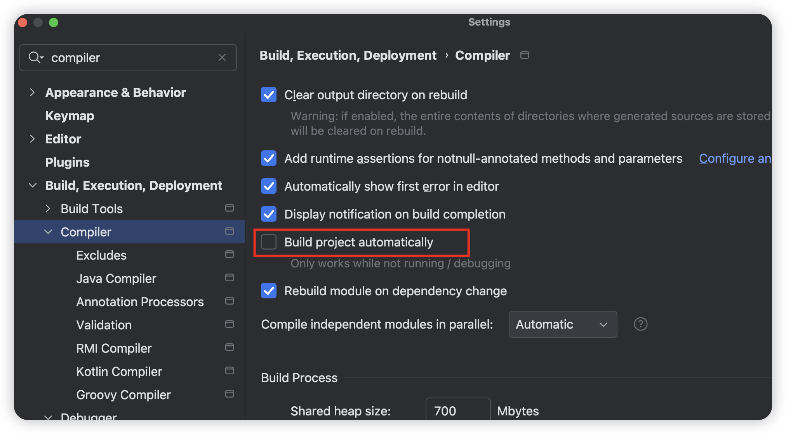

## 热启动配置

### 需要导入Dev-tools

```java
        <dependency>
            <groupId>org.springframework.boot</groupId>
            <artifactId>spring-boot-devtools</artifactId>
            <scope>runtime</scope>
            <optional>true</optional>
        </dependency>
```

引入工具后，当``target``目录文件发送变化后。会自动重启项目。


## 使用IDE功能在文件发生变化时，自动编译项目

