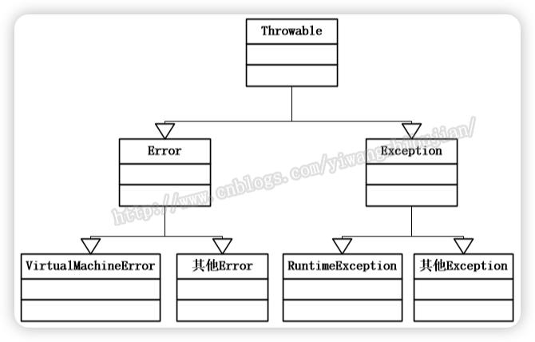
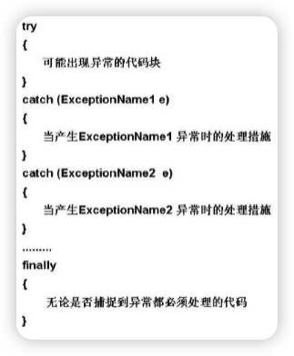

## spring-boot 异常处理机制

- 1.``@ControllerAdvice``
- 2.``@ExceptionHandler``

当存在``@ControllerAdvice``和``@ExceptionHandler``两个组合注解后，整个springboot项目的异常都会在这里统一处理。

```java
import org.springframework.web.bind.annotation.ControllerAdvice;
import org.springframework.web.bind.annotation.ExceptionHandler;

@ControllerAdvice
public class GlobalExceptionAdvice {
    @ExceptionHandler(value=Exception.class)
    public void handleException(HttpServletRequest req, Exception e) {
        System.out.println(e);
    }
}
```

## Java异常

### Java 异常体系

1. 顶层是throwable 

2. 第二层是 error 和 exception;
   1. <color>error 就是 虚拟机异常 VirtualMachineError;比如典型的 outofMemoryError, stackOverFlowError(滴滴面试);</color>
3. exception 两部分 1、编译时异常，2、运行时异常；
   1. 编译时异常(CheckedException): EOFExcetion; FileNotFoundException
      1. 程序运行过程中才可能发生的异常。一般为代码的逻辑错误。例如：类型错误转换，数组下标访问越界，空指针异常、找不到指定类等等。
   2. 运行时异常(RuntimeException):ClassNotFoundException;NullPointException;
      1. 编译期间可以检查到的异常，必须显式的进行处理（捕获或者抛出到上一层）。例如：IOException, FileNotFoundException等等。



### Java的异常处理

**常用关键字：try、catch、throw（抛出一个异常，动词）、throws（声明一个方法可能抛出的异常）、finally。**

#### **throws**（声明异常）

若方法中存在检查时异常，如果不对其捕获，那必须在方法头中显式声明该异常，以便于告知方法调用者此方法有异常，需要进行处理。 

在方法中声明一个异常，方法头中使用关键字throws，后面接上要声明的异常。若声明多个异常，则使用逗号分割。

若是父类的方法没有声明异常，则子类继承方法后，也不能声明异常。

#### try-catch（捕获异常）

示例：

```java
try {  
                        mSocket=new Socket(ip,port);  
                        if(mSocket!=null)  
                        {  
                            Log.i("Client","socket is create");  
                            clientInput=new ClientInputThread(mSocket);  
                            clientOutput=new ClientOutputThread(mSocket);  
                            clientInput.setStart(true);  
                            clientOutput.setStart(true);  
                          
                            clientInput.start();  
                            clientOutput.start();  
                              
                        }  
                        else {  
                            Log.i("Client","socket is not create");  
                        //  Toast.makeText(, "亲，服务器端连接出错",0).show();  
                        }  
                    } catch (UnknownHostException e) {  
                        // TODO Auto-generated catch block  
                        e.printStackTrace();  
                    } catch (IOException e) {  
                        // TODO Auto-generated catch block  
                        e.printStackTrace();  
                    }finally{}
```

从上述代码可以看到异常处理的步骤为:



1. 多个catch块时候，最多只会匹配其中一个异常类且只会执行该catch块代码，而不会再执行其它的catch块，且匹配catch语句的顺序为从上到下，也可能所有的catch都没执行。
