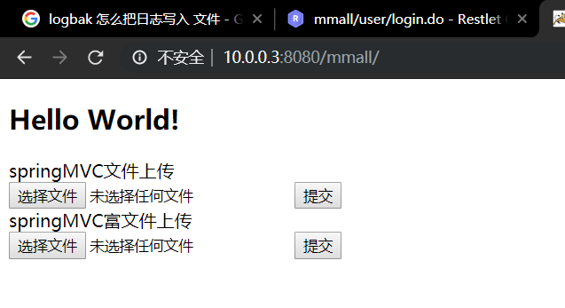

# FTP上传文件

我们要上传文件到服务器上时，通常需要放到FTP服务上。<br>
这里通过文件从本地到服务器的过程来介绍全过程<br>

## 1.前端接收文件
<br>
我们通过form表单提交文件上传请求:<br>
```jsp
<%@ page language="java" contentType="text/html; charset=UTF-8"
    pageEncoding="UTF-8"%>
<!DOCTYPE html>
<html>
<head>
<meta charset="UTF-8">
<title>Insert title here</title>
</head>
<body>
<h2>Hello World!</h2>
springMVC文件上传<br>
<form action="/mmall/manage/product/upload.do" method="post" enctype="multipart/form-data">
	<input type="file" name="upload_file"  />
	<input type="submit" name="springMVC文件上传" />
</form>
springMVC富文件上传<br>
<form action="/mmall/manage/product/richtext_img_upload.do" method="post" enctype="multipart/form-data">
	<input type="file" name="upload_file"  />
	<input type="submit" name="springMVC文件上传" />
</form>
</body>
</html>
```
要特别注意enctype的值是multipart/form-data;<br>

## 2.后端接收,并保存在服务器上
后端程序通过``MultipartFile``类型参数接收前端上传的文件对象.<br>
MultipartFile的实例化有成员方法``transferTo(path)``将文件上传到服务器上的path(资源指定符，包含路径和文件名)位置。<br>
```java
public ServerResponse upload(HttpSession session,
			@RequestParam(value = "upload_file", required = false) MultipartFile file, HttpServletRequest request){
        String path = request.getSession().getServletContext().getRealPath("upload/uploadFile.txt");
        file.transforTO(path);
    }
```

## 3.将文件拷贝到FTP管理的目录下
使用；<br>
```java
org.apache.commons.net.ftp.FTPClient;
```
```java
private boolean uploadFile(String remoteFile, File file) throws IOException {
    FTPClient ftpClient = new FTPClient();
    //fis输入流，用来读取被保存文件的内容
    FileInputStream fis = null;
    try {
        //连接ftp服务
        ftpClient.connect(ip);
        //登录ftp服务
        isSuccess = ftpClient.login(user, pwd);
    } catch (IOException e) {
        logger.error("ftp服务器连接异常", e);
    }
    //remoteFile是目标文件全名，内容是从参数file复制的
    ftpClient.changeWorkingDirectory(remoteFile);
    //设置缓冲区
    ftpClient.setBufferSize(1024);
    //设置编码
    ftpClient.setControlEncoding("UTF-8");
    //设置文件类型是二进制文件
    ftpClient.setFileType(FTPClient.BINARY_FILE_TYPE);
    ftpClient.enterLocalPassiveMode();
    fis = new FileInputStream(file);
    //传递原文件名和流，执行拷贝操作
	ftpClient.storeFile(file.getName(), fis);
}
```