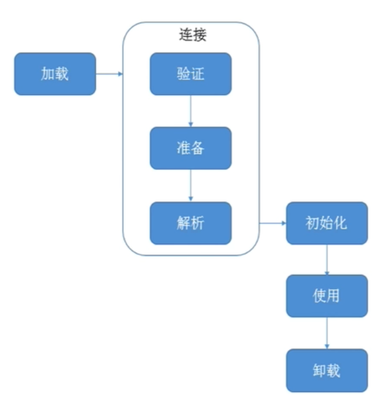
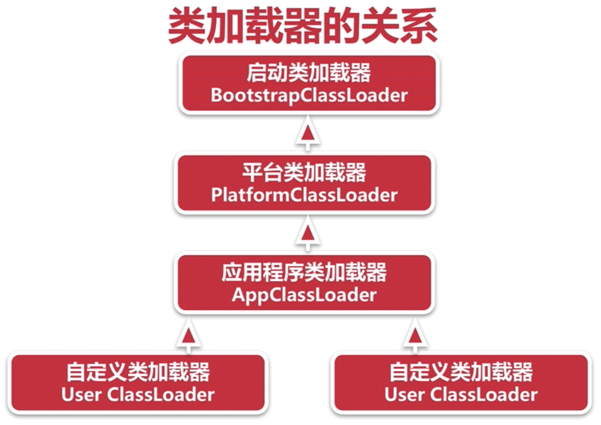
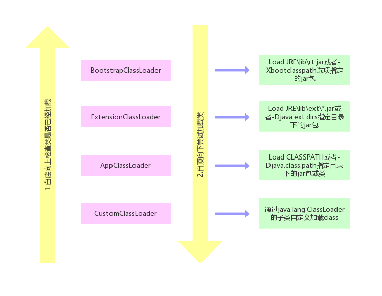

# 1.jvm如何加载class

## 01.类的生命周期

- 1.加载：查找并加载类的二进制数据
- 2.连接：就是将已经读入内存的类的二进制数据合并到JVM运行时环境中去，包含如下几个步骤：
    - 2.1.验证：确保被加载类的正确性
    - 2.2.准备：为类的静态变量分配内存，并初始化它们
    - 2.3.解析：把常量池中的符号引用转换成直接引用
- 3.初始化：为类的静态变量赋初始值

## 2.classLoader
- 1.ClassLoader是java的核心组件
- 2.主要工作在class装载阶段,从系统外部获取class二进制数据流
- 3.所有的class都由ClassLoader加载,再交给java虚拟机进行连接和初始化操作

### 2.1.classLoader的种类
- 1.BootStrapClassLoader: C++编写,加载核心库java.*
- 2.ExtClassLoader: java编写,加载扩展库javax.*(PlatformClassLoader JDK13以后废除Ext)
- 3.AppClassLoader: java编写,加载程序所在目录
- 4.自定义ClassLoader: java编写,定制化加载

### 2.2.classLoader的关系
层级关系：

- 1.启动类加载器：用于加载启动的基础模块类，比如：java.base,java.management,java.xml等等
- 2.平台类加载器：用于加载一些平台相关的模块，比如：java.scripting,java.compiler*,java.corba\*等等
- 3.应用程序类加载器：用于加载应用级别的模块，比如：jdk.compiler,jdk.jartool,jdk.jshell等等；还加载classpath路径中的所有类库

### 3.2.双生委派
 
- 1.一个类加载器收到类加载请求，自己不会加载该类，而是请求自己的父加载器加载该类，直到BootstrapClassLoader
- 2.BootstrapClassLoader会加载该类，或者反馈不能加载该类，再依此向下传递

双亲委派保证所有的类都是由同一个类加载器加载。
如果不存在双亲委派，用户编写的java.lang.Object，就会被低层次的类加载器加载。Java类型体系中最基础的行为也就无法保证。