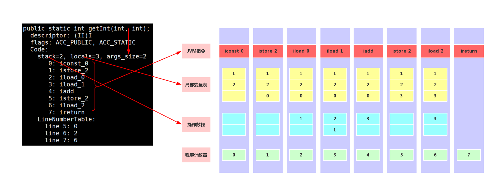

# java内存模型
- 1.线程角度
- 2.存储角度

## 1.从线程角度
线程私有:<br>
- 1.程序计数器
- 2.虚拟机栈
- 3.本地方法栈

线程共享:<br>
- 1.MetaSpace
- 2.java堆

<br>

### 1.1.程序计数器
- 1.当前线程执行字节码行号指示器(逻辑)
- 2.改变当前计数器的值来指向下一条要执行的字节码指令
- 3.每个线程有一一对应的程序计数器
- 4.只有java方法计算,native方法计数器为Undefined
- 5.不会发生内存泄漏

### 1.2.虚拟机栈
<br>
- 1.局部变量表:包含方法执行过程中的所有变量
- 2.操作数栈:入栈,出栈,复制,交换,产生消费变量

下面详细介绍局部变量表和操作数栈的关系:<br>
以下面的代码为例:<br>
```java
package com.noble;
  
class Test{
        public static int getInt(int i, int j){
                int c = 0;
                c = i + j;
                return c;
        }
}
```

```
javac com/noble/Test.java
javap -verbose com/noble/Test.class
```
下图详细解释了字节码指令执行时,操作数栈,局部变量表的变化规律.<br>
<br>

#### 问题java递归为什么会抛出java.lang.StackOverFlowError异常?
答案是 栈空间本身是有限制的.<br>

### 1.3.本地方法栈
- 与虚拟机栈类似.主要作用与标注了native的方法.<br>

### 1.4.MetaSpace元空间
MetaSpace中文称作元空间<br>
当类被加载时,元空间会存储类的信息:<br>
- 1.class: 目标类
- 2.Method: 目标类的方法
- 3.Feild: 目标类的字段
- 4.System类及其方法

## 2.面试常考问题
### 2.1.JVM三大性能调优参数
```
-Xms 堆的初始值
-Xmx 堆能达到的最大值
-Xss 规定每个线程虚拟机栈(堆栈)的大小
```

### 2.2.Java内存模型中堆和栈的区别

#### 内存分配策略
> 静态存储: 编译时就可以确定每个Feild所占空间<br>
> 栈式存储: 内存需求在编译时未知,在运行到当前模块时必须知道<br>
> 堆式存储: 编译时或运行时在模块入口都不能确定,动态存储<br>

#### Java内存模型中堆和栈的区别
> 管理方式: 栈自动释放,堆需要GC<br>
> 空间大小: 栈比堆小<br>
> 碎片相关: 栈产生的碎片远小于堆<br>
> 分配方式: 栈支持静态和动态分配<br>
> 效率:     栈的效率高<br>

<br>

### 2.3.解释JDK.6和之后版本 字符串intern()区别
```java
String s = new String("a");
s.intern();
```
> JDK6:当调用intern()方法时,如果字符串常量池先前已经创建出该字符串对象,则返回该字符串的引用.如果字符串常量池中没有该字符串常量,就创建新的字符串常量并返回该字符串的引用.<br>
> JDK6+:当调用intern()方法时,如果字符串常量池先前已经创建出该字符串对象,则返回该字符串的引用.否则,如果该字符串常量已经存在java堆中,则将堆中的此字符串常量的引用添加到字符串常量中,并返回该引用;如果堆中不存在,则在常量池中创建该字符串并返回引用.<br>