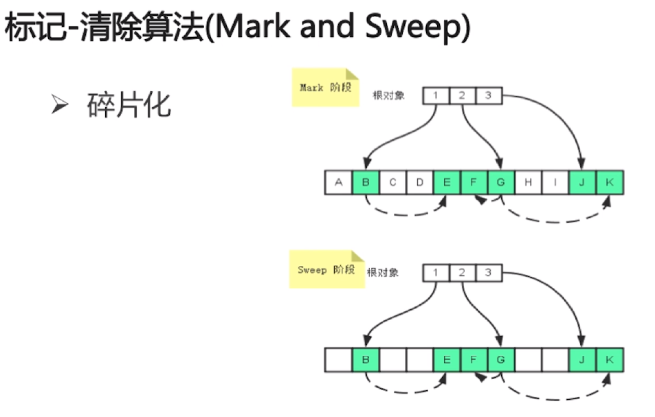
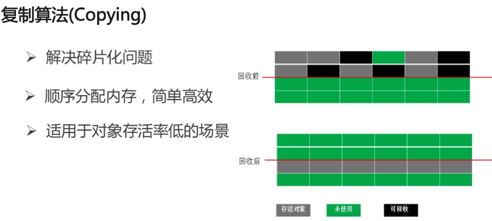
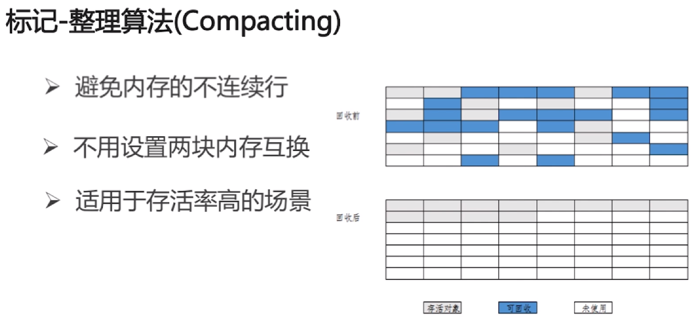
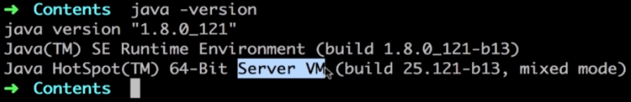

# java垃圾回收
垃圾回收大多指堆中对象的回收和方法区中字符串字面量的回收。在大量使用反射、动态代理、CGLib 等字节码框架、JSP 以及 OSGi 这类频繁自定义类加载器的场景中，通常都需要 Java 虚拟机具备类型卸载的能力，以保证不会对方法区造成太大压力。

## 分代收集理论
堆内存收集依据经验，有如下假说
- 绝大多数类都是很快死亡的
- 熬过越多次垃圾收集过程的对象就越难以消亡
- 跨代引用(如新生代引用老年代中的类)相对于同代引用是极少的
对堆内存划分区域，使用不同的垃圾回收策略是非常有必要的
## 1.找到垃圾
判断一个对象是否有用,就是垃圾回收机制的主要难题.<br>
常见方法:<br>
- 1.计数引用
- 2.可达性分析


### 1.1.引用计数算法
- 1.通过判断对象的引用树,是否可以被回收
- 2.每个对象实例都有一个计数器,当被引用时+1,引用销毁-1
- 3.任何引用计数为0的对象,可以被当作垃圾回收

#### 1.1.1.特点
- 1.速度快,开销小,基本不会打断程序运行
- 2.不能检测循环引用
- 3.每个类需要做计数器维护工作

### 1.2.可达性分析

#### 1.2.1.可被当作pathRoot的引用
- 1.虚拟机栈中引用的对象(栈帧中的本地变量表)
- 2.方法区中的常量引用的对象
- 3.方法区中静态属性引用对象
- 4.Native方法引用对象
- 5.活跃线程引用对象


## 2.垃圾回收算法

### 2.1.标记-清除算法
- 1.标记:从根集合进行扫描,对存活的对象标记
- 2.对堆内存从头到尾线性遍历,对不可达的对象清除



### 2.2.标记-复制算法
- 1.将内存分为对象区和空白区
- 2.对象在对象区创建
- 3.执行清除算法,存活的对象被复制到空白区
- 4.将对象区的所有内容清除(变成空白区)


统计数据表示新生代中的对象有 98% 熬不过第一次垃圾回收。存在一种 ```Appel 回收``，HotSpot 虚拟机的 Serial、ParNew 等新生代收集器均采用了这种策略。
Appel 具体做法是将新生代内存划分为 8:1:1 三个区域，称为 Eden 和 2 个 Survivor
- 创建对象时在 Eden 和一个 Survivor 上存储内存，可以使用 90% 存储空间
- 新生代 GC 时，将 Eden 和使用的 Survivor 存活对象，拷贝到另一个 Survivor 上
- GC 拷贝完成，清除 Eden 和之前的 Survivor
### 2.3.标记整理算法
- 1.标记:从根集合进行扫描,对存活的对象进行标记
- 2.清除:移动所有的对象,且按照内存地址依次排列,然后将末端地址之后的内存地址全部回收

<br>

### 2.4.分代收集算法
- 1.内存分为年轻代和老年代(java8之前,java8取消了老年代)
- 2.年轻代有一个Eden和两个Surviver区(8:1)
- 3.年轻代使用**复制算法** 又叫做MinorGC
- 4.老年代使用**标记整理算法** 又叫做FullGC

#### 2.4.1.调优参数
```
-XX:SurvivorRatio : Eden和Survivor内存大小的比值 默认8:1
-XX:NewRatio : 老年代和年轻代内存大小比值 默认大概2:1
-XX:MaxTenuringThreshold : 对象从年轻代晋升到老年代经过GC次数的最大阈值
```

#### 2.4.2.触发FullGC的条件
- 1.老年代空间不足
- 2.CMS GC时出现``promotion failed``,``concurrent mode failure``
- 3.MinorGC晋升到老年代的平均大小大于老年代的剩余空间
- 4.调用System.gc() 告知JVM进行回收,但不一定会回收


#### 2.4.3.stop-the-world
- 1.JVM由于执行GC而停止了应用进程的执行
- 2.任何一种GC算法中都会发生
- 3.多数GC优化通过减少stop-the-world发生的时间来提高程序性能

#### 2.4.4.safePoint
只有在safePoint才有可能运行GC<br>
- 1.分析过程中对象引用关系不会发生变化的点
- 2.产生safePoint的地方:方法调用;循环跳转;异常跳转;
- 3.safePoint的数量要适中

## 3.新生代垃圾回收器

### 3.1.JVM运行模式
- 1.server
- 2.client

<br>

