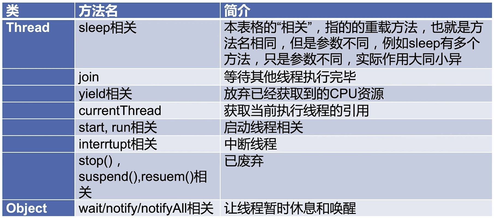
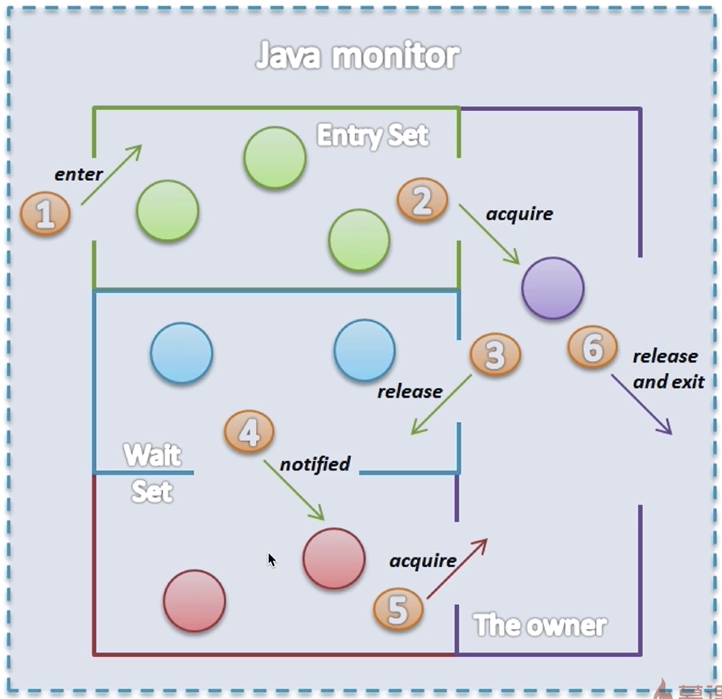

# ThreadObject重要方法
- 1.为什么线程通信的方法wait(),notify()和notifyAll()被定义在Object类里？而sleep定义在Thread类里？
- 2.用3种方式实现生产者模式
- 3.join和sleep和wait期间线程的状态分别是什么？为什么？

## 主要内容
- 1.方法概览
- 2.wait，notify，notifyAll方法详解 (重要)
- 3.sleep方法详解 (重要)
- 4.join方法 (重要)
- 5.yield方法
- 6.获取当前线程的引用：Thread.currentThread()方法
- 7.start和run方法
- 8.stop，suspend，resume方法

## 方法概览


## wait,notify,notifyAll
- notify 唤醒一个线程
- notifyAll 唤醒所有线程

### 1.wait,notify简单演示
- 1.thread1先获得锁
- 2.thread2没有获得锁时不能执行
- 3.thread1调用wait释放锁
- 4.thread2获得锁调用notify()唤醒thread1
- 5.thread1没有获得锁不能执行
- 6.thread2执行完毕退出释放锁
- 7.thread1获得锁继续执行1.


```java
/**
 * @program: simple2
 * @description: 展示wait和notify的基本用法
 * 1. 研究代码执行顺序
 * 2. 证明wait释放锁
 * @author: wangyuqing3
 * @created: 2021/03/30 21:57
 */
public class Wait {
    public static Object object = new Object();

    static class Thread1 extends Thread {
        public static void main(String[] args) throws InterruptedException {
            Thread1 thread1 = new Thread1();
            Thread2 thread2 = new Thread2();
            thread1.start();
            Thread.sleep(200);
            thread2.start();
        }
        @Override
        public void run() {
            synchronized (object) {
                System.out.println("线程" + Thread.currentThread().getName() + "开始执行");
                try {
                    object.wait();
                } catch (InterruptedException e) {
                    e.printStackTrace();
                }
                System.out.println("线程" + Thread.currentThread().getName() + "获取到了锁");
            }
        }
    }

    static class Thread2 extends Thread {
        @Override
        public void run() {
            synchronized (object) {
                object.notify();
                System.out.println("线程" + Thread.currentThread().getName() + "调用了notify()");
            }
        }
    }
}
```
```
线程Thread-0开始执行
线程Thread-1调用了notify()
线程Thread-0获取到了锁
```

### 2.notifyAll演示
```java
/**
 * @program: simple2
 * @description: 3个线程，线程1和线程2首先被阻塞，线程3唤醒他们
 * start先执行不代表线程先启动
 * @author: wangyuqing3
 * @created: 2021/03/30 22:08
 */
public class WaitNotifyAll implements Runnable {
    private static final Object resourceA = new Object();

    public static void main(String[] args) throws InterruptedException {
        Runnable r = new WaitNotifyAll();
        Thread threadA = new Thread(r);
        Thread threadB = new Thread(r);
        final Thread threadC = new Thread(new Runnable() {
            @Override
            public void run() {
                synchronized (resourceA) {
                    resourceA.notifyAll();
                    System.out.println("ThreadC notified");
                }
            }
        });
        threadA.start();
        threadB.start();
        Thread.sleep(200);
        threadC.start();
    }

    @Override
    public void run() {
        synchronized (resourceA) {
            System.out.println(Thread.currentThread().getName() + " got resourceA lock.");
            try {
                System.out.println(Thread.currentThread().getName() + " invoke wait()");
                resourceA.wait();
                System.out.println(Thread.currentThread().getName() + "'s waiting to end.");
            } catch (InterruptedException e) {
                e.printStackTrace();
            }
        }
    }
}
```
```
Thread-0 got resourceA lock.
Thread-0 invoke wait()
Thread-1 got resourceA lock.
Thread-1 invoke wait()
ThreadC notified
Thread-0's waiting to end.
Thread-1's waiting to end.
```

### 3.证明wait释放锁不影响其他锁
```java
/**
 * @program: simple2
 * @description:
 * 证明wait只释放当前的那把锁
 * @author: wangyuqing3
 * @created: 2021/03/30 22:24
 */
public class WaitNotifyReleaseOwnMonitor {
    private static volatile Object resourceA = new Object();
    private static volatile Object resourceB = new Object();

    public static void main(String[] args) {
        final Thread thread1 = new Thread(() -> {
            synchronized (resourceA) {
                System.out.println("ThreadA got resourceA lock");
                synchronized (resourceB) {
                    System.out.println("ThreadA got resourceB lock");
                    try {
                        System.out.println("ThreadA releases resourceA lock.");
                        resourceA.wait();
                    } catch (InterruptedException e) {
                        e.printStackTrace();
                    }
                }
            }
        });

        final Thread thread2 = new Thread(() -> {
            try {
                Thread.sleep(1000);
            } catch (InterruptedException e) {
                e.printStackTrace();
            }
            synchronized (resourceA) {
                System.out.println("ThreadB got resourceA lock");
                synchronized (resourceB) {
                    System.out.println("ThreadB got resourceB lock");
                }
            }
        });
        thread1.start();
        thread2.start();
    }
}
```
```
ThreadA got resourceA lock
ThreadA got resourceB lock
ThreadA releases resourceA lock.
ThreadB got resourceA lock
```

### 4.wait原理
