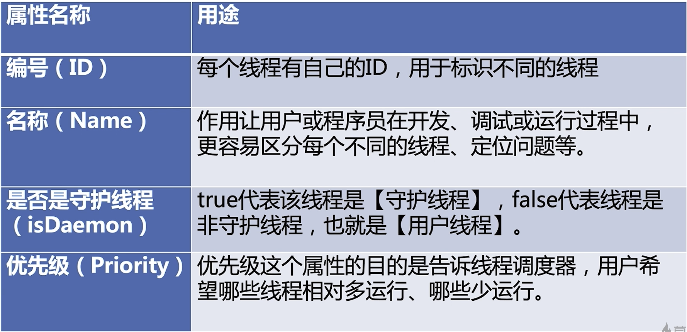

# 线程属性
- 什么时候我们需要设置守护线程
- 我们应该如何应用线程优先级来帮助程序运行？有哪些禁忌
- 不同的操作系统如何处理优先级问题



# 线程安全
《java Conrurrency in Practice》：
当多个线程访问一个对象时，如果不用考虑这些线程在运行时环境下的调度和交替运行，也不需要进行额外的同步，或者在调用方进行任何其他协调操作，调用这个对象的行为都可以获得正确的结果，那这个对象是线程安全的。

- 1.运行结果错误：a++多线程下出现小时的请求现象
- 2.活跃性问题：死锁、活锁、饥饿
- 3.对象发布和初始化的时候线程安全

## 1.对象发布线程安全
下面这个事例，类初始化还没有结束，就调用this方法，将类发布出去。其他线程访问时，因时间不同获取到类的状态不同。
```java
public class MultiThreadsError {
    static Point point;

    public static void main(String[] args) throws InterruptedException {
        new Thread(new PointMaker()).start();
        Thread.sleep(10);
        if (point != null) {
            System.out.println(point);
        }
    }
}

class Point {
    private final int x, y;
    public Point(int x, int y) throws InterruptedException {
        this.x = x;
        MultiThreadsError.point = this;
        Thread.sleep(100);
        this.y = y;
    }
    @Override
    public String toString() {
        return x + "," + y;
    }
}

class PointMaker implements Runnable {
    @Override
    public void run() {
        try {
            new Point(1,1);
        } catch (InterruptedException e) {
            e.printStackTrace();
        }
    }
}
```
```
1,0
```

## 2.观察者模式监听器注册-线程安全
下面这个案例
主线程注册监听器，并初始化count
子线程sleep 10ms后触发监听器

结果count没有初始化完成就完成了监听器触发
```java
public class MultiThreadsError {
    int count;
    public MultiThreadsError(MySource source) {
        source.registerListener(new EventListener() {
            @Override
            public void onEvent(Event e) {
                System.out.println("\n我得到的数字是"+count);
            }
        });
        for (int i = 0; i < 10000; i++) {
            System.out.print(i+" ");
        }
        count = 100;
    }

    public static void main(String[] args) {
        MySource source = new MySource();
        new Thread(new Runnable() {
            @Override
            public void run() {
                try {
                    Thread.sleep(10);
                } catch (InterruptedException e) {
                    e.printStackTrace();
                }
                source.eventCome(new Event() {});
            }
        }).start();
        MultiThreadsError threadsError = new MultiThreadsError(source);
    }
    static class MySource {
        private EventListener listener;
        void registerListener(EventListener eventListener) {
            this.listener = eventListener;
        }
        void eventCome(Event e) {
            if (listener != null) {
                listener.onEvent(e);
            } else {
                System.out.println("还未初始化完毕");
            }
        }
    }
    interface EventListener {
        void onEvent(Event e);
    }
    interface Event {}
}
```
```
0 1 2 3 4 5 6 7 8 9 10 11 12 .....
我得到的数字是0
332 333 334 335 336 337 338 ......
```