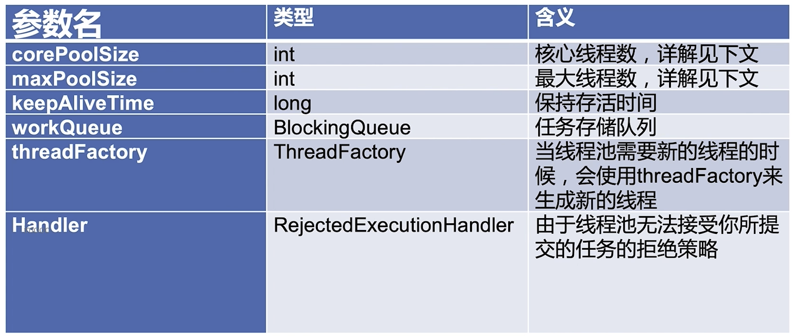
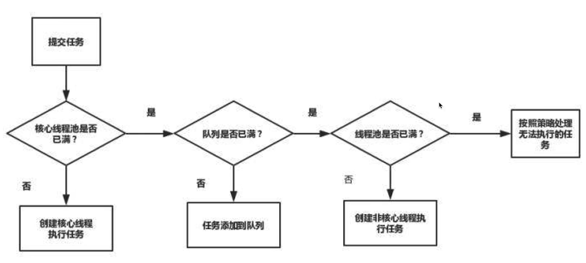

# 线程池

## 使用场景举例
服务器接收到大量的请求时，使用线程池计数是非常合适的，它可以大大减少线程的创建和销毁次数，提高服务器的工作效率

## 线程池构造函数的参数


## corePoolSize
线程池在完成初始化后，默认情况下，线程池中并没有任何线程，线程池会等待有任务到来时，再创建线程去执行任务

## maxPollSize
线程池有可能会在核心线程数的基础上，额外增加一些线程(任务存储到达上限时才在corePoolSize基础上创建新线程 )，但是这些新增加的线程数有一个上限，这就是最大量maxPoolSize

## keepAliveTime
如果线程池当前线程数多于corePoolSize，那么如果多余的线程空闲时间超过keepAliveTime，它们就会终止

## ThreadFactory
新的线程是由ThreadFactory创建的，默认使用Executors.defaultThreadFactory()，创建出来的线程都在同一个线程组，拥有同样的NORM_PRIORITY优先级并且都不是守护线程。如果自己指定ThreadFactory,那么就可以改变线程名，线程组，优先级，是否是守护线程等。

## workQueue
有三种常见的队列类型：
- 1.直接交接：SynchronousQueue.    新任务会直接创建新线程
- 2.无界队列：LinkedBlockingQueue  永远不会创建新线程(可能outmemery)
- 3.有界队列：ArrayBlockingQueue

### 添加线程的规则


## 线程池的特点
- 1.通过设置corePoolSize和maxPoolSize相同，就可以创建固定大小的线程池
- 2.线程池希望保持较少的线程数，并且只有在负载变得很大时才增加它
- 3.通过设置maxPoolSize为很高的值，例如Integer.MAX_VALUE，可以允许线程池容纳任意数量的并发任务。
- 4.只有在队列满时才创建多于corePoolSize的线程，所以如果使用的是无界队列(例如LinkedBlockingQueue)，那么线程就不会超过corePoolSize

## 线程池建议手动创建
某人线程池使用的是无限队列LinkedBlockingQueue。可能oom

### 1.线程池里的线程数量设定为多少合适

- 1.CPU密集型(加密，计算hash等)：最佳线程数为CPU核心数的1-2倍左右
- 2.耗时IO型（读写数据库，文件，网络读写等）：最佳线程数一般大于cpu核心数很多倍，以JVM线程监控显示繁忙情况为依据，保证线程空闲可以衔接上，参考Brain Goetz推荐的计算方法：
    - 线程数 = CPU核心数*(1+平均等待时间/平均工作时间)

    
## 线程池拒绝4策略
- AbortPolicy 直接抛出异常
- DiscardPolicy 默默丢弃
- DiscardOldestPolicy 丢弃队列中最老的任务
- CallerRunsPolicy 让提交这个任务的线程执行
    - 1.任务不会丢失
    - 2.提交任务的线程会(变慢)

    
## 线程池案例
```java
@Configuration
@EnableAsync
@Slf4j
public class ExecutorConfig {
    @Bean
    public Executor asyncServiceExecutor() {
        log.info("start executor init");
        ThreadPoolTaskExecutor executor = new ThreadPoolTaskExecutor();
        //配置核心线程数
        executor.setCorePoolSize(10);
        //配置最大线程数
        executor.setMaxPoolSize(10);
        //配置队列大小
        executor.setQueueCapacity(99);
        //配置线程池中的线程的名称前缀
        executor.setThreadNamePrefix("async-service-");

        // rejection-policy：当pool已经达到max size的时候，如何处理新任务
        // CALLER_RUNS：不在新线程中执行任务，而是由调用者所在的线程来执行
        executor.setRejectedExecutionHandler(new ThreadPoolExecutor.CallerRunsPolicy());
        //执行初始化
        executor.initialize();
        return executor;
    }
}
```