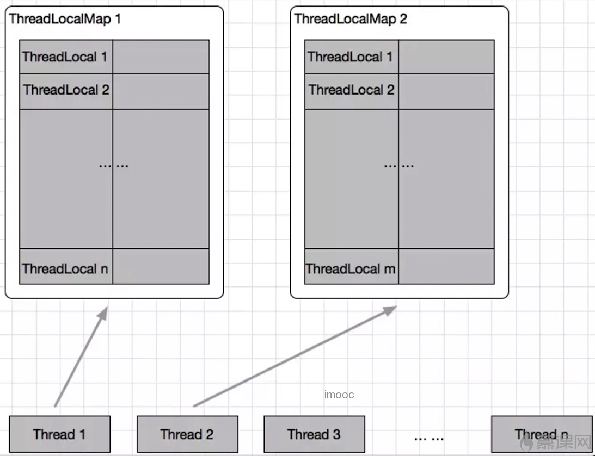

# ThreadLocal的使用
 
## 解决问题
使用线程池处理问题时，有一些工具类会在每次任务中实例化一次。一千个任务就创建销毁一千次。
ThreadLocal可以让这个工具类在每个线程中独自存在一份，10个线程就创建十次。不会因任务的数量反复创建。



每一个Thread有一个ThreadLocalMap，里面放多个ThreadLocal

## 重要方法

### T initialValue()
- 1.该方法会返回当前线程对应的“初始值”，这是一个**延迟加载**的方法，只有在**调用get**的时候，才会触发
- 2.当线程**第一次使用get方法**访问变量时，将调用此方法，除非线程先前调用了set方法，在这种情况下，不会为线程调用本initialValue方法


### void set(T t)
为这个线程设置一个新值
```java
public void set(T value) {
    Thread t = Thread.currentThread();
    ThreadLocalMap map = getMap(t);
    if (map != null)
        map.set(this, value);
    else
        createMap(t, value);
}
```

- 1.先获取本线程，调用getMap(Thread t)方法获取ThreadLocalMap
- 2.如果ThreadLocalMap存在就添加或覆盖新值，否则创建一个TreadLocalMap


### T get()
得到这个线程对应的value。如果是首次调用get(), 则会调用initialize来得到这个值

### void remove() 
删除对应这个线程的值


## 注意点
### ThreadLocal内存泄露
- ThreadLocal对象是不会被回收的
- JDK已经考虑到了这个问题，所以在set，remove，rehash方法中会扫描key为null的Entry，并把对应的value设置为null，这样value对象就可以被回收了
- 但是如果一个ThreadLocal不被使用，那么实际上set，remove，rehash方法也不会被调用，如果同时线程又不停止，那么调用练就一直存在，那么就导致了value的内存泄漏
- 调用remove方法，删除不用的ThreadLocal

### 空指针异常
在get之前，需要先set。否则拿到的是null

### 共享对象
如果在每个线程中ThreadLocal.set()进去的东西本来就是多线程共享的同一个对象，比如static对象，那么多线程的ThreadLocal.get()取得的还是这个共享对象本身，还是有并发访问问题

## 在Spring中的实例分析
每次HTTP请求都对应一个线程，线程之间相互隔离，这就是ThreadLocal的典型应用场景