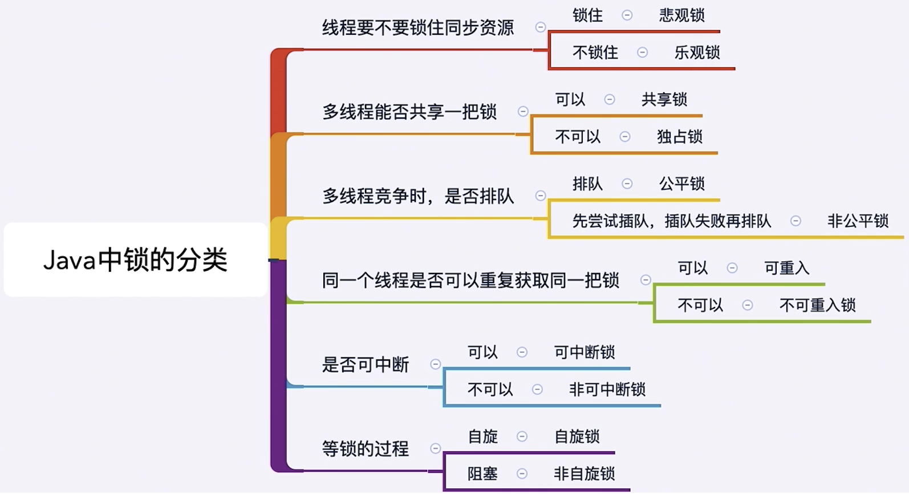

# java-spring中各种锁

- 锁是一种工具，用于控制对共享资源的访问
- Lock和synchronized，这两个是最常见的锁，它们都可以达到线程安全的目的，但是在使用上和功能上又有较大的不同。
- Lock并不是用来代替synchronized的，而是当使用synchronized不合适或不足以满足要求的时候，来提供高级功能的

## 为什么synchronized不够用
- 1.效率低：锁的释放情况少，试图获得锁时不能设置超时时间，不能中断一个正在试图获取锁的线程
- 2.不够灵活：加锁和释放的时机单一，每个锁仅有单一的条件(某个对象)，可能是不够的
- 3.无法知道是否能成功获得锁

## Lock主要方法介绍
- 1.在Lock中声明了四个方法获取锁
- 2.lock(), tryLock(), tryLock(long time, TimeUnit unit), lockInterruptibly()

### 1.lock()
- 1.lock()就是最普通的获取锁。如果锁已经被其他线程获取，则进行等待
- 2.lock()不会像synchronized一样在异常时自动释放锁
- 3.因此最佳实践是，在finally中释放锁，以保证发生异常时锁一定被释放
- 4.lock()方法不能被中断，这会带来很大的隐患：一旦陷入死锁，lock()就会陷入永久等待

```java
import java.util.concurrent.locks.Lock;
import java.util.concurrent.locks.ReentrantLock;

/**
 * Lock不会像synchronized一样，异常时自动释放锁，所以最佳实践是，在finally中释放锁。以便保证发生异常的时候锁一定被释放
 */
public class MustUnlock {
    private static Lock lock = new ReentrantLock();

    public static void main(String[] args) {
        lock.lock();
        try {
            // 获取本锁保护的资源
            System.out.println(Thread.currentThread().getName() + "start mission");
        }finally {
            lock.unlock();
        }
    }
}
```

### tryLock()
- tryLock()用了尝试获取锁，如果当前锁没有被其他线程占用，则获取成功，则返回true，否则返回false，代表获取锁失败
- 相比lock，这样的方法显然功能更强大了，我们可以根据是否能获取到锁来**决定后续程序的行为**
- (没有参数)该方法会立即返回，即便在拿不到锁时也不会等待
- tryLock(long time, TimeUnit unit) 超时就放弃

两个线程配合获取锁的案例
```java
import java.util.Random;
import java.util.concurrent.TimeUnit;
import java.util.concurrent.locks.Lock;
import java.util.concurrent.locks.ReentrantLock;

public class TryLockDeadlock implements Runnable{
    int flag = 1;
    static Lock lock1 = new ReentrantLock();
    static Lock lock2 = new ReentrantLock();

    public static void main(String[] args) {
        TryLockDeadlock r1 = new TryLockDeadlock();
        TryLockDeadlock r2 = new TryLockDeadlock();
        r1.flag = 0;
        r2.flag = 1;
        new Thread(r1).start();
        new Thread(r2).start();
    }
    @Override
    public void run() {
        for (int i = 0; i < 100; i++) {
            if (flag == 1) {
                try {
                    if (lock1.tryLock(800, TimeUnit.MILLISECONDS)) {
                        try {
                            System.out.println("线程1获取到了锁1");
                            Thread.sleep(new Random().nextInt(1000));
                            if (lock2.tryLock(800, TimeUnit.MILLISECONDS)) {
                                try {
                                    System.out.println("线程1获取到了锁2");
                                    System.out.println("线程1成功获取到两把锁");
                                    break;
                                } finally {
                                    lock2.unlock();
                                }
                            } else {
                                System.out.println("线程1获取第2把锁失败");
                            }
                        } finally {
                            lock1.unlock();
                            Thread.sleep(new Random().nextInt(1000));
                        }
                    } else {
                        System.out.println("线程1获取锁1失败，已重试");
                    }
                } catch (InterruptedException e) {
                    e.printStackTrace();
                }
            }
            if (flag == 0) {
                try {
                    if (lock2.tryLock(3000, TimeUnit.MILLISECONDS)) {
                        try {
                            System.out.println("线程2获取到了锁2");
                            Thread.sleep(new Random().nextInt(1000));
                            if (lock1.tryLock(3000, TimeUnit.MILLISECONDS)) {
                                try {
                                    System.out.println("线程2获取到了锁1");
                                    System.out.println("线程2成功获取到两把锁");
                                    break;
                                } finally {
                                    lock1.unlock();
                                }
                            } else {
                                System.out.println("线程2获取第1把锁失败");
                            }
                        } finally {
                            lock2.unlock();
                            Thread.sleep(new Random().nextInt(1000));
                        }
                    } else {
                        System.out.println("线程2获取锁2失败，已重试");
                    }
                } catch (InterruptedException e) {
                    e.printStackTrace();
                }
            }
        }
    }
}
```
```
线程2获取到了锁2
线程1获取到了锁1
线程1获取第2把锁失败
线程2获取到了锁1
线程2成功获取到两把锁
线程1获取到了锁1
线程1获取到了锁2
线程1成功获取到两把锁

Process finished with exit code 0
```

## 锁的分类


### 1.乐观锁和悲观锁
悲观锁适合并发写入多的情况，适用于临界区持锁时间比较长的情况，悲观锁可以避免大量的无用自旋等消耗，典型情况：
- 1.临界区有IO操作
- 2.临界区代码复杂或者循环量大
- 3.临界区竞争非常激烈

乐观锁：适合并发写入少，大部分是读取的场景，不加锁的能让读取性能大幅提高


#### 1.1.悲观锁
悲观锁也叫做互斥同步锁
如果不锁住资源，别人就会争抢，会造成数据结果错误，所以每次悲观锁为了确保数据结果正确性，会在每次获取并修改数据时，把数据锁住，让别人无法访问该数据，这样就保证了数据内容万无一失
- java中悲观锁的实现就是synchronized和Lock相关类

如果持有锁的线程被永久阻塞(如：无限循环，死锁等)，那么等待该线程是否锁的其他线程将永远得不到执行

#### 1.2.乐观锁
乐观锁也叫做非互斥同步锁
认为自己在处理操作的时候不会有其他线程来干扰，所以并不会锁住被操作对象
在更新的时候，去对比在我修改的期间数据有没有被其他人改变过：如果没有被改变，就说明真的只有我自己在操作，那我就正常去修改数据
如果数据和我一开始拿到的不一样了，说明其他人在这段时间内改变过数据，那我就不能继续刚才的更新数据过程了，我会选择放弃、报错、重试等策略

乐观锁一般都是利用CAS算法实现的

- 乐观锁的典型例子就是原子类、并发容器等

### 可重入锁
同一个线程可以多次获取这把锁，不用释放锁，每获取一次锁 数值加一。后面必须解锁相同的数值才能被其他线程获取。

- 降低死锁可能性
- 简化代码

```java
getHoldCount 返回当前线程加锁次数
isHeldByCurrentThread 可以看出锁是否被当前线程持有
getQueueLength返回当前正在等待这把锁的队列有多长
```

### 公平锁非公平锁
公平锁：所有想要拿锁的线程按先后顺序放在队列中，依此获取锁执行
非公平锁：一个线程释放锁后又想要获取锁，不管这个线程是否再等待队列中，为了降低CPU切换线程的开销，依然让该线程执行

```java
import java.util.Random;
import java.util.concurrent.locks.Lock;
import java.util.concurrent.locks.ReentrantLock;

public class FairLock {
    static Thread[] threads = new Thread[10];
    public static void main(String[] args) throws InterruptedException {
        PrintQueue printQueue = new PrintQueue();
        for (int i = 0; i < threads.length; i++) {
            threads[i] = new Thread(new Job(printQueue));
        }
        for (int i = 0; i < threads.length; i++) {
            threads[i].start();
            Thread.sleep(100);
        }
    }
}

class Job implements Runnable {
    private PrintQueue printQueue;
    Job(PrintQueue printQueue) {
        this.printQueue = printQueue;
    }
    @Override
    public void run() {
        System.out.println(Thread.currentThread().getName() + "开始打印");
        printQueue.printJob();
        System.out.println(Thread.currentThread().getName() + "打印完毕");
    }
}

class PrintQueue{
    private Lock queueLock = new ReentrantLock(false);
    public void printJob () {
        queueLock.lock();
        try {
            int duration = new Random().nextInt(10) + 1;
            System.out.println(Thread.currentThread().getName() + "正在打印 需要" + duration + "s");
            Thread.sleep(duration * 1000);
        } catch (InterruptedException e) {
            e.printStackTrace();
        } finally {
            queueLock.unlock();
        }
        queueLock.lock();
        try {
            int duration = new Random().nextInt(10) + 1;
            System.out.println(Thread.currentThread().getName() + "正在打印 需要" + duration + "s");
            Thread.sleep(duration * 1000);
        } catch (InterruptedException e) {
            e.printStackTrace();
        } finally {
            queueLock.unlock();
        }
    }
}
```

### 共享锁排他锁
- 排他锁，又称为独占锁，独享锁
- 共享锁，又称读锁，获得共享锁后，可以查看但无法修改和删除数据，其他线程此时可以获取到共享锁，也可以查看但无法修改和删除数据
- 共享锁和排他锁的典型是读写锁ReentrantReadWriteLock，其中读锁是共享锁，写锁是独享锁

```java
import java.util.concurrent.locks.ReentrantReadWriteLock;

public class CinemaReadWrite {
    private static ReentrantReadWriteLock reentrantReadWriteLock = new ReentrantReadWriteLock();
    private static ReentrantReadWriteLock.ReadLock readLock = reentrantReadWriteLock.readLock();
    private static ReentrantReadWriteLock.WriteLock writeLock = reentrantReadWriteLock.writeLock();

    private static void read() {
        readLock.lock();
        try {
            System.out.println(Thread.currentThread().getName() + "得到了读锁，正在读取");
            Thread.sleep(1000);
        } catch (InterruptedException e) {
            e.printStackTrace();
        } finally {
            readLock.unlock();
            System.out.println(Thread.currentThread().getName() + "释放读锁");
        }
    }

    private static void write() {
        writeLock.lock();
        try {
            System.out.println(Thread.currentThread().getName() + "得到了写锁，正在写入");
            Thread.sleep(1000);
        } catch (InterruptedException e) {
            e.printStackTrace();
        } finally {
            System.out.println(Thread.currentThread().getName() + "释放写锁");
            writeLock.unlock();
        }
    }

    public static void main(String[] args) {
        new Thread(()->read(),"Thread1").start();
        new Thread(()->read(),"Thread2").start();
        new Thread(()->write(),"Thread3").start();
        new Thread(()->write(),"Thread4").start();
    }
}
```
```
Thread1得到了读锁，正在读取
Thread2得到了读锁，正在读取
Thread1释放读锁
Thread3得到了写锁，正在写入
Thread2释放读锁
Thread3释放写锁
Thread4得到了写锁，正在写入
Thread4释放写锁
```

#### 1.读写锁插队策略
- 公平锁：不允许插队
- 非公平锁：
    - 写锁可以随时插队
    - 读锁仅在队列头节点不是想获取写锁的线程的时候可以插队

##### 源码
```java
static final class NonfairSync extends Sync {
    private static final long serialVersionUID = -8159625535654395037L;
    final boolean writerShouldBlock() {
        return false; // writers can always barge
    }
    final boolean readerShouldBlock() {
        /* As a heuristic to avoid indefinite writer starvation,
         * block if the thread that momentarily appears to be head
         * of queue, if one exists, is a waiting writer.  This is
         * only a probabilistic effect since a new reader will not
         * block if there is a waiting writer behind other enabled
         * readers that have not yet drained from the queue.
         */
        return apparentlyFirstQueuedIsExclusive();
    }
}

static final class FairSync extends Sync {
    private static final long serialVersionUID = -2274990926593161451L;
    final boolean writerShouldBlock() {
        return hasQueuedPredecessors();
    }
    final boolean readerShouldBlock() {
        return hasQueuedPredecessors();
    }
}
```

### 锁的升降级
只支持降级 不支持升级

## 自旋锁和阻塞锁
常见的情况是 线程没有拿到锁被阻塞，只能等到被唤醒。这个阻塞和唤醒是有开销的。
自旋锁，让线程不放弃CUP，而是让当前线程自旋，如果在自旋完成后前面的锁已经释放，那么当前线程就可以不必阻塞而直接获取同步资源，从而避免切换线程的开销

注意：如果锁被占用的时间过长，那么自旋只会浪费CPU资源

### 1.代码实现
```java
import java.util.concurrent.atomic.AtomicReference;

public class SpinLock {
    private AtomicReference<Thread> sign = new AtomicReference<>();

    public void lock() {
        Thread current = Thread.currentThread();
        while (!sign.compareAndSet(null, current)) {
            System.out.println("自旋获取失败，再次尝试");
        }
    }

    public void unlock() {
        Thread current = Thread.currentThread();
        sign.compareAndSet(current, null);
    }

    public static void main(String[] args) {
        SpinLock spinLock = new SpinLock();
        final Runnable runnable = new Runnable() {
            @Override
            public void run() {
                System.out.println(Thread.currentThread().getName() + "开始尝试获取自旋锁");
                spinLock.lock();
                System.out.println(Thread.currentThread().getName() + "得到自旋锁");
                try {
                    Thread.sleep(300);
                } catch (InterruptedException e) {
                    e.printStackTrace();
                } finally {
                    spinLock.unlock();
                    System.out.println(Thread.currentThread().getName() + "释放了自旋锁");
                }
            }
        };
        Thread thread1 = new Thread(runnable);
        Thread thread2 = new Thread(runnable);
        thread1.start();
        thread2.start();
    }
}
```

## 可中断锁
在java中synchronized就是不可中断锁，而Lock是可中断锁
tryLock(time) 和 lockInterruptibly都能响应中断。

如果某一线程A正在执行锁中的代码，另一线程B正在等待获取该锁，可能由于等待时间过长，线程B不想等待了，想先处理其他事情，我们可以中断它，这种就是可中断锁

## 锁优化
### JAVA JVM对锁的优化
- 自旋锁和自适应
- 锁消除
- 锁粗化

### 最佳实践
- 1.缩小同步代码块
- 2.尽量不要锁住方法
- 3.减少锁的次数
- 4.避免人为制造“热点”
- 5.锁中尽量不要再包含锁
- 6.选择合适的锁类型或合适的工具类