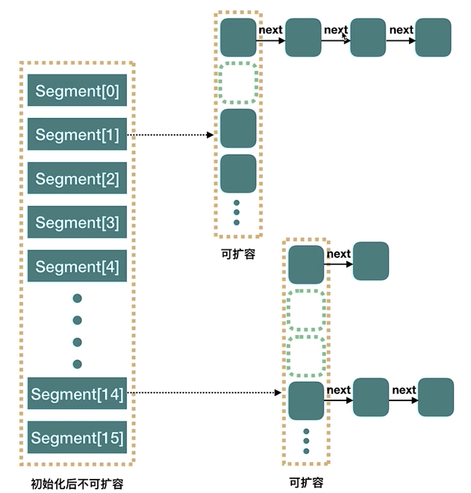
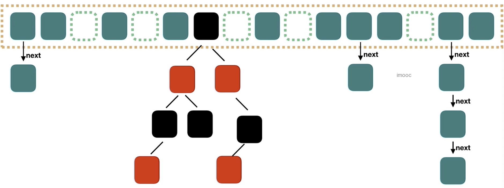
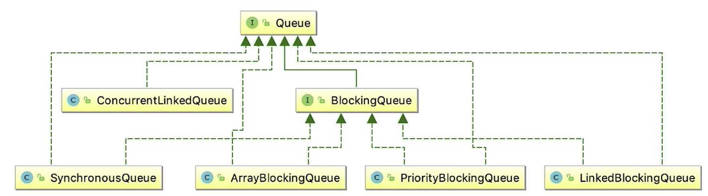

# 并发容器

## ConcurrentHashMap

### 1.java7中ConcurrentHashMap实现


- Java7中的ConcurrentHashMap最外层是多个**segment**，每个segment的底层数据结构与HashMap类似，仍然是数组和链表组成的**拉链法**
- 每个segment**独立上ReentrantLock锁*，每个segment之间互不影响，提高了并发效率
- ConcurrentHashMap默认有16个Segments，所以最多可以**同时支持16个线程并发写**(操作分布在不同的segment上)。这个默认值可以在初始化的时候设置为其他值，但是一旦初始化以后，是不可以扩容的

## 2.Java8中的ConcurrentHashMap
完全重写Java7中的版本，代码增加了6倍

- 虚线框中称为node，每个node都是线程独立的

### 2.1.ConcurrentHashMap实践
错误实例：
```java
private static ConcurrentHashMap<String, Integer> scores = new ConcurrentHashMap<String, Integer>();
scores.put("name", 0);
// 并发代码
int score = scores.get("name");
scores.put("name", score+1);
```

- concurrentHashMap能保证put或者get时是线程安全的。但是当我们自己get之后再set同一个值(set的值和get的值有关)是会发生线程安全的。

修改为正确代码：
```java
private static ConcurrentHashMap<String, Integer> scores = new ConcurrentHashMap<String, Integer>();
scores.put("name", 0);
// 并发代码
while(true) {
    int score = scores.get("name");
    boolean result = scores.replace("name", score, score+1);
    if (result) break;
}

scores.put("name", score+1);
```


## CopyOnWriteArrayList
- 在写之前先将数据拷贝一份，在新的数据上修改
- 修改完成后修改指针指向新数据源

特点：
- 1.原始数据不可变，因为没有人修改
- 2.因为1，所以读操作不会因为写操作而加锁
- 3.适合读多，写少的场景
- 4.每次修改都要拷贝数据，要考虑拷贝的成本(一般还好，因为新数据还没准备好之前有旧数据可以读取)


## 并发队列


### 1.BlockingQueue 阻塞队列
- 阻塞队列是具有 **阻塞** 功能的 **队列**，首先它是一个队列，其次是拥有阻塞功能
- 通常，阻塞队列的一端是给生产者放数据用，另一段是给消费者拿数据用。阻塞队列是**线程安全的**，所以生产者和消费者可以是多线程。

### 2.重要方法
#### 2.1.经典方法
- take()方法：获取并移除队列的头节点，如果执行take时，**队列里无数据，则阻塞**，直到队列里有数据
- put()方法：插入元素。如果队列**已满**，那么就无法继续插入，**则阻塞**，直到队列里有了空闲空间

#### 2.2.第二组方法
- add: 如果队列满 会抛出异常
- remove: 队列空 会抛出异常
- element: 返回队列头元素，为空抛异常

#### 2.3.第三组方法
- offer: 添加元素，如果队列满了返回false
- poll: 取出元素，同时删除 为空返回null
- peek: 取出元素，不删除 为空返回null

### 3.ArrayBlockingQueue
- 有界
- 指定容量
- 公平：还可以指定是否需要保证公平，如果想保证公平的话，那么等待了最长时间的线程会被优先处理，不过这会同时带来一定的性能损耗

```java
public class ArrayBlockingQueueDemo {


    public static void main(String[] args) {

        ArrayBlockingQueue<String> queue = new ArrayBlockingQueue<String>(3);

        Interviewer r1 = new Interviewer(queue);
        Consumer r2 = new Consumer(queue);
        new Thread(r1).start();
        new Thread(r2).start();
    }
}

class Interviewer implements Runnable {

    BlockingQueue<String> queue;

    public Interviewer(BlockingQueue queue) {
        this.queue = queue;
    }

    @Override
    public void run() {
        System.out.println("10个候选人都来啦");
        for (int i = 0; i < 10; i++) {
            String candidate = "Candidate" + i;
            try {
                queue.put(candidate);
                System.out.println("安排好了" + candidate);
            } catch (InterruptedException e) {
                e.printStackTrace();
            }
        }
        try {
            queue.put("stop");
        } catch (InterruptedException e) {
            e.printStackTrace();
        }
    }
}

class Consumer implements Runnable {

    BlockingQueue<String> queue;

    public Consumer(BlockingQueue queue) {

        this.queue = queue;
    }

    @Override
    public void run() {
        try {
            Thread.sleep(1000);
        } catch (InterruptedException e) {
            e.printStackTrace();
        }
        String msg;
        try {
            while(!(msg = queue.take()).equals("stop")){
                System.out.println(msg + "到了");
            }
            System.out.println("所有候选人都结束了");
        } catch (InterruptedException e) {
            e.printStackTrace();
        }
    }
```

### 4.LinkedBlockingQueue
- 无界
- 容量Integer.MAX_VALUE
- 内部结构:Node，两把锁。分析put方法

### 5.PriorityBlockingQueue
- 支持优先级
- 自然顺序(而不是先进先出)
- 无界队列
- PriorityQueue的线程安全版本

### 6.SynchronousQueue
- 它的容量为0
- SynchronousQueue没有peek等函数，因为peek的含义是取出头节点，但是SynchronousQueue的容量是0，所以没有头节点，也就没有peek方法。同理，没有iterate相关方法
- 是一个极好的用来**直接传递**的并发数据结构
- SynchronousQueue是线程池Executors.newCachedThreadPool()使用的阻塞队列