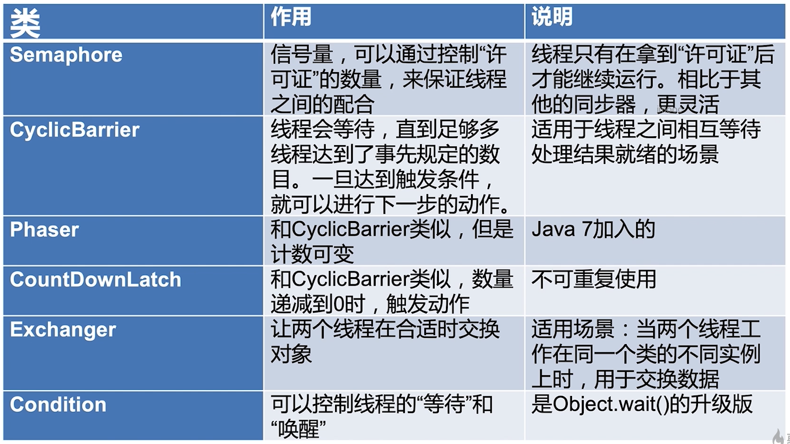
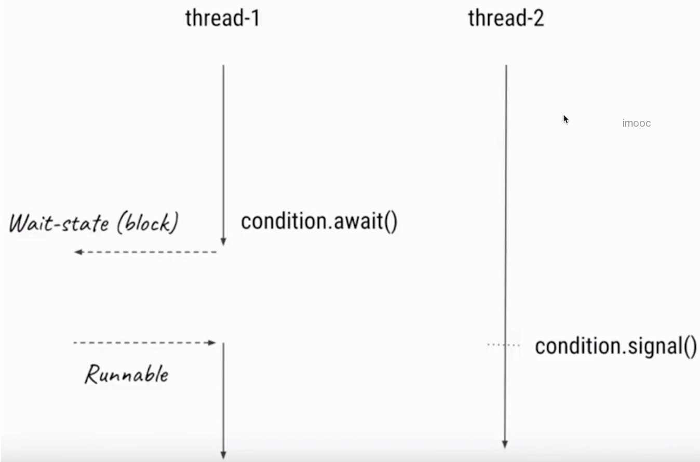

# 控制并发流程
- 控制并发流程的工具类，作用就是帮助我们程序员更容易得让线程之间合作
- 让线程之间相互配合，来满足业务逻辑
- 比如让**线程A等待线程B执行完成**后再执行



## CountDownLatch倒计时门闩
- 例子：大巴(游乐园坐过山车)，人满发车
- 流程：倒数结束前，一直处于等待状态，直到倒计时结束，此线程才继续工作

### 1.主要方法

- CountDownLatch(int count): 仅有一个**构造函数**，参数count为需要倒数的数值
- await():调用await方法的线程会被挂起，它会等待直到count值为0才继续执行。
- countDown(): 将count值减1，直到为0时，等待的线程会被唤起

### 2.主要用法
#### 2.1.一个线程等待多个线程执行完毕
```java
import java.util.concurrent.CountDownLatch;
import java.util.concurrent.ExecutorService;
import java.util.concurrent.Executors;

/**
 * 描述：     工厂中，质检，5个工人检查，所有人都认为通过，才通过
 */
public class CountDownLatchDemo1 {

    public static void main(String[] args) throws InterruptedException {
        CountDownLatch latch = new CountDownLatch(5);
        ExecutorService service = Executors.newFixedThreadPool(5);
        for (int i = 0; i < 5; i++) {
            final int no = i + 1;
            Runnable runnable = new Runnable() {

                @Override
                public void run() {
                    try {
                        Thread.sleep((long) (Math.random() * 10000));
                        System.out.println("No." + no + "完成了检查。");
                    } catch (InterruptedException e) {
                        e.printStackTrace();
                    } finally {
                        latch.countDown();
                    }
                }
            };
            service.submit(runnable);
        }
        System.out.println("等待5个人检查完.....");
        latch.await();
        System.out.println("所有人都完成了工作，进入下一个环节。");
    }
}
```

#### 2.2.多个线程等待某一个线程的信号，同时开始执行工作
```java
import java.util.concurrent.CountDownLatch;
import java.util.concurrent.ExecutorService;
import java.util.concurrent.Executors;

/**
 * 描述：     模拟100米跑步，5名选手都准备好了，只等裁判员一声令下，所有人同时开始跑步。当所有人都到终点后，比赛结束。
 */
public class CountDownLatchDemo1And2 {

    public static void main(String[] args) throws InterruptedException {
        CountDownLatch begin = new CountDownLatch(1);

        CountDownLatch end = new CountDownLatch(5);
        ExecutorService service = Executors.newFixedThreadPool(5);
        for (int i = 0; i < 5; i++) {
            final int no = i + 1;
            Runnable runnable = new Runnable() {
                @Override
                public void run() {
                    System.out.println("No." + no + "准备完毕，等待发令枪");
                    try {
                        begin.await();
                        System.out.println("No." + no + "开始跑步了");
                        Thread.sleep((long) (Math.random() * 10000));
                        System.out.println("No." + no + "跑到终点了");
                    } catch (InterruptedException e) {
                        e.printStackTrace();
                    } finally {
                        end.countDown();
                    }
                }
            };
            service.submit(runnable);
        }
        //裁判员检查发令枪...
        Thread.sleep(5000);
        System.out.println("发令枪响，比赛开始！");
        begin.countDown();

        end.await();
        System.out.println("所有人到达终点，比赛结束");
    }
```

## Semaphore信号量
- Semaphore可以用来**限制**或管理数量**有限的资源**的使用情况
- 信号量的作用是维护一个“**许可证**”的计数，线程可以“获取”许可证，那信号量剩余的许可证就减一，线程也可以“释放”许可证，那信号量剩余的许可证就加一，当信号量所拥有的许可证数量为0，那么下一个还想要获取许可证的线程，就需要等待，直到有另外的线程释放了许可证

### 1.信号量使用流程
- 1.初始化Semaphore并指定**许可证的数量**
- 2.在需要被限制的代码前加acquire()或者acquireUninterruptibley()方法
- 3.在任务执行结束后，调用release()来释放许可证

### 2.重要方法
- new Semaphore(int permits, boolean fair); 这里可以设置是否使用**公平**策略，如果传入true，那么Semaphore会把之前等待的线程放到FIFO的队列里，以便于有了新的许可证，可以分发给之前等了最长时间的线程。
- acquire() 获取信号量(可以响应中断)
- acquireUninterruptibly() 获取信号量(不响应中断)
- tryAcquire() 看看现在有没有空闲的许可证，如果有的话就获取，如果没有也没关系，我不会陷入阻塞，我可以去做别的事，过一会再来看许可证的空闲情况。
- tryAcquire(timeout) 和tryAcquire()一样，但多了一个超时时间，比如“在3s内获取不到许可证，我就去做别的事”
- release() 归还许可证

```java
import java.util.concurrent.ExecutorService;
import java.util.concurrent.Executors;
import java.util.concurrent.Semaphore;

/**
 * 描述：     演示Semaphore用法
 */
public class SemaphoreDemo {

    static Semaphore semaphore = new Semaphore(5, true);

    public static void main(String[] args) {
        ExecutorService service = Executors.newFixedThreadPool(50);
        for (int i = 0; i < 100; i++) {
            service.submit(new Task());
        }
        service.shutdown();
    }

    static class Task implements Runnable {

        @Override
        public void run() {
            try {
                semaphore.acquire(3);
            } catch (InterruptedException e) {
                e.printStackTrace();
            }
            System.out.println(Thread.currentThread().getName() + "拿到了许可证");
            try {
                Thread.sleep(2000);
            } catch (InterruptedException e) {
                e.printStackTrace();
            }
            System.out.println(Thread.currentThread().getName() + "释放了许可证");
            semaphore.release(2);
        }
    }
}
```

### 3.注意点
- 1.**获取**和**释放**的许可证数量必须**一致**，否则比如每次都获取2个但是只释放1个甚至不释放，随着时间的推移，到最后许可证数量不够用，会导致程序卡死。(虽然信号量类并不对是否和获取的数量做限定，但是这是我们的编程规范，否则容易出错)
- 2.注意在初始化Semaphore的时候设置**公平性**，一般设置为true会更合理
- 3.并不是必须由获取许可证的线程释放那个许可证，事实上，**获取和释放许可证对线程并无要求，也许是A获取了，然后由B释放**，只要逻辑合理即可。

## Condition接口(条件对象)
- 当线程1需要等待某个条件的时候，它就去执行**condition.await()**方法，一旦执行了await()方法，线程就会进入**阻塞**状态
    - 然后通常会有另外一个线程，假设是线程2，去执行对应的条件，直到这个条件达成的时候，线程2就会去执行**condition.signal()**方法，这时JVM就会从被阻塞的线程中找，找到哪些等待该condition的线程，线程1就会收到可执行信号的时候，它的线程状态就会变成**Runnable**可执行状态

    
    
### 1.重要方法
- signalAll() 会唤起**所以**的正在等待的线程
- signal() 是**公平**的，只会唤起那个等待时间最长的线程

```java
import java.util.concurrent.locks.Condition;
import java.util.concurrent.locks.ReentrantLock;

/**
 * 描述：     演示Condition的基本用法
 */
public class ConditionDemo1 {
    private ReentrantLock lock = new ReentrantLock();
    private Condition condition = lock.newCondition();

    void method1() throws InterruptedException {
        lock.lock();
        try{
            System.out.println("条件不满足，开始await");
            condition.await();
            System.out.println("条件满足了，开始执行后续的任务");
        }finally {
            lock.unlock();
        }
    }

    void method2() {
        lock.lock();
        try{
            System.out.println("准备工作完成，唤醒其他的线程");
            condition.signal();
        }finally {
            lock.unlock();
        }
    }

    public static void main(String[] args) throws InterruptedException {
        ConditionDemo1 conditionDemo1 = new ConditionDemo1();
        new Thread(new Runnable() {
            @Override
            public void run() {
                try {
                    Thread.sleep(1000);
                    conditionDemo1.method2();
                } catch (InterruptedException e) {
                    e.printStackTrace();
                }
            }
        }).start();
        conditionDemo1.method1();
    }
}
```

### 2.Condition注意点
- 实际上，如果说Lock用来代替synchronized，那么Condition就是用来代替相对应的Object.wait/notify的，所以在用法和性质上，几乎都一样
- await方法会自动释放持有的Lock锁，和Object.wait一样，不需要自己手动释放锁
- 调用await的时候，必须持有锁，否则会抛出异常，和Object.wait一样。

## CyclicBarrier循环栅栏
- CyclicBarrier循环栅栏和CountDownLatch很类似，都能阻塞一组线程
- 当由大量线程相互配合，分别计算不同任务，并且需要最后统一**汇总**的时候，我们可以使用CyclicBarrier。CyclicBarrier可以构造一个集结点，当某一个线程执行完毕，它就会到集结点等待，直到所有线程都到了集结点，那么该栅栏就被撤消，所有线程再统一出发，继续执行剩下的任务。
- 生活中的例子：“咱们3个人明天中午在学校碰面，都到齐后，一起讨论下学期的计划”

```java
import java.util.concurrent.BrokenBarrierException;
import java.util.concurrent.CyclicBarrier;

/**
 * 描述：    演示CyclicBarrier
 */
public class CyclicBarrierDemo {
    public static void main(String[] args) {
        CyclicBarrier cyclicBarrier = new CyclicBarrier(5, new Runnable() {
            @Override
            public void run() {
                System.out.println("所有人都到场了， 大家统一出发！");
            }
        });
        for (int i = 0; i < 10; i++) {
            new Thread(new Task(i, cyclicBarrier)).start();
        }
    }

    static class Task implements Runnable{
        private int id;
        private CyclicBarrier cyclicBarrier;

        public Task(int id, CyclicBarrier cyclicBarrier) {
            this.id = id;
            this.cyclicBarrier = cyclicBarrier;
        }

        @Override
        public void run() {
            System.out.println("线程" + id + "现在前往集合地点");
            try {
                Thread.sleep((long) (Math.random()*10000));
                System.out.println("线程"+id+"到了集合地点，开始等待其他人到达");
                cyclicBarrier.await();
                System.out.println("线程"+id+"出发了");
            } catch (InterruptedException e) {
                e.printStackTrace();
            } catch (BrokenBarrierException e) {
                e.printStackTrace();
            }
        }
    }
}
```

### 1.与CountDownLatch的区别
- 作用不同：CyclicBarrier要等待固定数量的线程都达到了栏栅位置才能继续执行，而CountDownLatch只需要等待数字到0，也就是说，CountDownLatch用于事件，但是CyclicBarrier是用于线程的
- 可重用性不同：CountDownLatch在倒数到0并触发门闩打开后，就不能再次使用了，除非新建新的实例；而CyclicBarrier可以重复使用