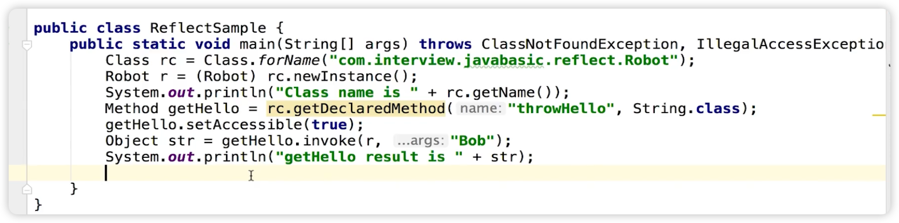

# JVM

- Class Loader: 依据特定格式，加载class文件到内存
- Execution Engine：对命令进行解析
- Native Interface：融合不同开发语言的原生库位Java所用
- Runtime Data Area：JVM内存空间结构模型

# 谈谈反射

JAVA 反射机制是在运行状态中，对于任意一个类，都能够知道这个类的所有属性和方法；对于任意一个对象，都能够调用它的任意方法和属性；这种动态获取信息以及动态调用对象方法的功能称为java 语言的反射机制。 

1. Class.forName：通过类路径加载class
2. rc.newInstance()：创建对象
3. rc.getDeclaredMethod("throwHello", String.class)：获取名称是"throwHello"，入参定义是一个String的方法
4. getHello.setAccessible(true)：throwHello是privite方法，现形设置可以访问
5. getHello.invoke(r, "Bob")：调用这个方法。