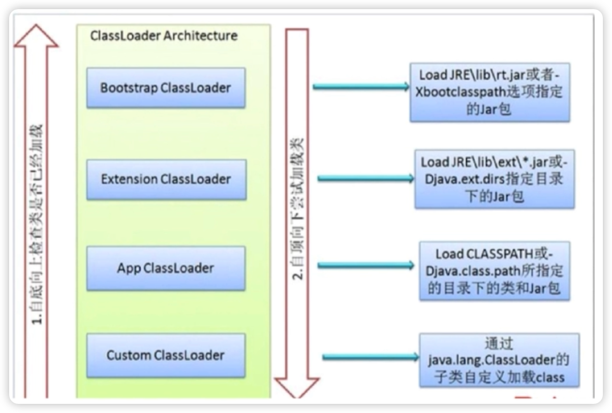

# ClassLoader

## 类从编译到执行的过程

1. 编译器将Robot.Java源文件编译为Robot.class字节码文件
2. ClassLoader将字节码转换为JVM中的Class<Robot>对象
3. JVM利用Class<Robot>对象实例化为Robot对象

## 谈谈ClassLoader

ClassLoader 在Java 中有着非常重要的作用，它主要工作在 Class 装载的加载阶段，其主要作用是从系统外部获得 Class 二进制数流。它是 Java 的核心组件，所有的 Class 都是由 ClassLoader 进行加载的， ClassLoader 负责通过将 Class 文件里的二进制数据流装载进系统，然后交给 Java 虚拟机进行连接、初始化等操作。

## ClassLoader的种类

- BootStrapClassLoader: C++编写，加载核心哭java.*
- ExClassLoader: Java编写，加载扩展库javax.*
- AppClassLoader: Java编写，加载程序所在目录（我们自己写的代码，maven定义的第三方依赖，通常都是这个加载器加载的
- 自定义ClassLoader：Java编写，定制化加载

## ClassLoader的双亲委派机制

目的：

1. 避免类的重复加载

2. 保证 Java 核心类库的安全，（核心类比如java.lang.Object不会被用户代码覆盖

机制：

1. 当JVM收到class加载请求后(new, loadClass, forname)，当前classLoader不会立即尝试加载。先找父类询问是否已经加载该类，直到Bootstrap ClassLoader
2. Bootstrap ClassLoader如果没有加载，则尝试自己加载。如果加载不了，就让Extension ClassLoader尝试加载，直至Custom ClassLoader