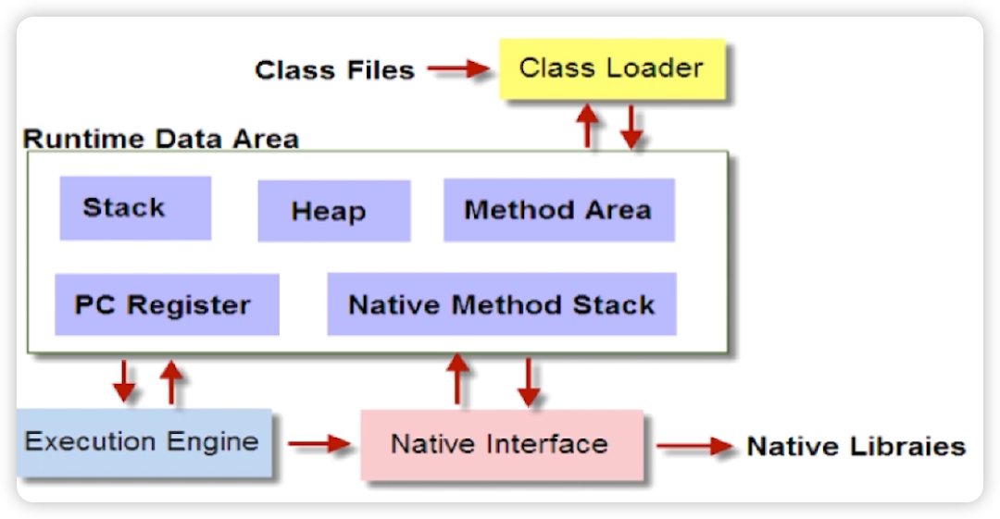
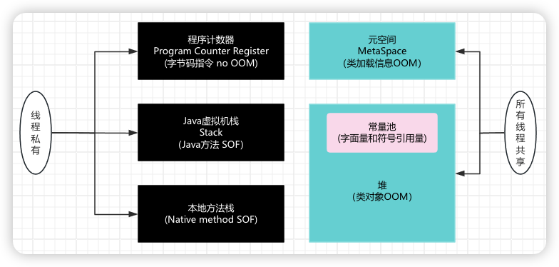

# JVM内存模型



Runtime Data Area就是JVM内存模型部分

# 线程独占 or 共享

我们按照线程是否共享内存做个分类：



- 线程私有：程序计数器、虚拟机栈、本地方法栈
- 线程共享：MetaSpace、Java堆
- SOF：stackOverFlowError
- OOM：outOfMemeryError

## 程序计数器(Program Counter Register)：

- 当前线程所执行的字节码行号指示器（逻辑）
- 改变计数器的值来选取下一条需要执行的字节码指令
- 和线程是一对一的关系即“线程私有”
- 对Java方法计数，如果是Native方法则计数器值为Undefined
- 不会发生内存泄露

## JAVA虚拟机栈(Stack)

- Java方法执行的内存模型
- 包含多个栈帧（每次调用方法都会创建栈帧）

为什么会出现stackOverFlowError，每个线程栈有调用方法的上限，超过了就会有这个异常。

## 本地方法栈

native调用的栈，可类比JAVA虚拟机栈

## 元空间(MetaSpace)

元空间存储的数据

1. 类元数据：类定义信息、字段信息、方法信息

2. 方法数据和方法代码（加上1，相当于完整代码）

3. 运行时常量池：字面量(数字，字符串常量等)

4. 静态变量：类的静态变量也会存储在元空间

   1. ```java
      public class StaticVariableExample {
          public static int staticValue = 10;
      }
      ```

   2. 这里的 `staticValue` 静态变量就会存储在元空间。

5. 类加载器信息

元空间使用的内存：元空间不用JVM内存，是系统本地内存。

元空间也有OOM

- 若显式设置此参数（如 `-XX:MaxMetaspaceSize=256m`），元空间大小超过该值时会触发 OOM。
- 若未设置，元空间会动态扩展，直到耗尽系统可用的本地内存。
- 即使不设置 `MaxMetaspaceSize`，本地内存被其他进程或元空间耗尽时，也会触发 OOM。

## Java堆（Heap）

对象实例的分配区域，是GC主要管理的区域


# 常见面试题

## JVM 三大性能调优参数-Xms-Xmx -Xss的含义

- Xss：规定了每个线程虚拟机栈（堆栈）的大小
- Xms：堆的初始值
- Xmx：堆能达到的最大值