# JVM8-分代垃圾回收器

## 年轻代回收器

### Serial收集器（-XX：+UseSerialGC，复制算法）

- 单线程收集，进行垃圾收集时，必须暂停所有工作线程
- 简单高效，Client模式下默认的年轻代收集器

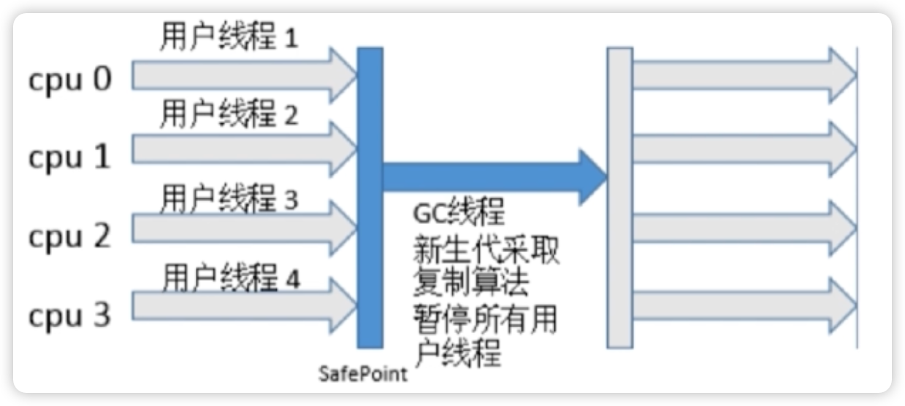

### ParNew收集器（-XX：+UseParNewGC，复制算法）

- 多线程收集，其余的行为、特点和Serial收集器一样
- 单核执行效率不如Serial，在多核下执行才有优势

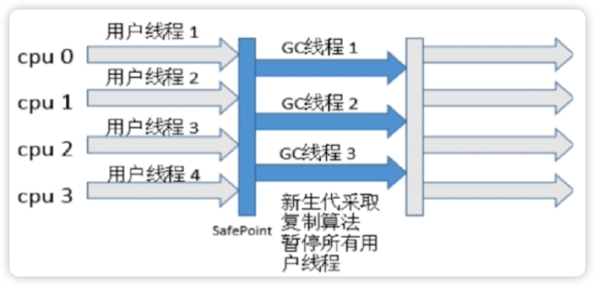

### Parallel Scavenge收集器（-XX：+UseParallelGC，复制算法）

- 吞吐量=运行用户代码时间/（运行用户代码时间＋垃圾收集时间）
- 比起关注用户线程停顿时间，更关注系统的吞吐量
- 在多核下执行才有优势，Server模式下默认的年轻代收集器

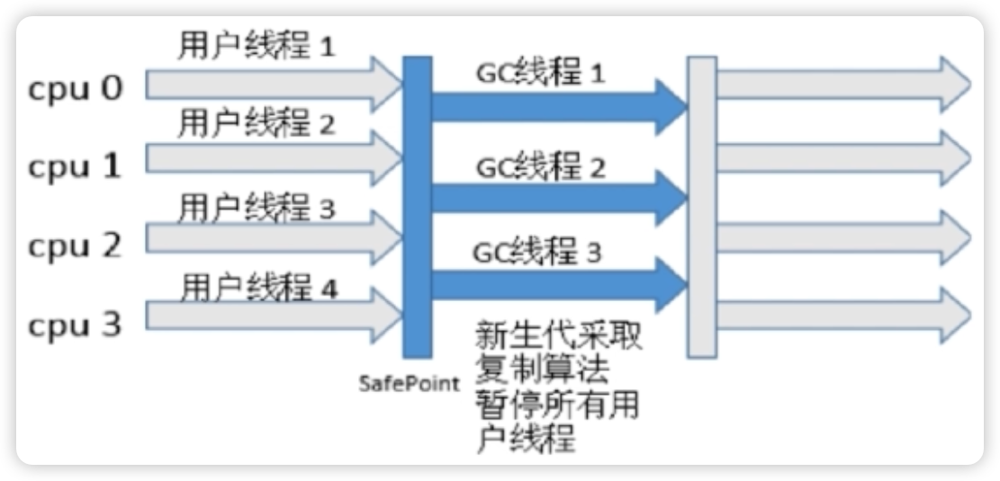

### JVM自适应选择：-XX：+UseAdaptiveSizePolicy

让JVM来判断用什么垃圾回收器

## 老年代垃圾回收器

### Serial Old收集器（-XX：+UseSerialOldGC，标记-整理算法）

- 单线程收集，进行垃圾收集时，必须暂停所有工作线程
- 简单高效，Client模式下默认的老年代收集器

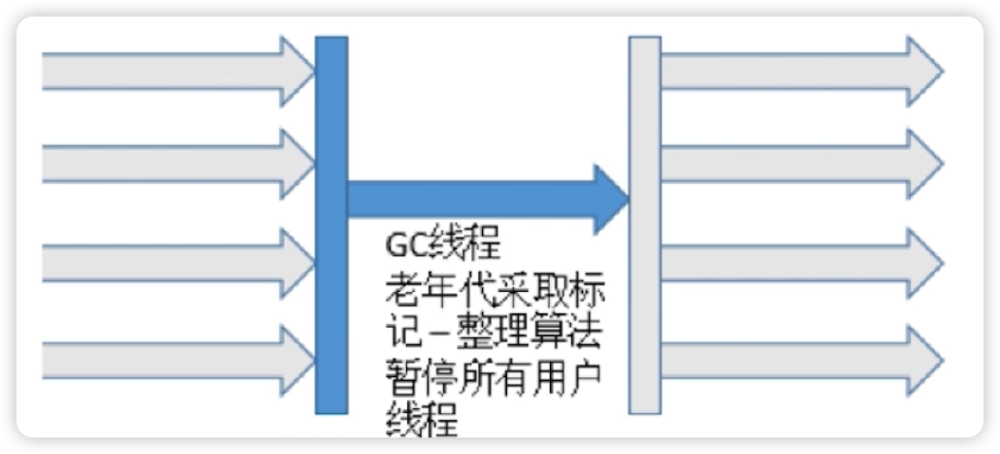

### Parallel Old收集器（-XX：+UseParallelOldGC，标记-整理算法）

- 多线程，吞吐量优先

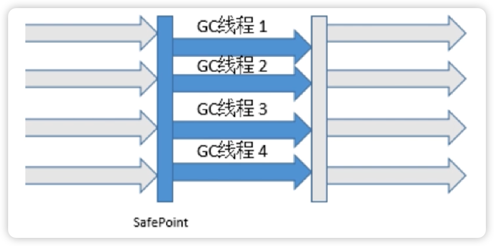

一种常见的组合（以提高系统吞吐量为目的）：新生代Parallel Scavenge + 老年代Parallel Old

### CMS收集器（-XX：+UseConcMarkSweepGC，标记-清除算法）

- 目的在尽可能降低STW

过程：

- 初始标记（STW）：stop-the-world
- 并发标记：并发追溯标记，程序不会停顿
- 并发预清理：查找执行并发标记阶段从年轻代晋升到老年代的对象
- 重新标记（STW）：暂停虚拟机，扫描CMS堆中的剩余对象
- 并发清理：清理垃圾对象，程序不会停顿
- 并发重置：重置CMS收集器的数据结构

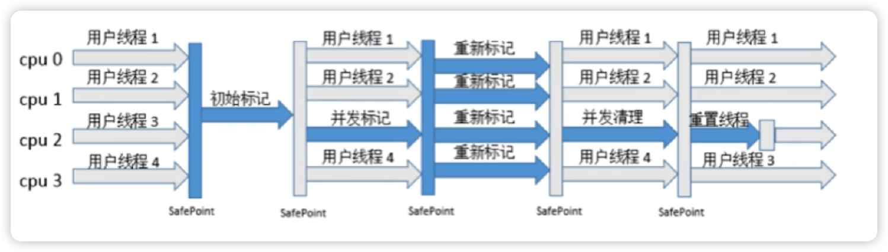

## 新声代&老年代

### G1(Garbage First)收集器（-XX：+UseG1GC，复制+标记-整理算法）

使用该垃圾回收器时，JVM的堆内存模型会变化

- 将整个Java堆内存划分成多个大小相等的Region
- 年轻代和老年代不再物理隔离

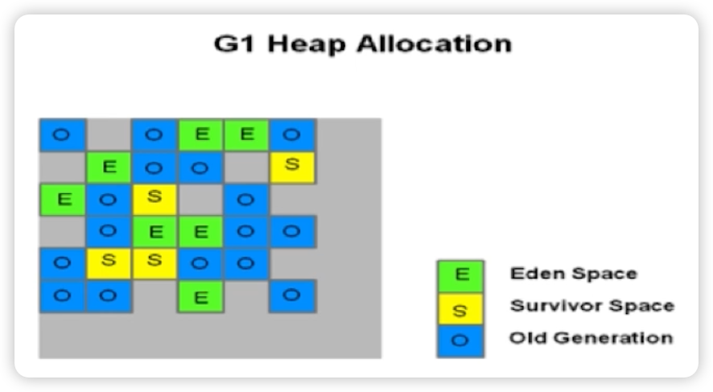

- 并行和并发
- 分代收集
- 空间整合
- 可预测的停顿

## 那些垃圾回收器可以配合使用

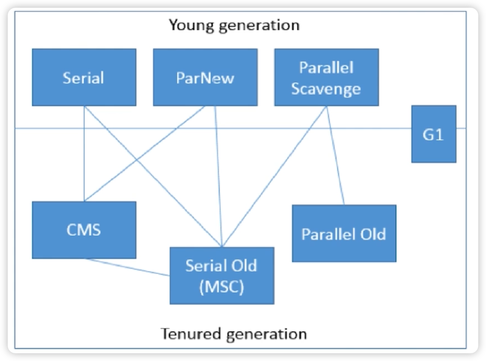

## 提到的算法

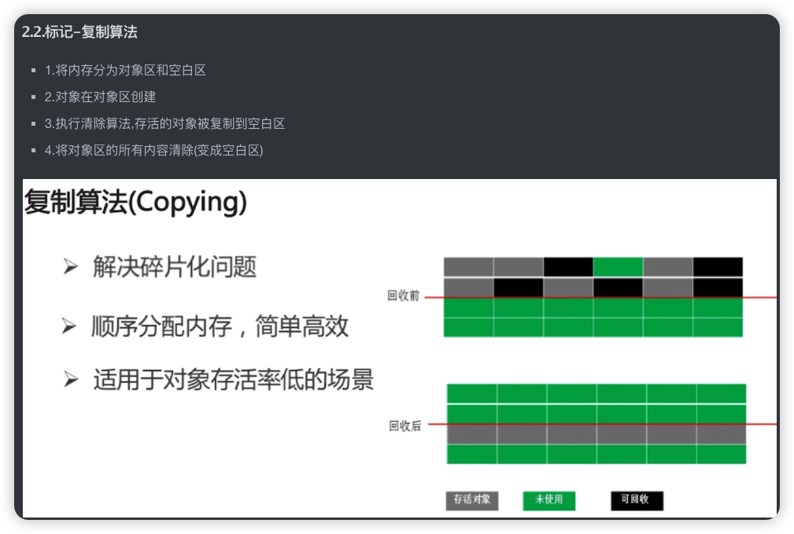

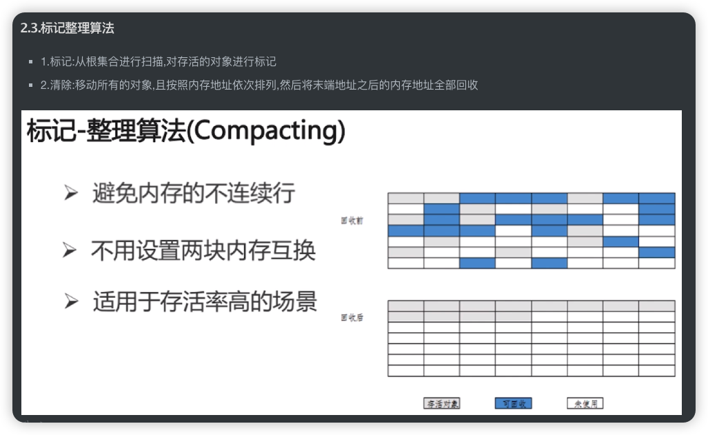

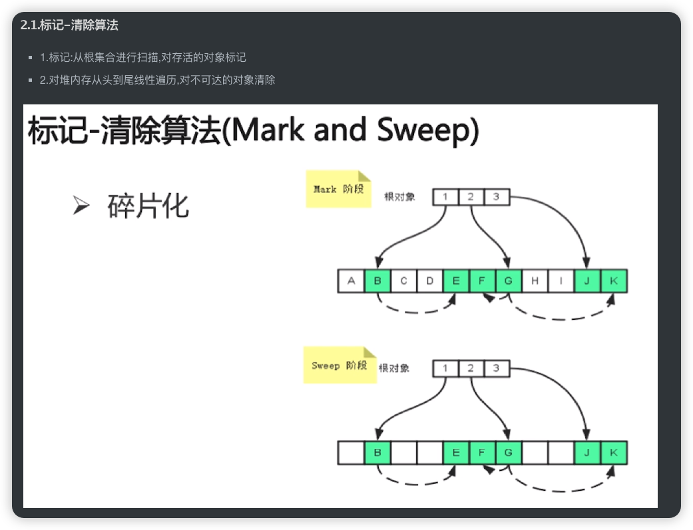

# 一些面试题

## Object的finalize0方法的作用是否与C++的析构函数作用相同

- 与C++的析构函数不同，析构函数调用确定，而它的是不确定的
- 将未被引用的对象放置于F-Queue队列
- 方法执行随时可能会被终止
- 给予对象最后一次重生的机会

## Java中的强引用，软引用，弱引用，虚引用有什么用

强引用（Strong Reference）

- 最普遍的引用：Object obj=new Object（） 
- 拋出OutOfMemoryError终止程序也不会回收具有强引用的对象
- 通过将对象设置为null来弱化引用，使其被回收
