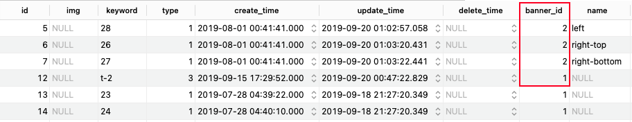

# jpa关系对应

## 01.oneToMany
单项一对多关系
- 1.通过banner可以查询出下属的所有BannerItem

```java
@Entity
public class Banner {
    @Id
    @GeneratedValue(strategy = IDENTITY)
    private Long id;
    private String name;
    private String description;
    private String title;
    private String img;

    @OneToMany
    @JoinColumn(name="bannerId")
    private List<BannerItem> bannerItems;
}
```

```java
@Entity
public class BannerItem {
    @Id
    private Long id;
    private String img;
    private String keyword;
    private short type;
    private Long bannerId;
    private String name;
}
```

- 1.@JoinColumn和外健的功能差不多
- 2.一对多关系不需要第三张表，使用上面的外键
    - 
- 3.@GeneratedValue(strategy = IDENTITY)自动递增


## 02.双向一对多
双向一对多关系
- 1.通过banner可以查询出下属的所有BannerItem
- 2.通过bannerItem可以查出属于那个banner
- 3.双向关系一定不能将数据直接做restfulAPI返回，(双向绑定关系)会造成数据无限嵌套

```java
@Entity
public class Banner {
    @Id
    private Long id;
    private String name;
    private String description;
    private String title;
    private String img;

    @OneToMany(mappedBy = "banner", fetch = FetchType.LAZY)
    private List<BannerItem> items;
}
```

```java
@Entity
public class BannerItem {
    @Id
    private Long id;
    private String img;
    private String keyword;
    private short type;
//    private Long bannerId;
    private String name;

    @ManyToOne(fetch = FetchType.LAZY)
    @JoinColumn(name = "bannerId")
    private Banner banner;
}
```

自己在开发中不要使用双向一对多关系(使用 JPQL语句的 join 代替)

- 1.@JoinColumn在双向一对一时，要放在多端
- 2.一端的@OneToMany需要增加mappedBy参数 值是 多端配置的关系参数名，这里是banner
- 3.有了@JoinColumn 就不需要private Long bannerId了。添加会报错（这是自己不使用双向的原因）

## 03.单项多对多
单项多对多
- 1.多对多关系中一共有3张表：them，spu，theme_spu
- 2.如下代码实例：joinTable都与第三张表关联

theme_spu:
```sql
CREATE TABLE `theme_spu` (
  `id` int(10) unsigned NOT NULL AUTO_INCREMENT,
  `theme_id` int(10) unsigned NOT NULL,
  `spu_id` int(10) unsigned NOT NULL,
  PRIMARY KEY (`id`)
) ENGINE=InnoDB AUTO_INCREMENT=101 DEFAULT CHARSET=utf8mb4 COLLATE=utf8mb4_general_ci;
```


代码实例：

```java
@Entity
public class Theme {
    @Id
    private Long id;
    private String title;
    private String description;
    private String name;
    private String tplName;
    private String entranceImg;
    private String extend;
    private String internalTopImg;
    private String titleImg;
    private short online;

    @ManyToMany
    @JoinTable(name = "theme_spu", joinColumns = @JoinColumn(name = "theme_id")
    , inverseJoinColumns = @JoinColumn(name = "spu_id"))
    private List<Spu> spuList;
}
```

```java
@Entity
public class Spu {
    @Id
    private Long id;
    private String title;
    private String subtitle;
    private String categoryId;
    private String rootCategoryId;
    private String online;
    private String price;
    private String sketchSpecId;
    private String defaultSkuId;
    private String img;
    private String discountPrice;
    private String description;
    private String tags;
    private String isTest;
    private String spuThemeImg;
    private String forThemeImg;
}
```

## 04.双向多对多
```java
@Entity
public class Theme {
    @Id
    private Long id;
    private String title;
    private String description;
    private String name;
    private String tplName;
    private String entranceImg;
    private String extend;
    private String internalTopImg;
    private String titleImg;
    private short online;

    @ManyToMany(fetch = FetchType.LAZY)
    @JoinTable(name = "theme_spu", joinColumns = @JoinColumn(name = "theme_id")
    , inverseJoinColumns = @JoinColumn(name = "spu_id"))
    private List<Spu> spuList;
}
```

```java
@Entity
public class Spu {
    @Id
    private Long id;
    private String title;
    private String subtitle;
    private String categoryId;
    private String rootCategoryId;
    private String online;
    private String price;
    private String sketchSpecId;
    private String defaultSkuId;
    private String img;
    private String discountPrice;
    private String description;
    private String tags;
    private String isTest;
    private String spuThemeImg;
    private String forThemeImg;

    @ManyToMany(mappedBy = "spuList")
    private List<Theme> themeList;
}
```