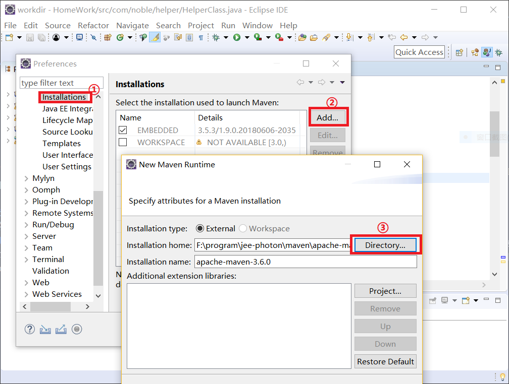
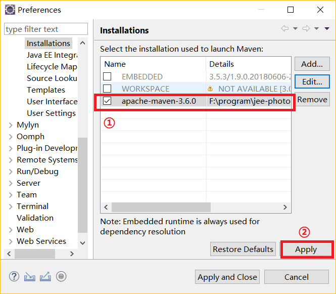
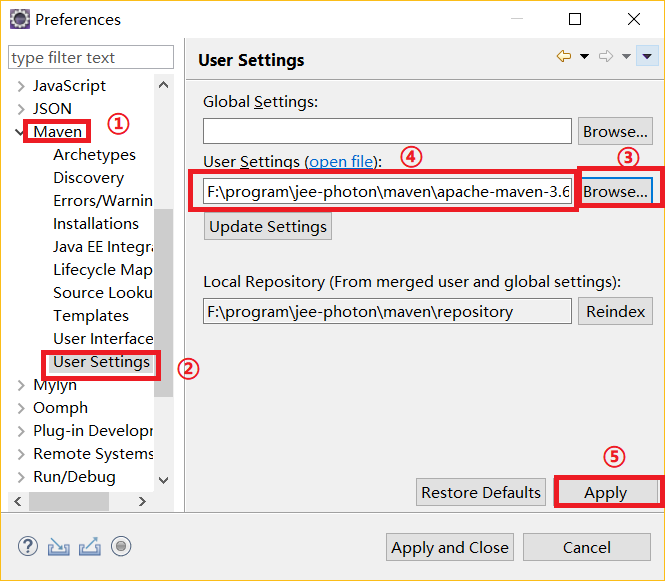

# Maven管理工具

## 1.Maven介绍
Maven是纯java开发，所以支持跨平台。Maven的依赖管理，对jar包统一管理，可以节省空间。<br>

## 2.环境搭建(linux)
### 2.1.软件下载
在清华镜像下载:<br>
[https://mirrors.tuna.tsinghua.edu.cn/apache/maven/maven-3/3.0.5/binaries/](https://mirrors.tuna.tsinghua.edu.cn/apache/maven/maven-3/3.0.5/binaries/)<br>

### 2.2.解压安装
```sh
tar -xf apache-maven-3.0.5-bin.tar.gz -C /application/
ln -s /application/apache-maven-3.0.5/ maven
```

### 2.3.添加环境变量
```sh
cat >>/etc/profile<<'EOF'
export MAVEN_HOME=/application/maven
export PATH=$MAVEN_HOME/bin:$PATH
EOF
source /etc/profile
```

## 2.环境搭建(windows)
### 1.下载安装包
[https://maven.apache.org/download.cgi](https://maven.apache.org/download.cgi)<br>
我们下载好解压包，在带有java开发环境中直接解压即可。<br>

### 2.配置环境变量
和java类似：<br>
```path
MAVEN_HOME F:\program\jee-photon\maven\apache-maven-3.6.0
path F:\program\jee-photon\maven\apache-maven-3.6.0\bin
```

### 3.本地仓库设置
maven在编译文件时，为从网上下载jar包，并在本地默认位置``${user.home}/.m2/repository``保存这些jar包，我们可以自己配置本地仓库的位置，方便我们自己维护。<br>

在Maven的核心配置文件``conf/settings.xml``中49行是关于本地仓库路径的配置选项：<br>
```xml
<!-- localRepository
 | The path to the local repository maven will use to storeartifacts.
 |
 | Default: ${user.home}/.m2/repository
<localRepository>/path/to/local/repo</localRepository>
-->
```
我们在外部配置路径信息：<br>
```xml
<localRepository>F:\program\jee-photon\maven\repository</localRepository>
```

## 3.Maven常用命令
```shell
mvn clean    #清空编译结果
mvn compile #编译开发工程中的main目录
mvn test     #编译开发工程中的tast目录并运行
mvn package  #打出war包
mvn install  #项目发布到本地仓库
mvn clean package -Dmaven.test.skip=true #跳过单元测试
```
我们按照顺序排列``compaile test package install``这四个命令，每当执行任何一个命令时，Maven都会先执行前面的命令。<br>

## 4.使用eclipse集成Maven工具
一般来说我们的eclipse都会按照Maven的m2e插件，如果没有我们自己安装就好。<br>

### 1.换用我们自己的Maven工具
eclipse上自带的Maven版本一般较低和我们的不匹配，我们需要自己设置eclipse上的插件选项，让eclipse集成我们自己的Maven工具。<br>

<br>
<br>

### 2.修改默认Maven配置文件
<br>


#
