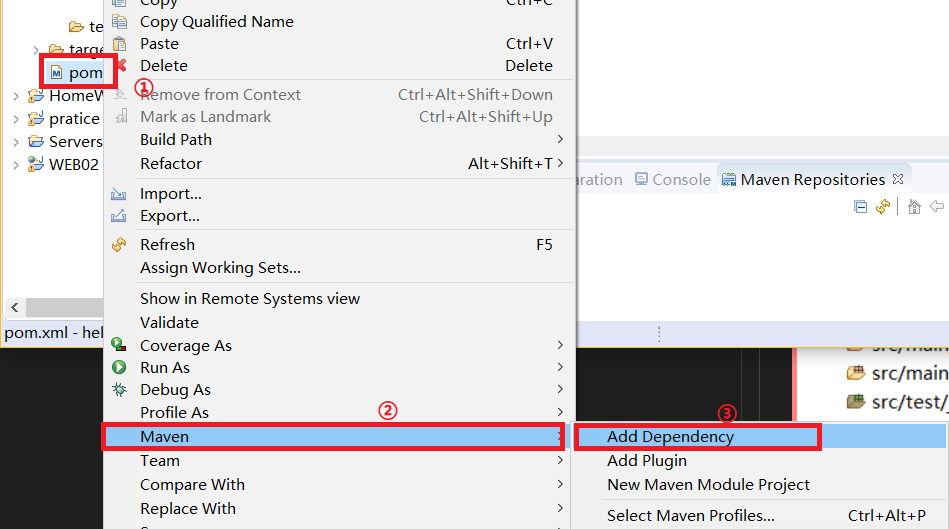

# 第一个Maven项目

## 1.linux环境创建Maven工程
### 1.1.Maven工程的目录
Maven工程目录树如下:<br>
<br>
main目录中存放源代码,test存放单元测试.<br>
pom.xml管理项目的逻辑结构<br>

### 1.2.里程碑一 编写HelloWorld.java
按照package模式放在``src/main/java/``下.<br>
```java
package com.noble;

public class HelloWorld{
        public String sayHello(){
                return "Hello World!";
        }
}
```

### 1.3.里程碑二 编写HelloWorldTest.java
按照package模式放在``src/test/java/``下.<br>
```java
package com.noble;

import org.junit.*;
import org.junit.Assert.*;

public class HelloWorldTest{
        @Test
        public void testHello(){
                Assert.assertEquals("Hello World!",new HelloWorld().sayHello());
        }
}
```

### 1.4.里程碑三 编写pom.xml文件
将pom.xml文件放在项目的根目录下<br>
```xml
<?xml version="1.0" encoding="UTF-8"?>

<project xmlns="http://maven.apache.org/POM/4.0.0"
         xmlns:xsi="http://www.w3.org/2001/XMLSchema-instance" 
         xsi:schemaLocation="http://maven.apache.org/POM/4.0.0 http://maven.apache.org/maven-v4_0_0.xsd">
        <modelVersion>4.0.0</modelVersion>

        <groupId>com.noble</groupId>
        <artifactId>maven01-model</artifactId>
        <version>0.0.1SNAPSHOT</version>

        <dependencies>
                <dependency>
                        <groupId>junit</groupId>
                        <artifactId>junit</artifactId>
                        <version>4.10</version>
                </dependency>
        </dependencies>
</project>
```

### 1.5.里程碑四 构建并运行项目
```sh
mvn compile
mvn test
```


## 2.windows创建Maven工程的流程

### 里程碑一 创建工程
<br>
<br>
<br>

我们点击finish就创建好了工程，如下：<br>
<br>

### 里程碑二 基本配置

#### 1.处理小红×
我们需要创建一个web.xml文件，把这个文件放在``main/webapp/WEB-INF/``下，没有的目录我们自己创建。<br>

我们从一般的Servlet工程中拷贝一份web.xml文件过来即可，或者自己创建，web.xml中的内容如下：<br>
```xml
<?xml version="1.0" encoding="UTF-8"?>
<web-app xmlns:xsi="http://www.w3.org/2001/XMLSchema-instance" xmlns="http://java.sun.com/xml/ns/javaee" xsi:schemaLocation="http://java.sun.com/xml/ns/javaee http://java.sun.com/xml/ns/javaee/web-app_2_5.xsd" id="WebApp_ID" version="2.5">
  <display-name>WEB02</display-name>
  <welcome-file-list>
    <welcome-file>index.html</welcome-file>
    <welcome-file>index.htm</welcome-file>
    <welcome-file>index.jsp</welcome-file>
    <welcome-file>default.html</welcome-file>
    <welcome-file>default.htm</welcome-file>
    <welcome-file>default.jsp</welcome-file>
  </welcome-file-list>
</web-app>
```

上述工作完成后，结果如下：<br>
<br>

#### 2.更改编译环境版本
我们创建好的Maven工程默认使用的是1.5的版本，如果我们想用更高的版本需要自己配置pom.xml文件。<br>

我们在``pom.xml``文件中添加如下内容：<br>
```xml
<build>
        <plugins>
		<plugin>
			<groupId>org.apache.maven.plugins</groupId>
			<artifactId>maven-compiler-plugin</artifactId>
			<version>3.5.1</version>
			<configuration>
				<source>1.8</source>
				<target>1.8</target>
				<encoding>UTF-8</encoding>
			</configuration>
		</plugin>
	</plugins>
</build>
```
上面的内容要放在``project``标签内部。<br>

然后我们把工程update一下：<br>
<br>

完成上述工作后我们可以看到，我们的编译环境以及编程自己想要的1.8了：<br>
<br>

#### 3.添加依赖jar包
我们以一个实例来说明，假如我们创建一个jsp页面(jsp应创建在``src/main/webapp``下)如下：<br>
<br>

如上图中报错的原因很明显，是因为缺少Servlet和jsp的依赖，解决方法是更改pom.xml文件，我们可以copy并复制到pom.xml。但现在我们介绍一个更常用的 在Maven工程中添加依赖jar包的方法。<br>

##### 3.1.添加Maven工程依赖索引
在一个全新的工程中，我们可能使用的是我们自己的本地Maven仓库，eclipse默认没有在我们的仓库中添加索引，此时如果想从本地的Maven仓库中导入依赖jar是不方便的，所以我们先添加仓库的索引。<br>

我们要设置Maven仓库的索引，首先要打卡Maven的仓库视图：<br>
<br>

我们找到Maven的仓库视图，并打开：<br>
<br>

Maven的视图在IDE的下方，我们执行下图中的操作来添加索引：<br>
<br>
<br>

到此，我们仓库的索引就添加成功，现在我们再在Maven工程中添加依赖，就会有索引提示，会方便很多，下面介绍Maven工程中添加依赖的一般方法。<br>

##### 3.2.添加依赖
首先我们来到添加依赖的窗口：<br>
<br>

现在我们试着添加jsp的依赖包：<br>
<br>

我们添加完依赖后，Maven工程会多出一个目录项，用来维护jar包：<br>
<br>

此时，我们的pom.xml文件会多出来一个标签标示引用jar包：<br>
<br>

以上可以看出我们对工程做的很多配置，本质上就是更改了pom.xml文件。<br>

同理我们添加Servlet依赖，完成后，工程就不再报错了。<br>

## 3.排坑

### 1.依赖冲突
我们在Tomcat上运行eclipse创建的web工程，时常有个问题，就是jar包冲突。在Tomcat上已经有jsp和Servlet的包，但我们在工程中又添加了这两个包，这是就会出现包的冲突，为了解决这个问题，Maven工程引入了jar包的作用范围概念。<br>
常见的依赖范围有四种：<br>
```
Compile
Provided
Runtime
Test
```