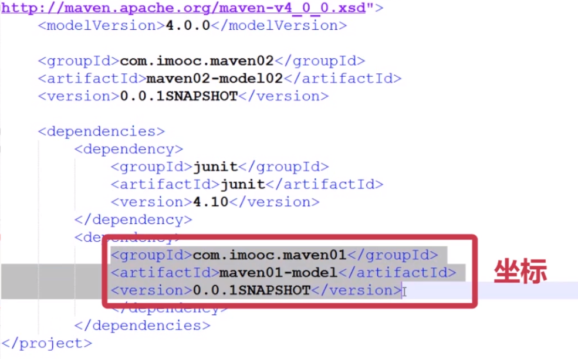

# Maven核心基础知识

## 1.Maven常用命令
```shell
mvn clean    #清空编译结果
mvn compile  #编译开发工程中的main目录
mvn test     #编译开发工程中的tast目录并运行
mvn package  #打包
mvn install  #项目发布到本地仓库
mvn clean -U package -Dmaven.test.skip=true --settings ./settings.xml #跳过单元测试
mvn dependency:tree #检查maven依赖冲突
```

## 2.坐标,构建
再Maven项目中每一个依赖,插件,项目输出都被称作 **构建** <br>
这些构建都通过一个 **坐标** 确定位置.<br>
上述信息记录在项目的pom.xml文件中<br>
在如下网站查找目标依赖的坐标:<br>
[https://mvnrepository.com/](https://mvnrepository.com/)<br>
<br>

## 3.仓库
仓库是用来存放构建的<br>
仓库分为远程仓库和本地仓库,Maven通过坐标查找构建当本地仓库没有目标构建时,就从远程仓库下载,如果远程仓库也没有目标构建,就会报错.<br>

### 3.1.修改远程仓库的镜像
如果下载远程仓库网速慢,或不能访问外网,可以设置远程仓库的镜像目录<br>
通常情况我们不用设置镜像仓库<br>
在``Maven/conf/settings.xml``文件中找到``mirror``在152行<br>
```xml
<mirror>
    <id>mirrorId</id>
    <mirrorOf>repositoryId</mirrorOf>
    <name>Human Readable Name for this Mirror.</name>      <url>http://my.repository.com/repo/path</url>
</mirror>
```
改为:<br>
```xml
<mirror>
    <id>maven.net.cn</id>
    <!-- mirrorOf 设置位central就会屏蔽中心仓库,也可以使用通配符* -->
    <mirrorOf>central</mirrorOf>
    <name>central mirror in china</name>      <url>http://maven.net.cn/content/group/public</url>
</mirror>
```

### 3.2.更改本地仓库的位置
Maven下载的构建默认存放的本地仓库在用户目录下.<br>
- linux 在 ``~/``目录下.m2
- windows 在C盘

修改本地仓库目录的位置在``settings.xml``文件的53行<br>
```xml
<localRepository>/path/to/local/repo</localRepository>
```
改为:<br>
```xml
<localRepository>/application/mavenRepository</localRepository>
```

## 4.Maven常用标签
```xml
<!-- 默认是jar 可以是war pom zip -->
<packaging></packaging>

<!--项目描述名 -->
<name></name>

<!--项目地址 -->
<url></url>

<!--项目描述 -->
<description></description>

<!--开发人员信息 -->
<developers></developers>

<!--许可证信息 -->
<licences></licences>

<!--组织信息 -->
<organization></organization>
```
重要的标签:依赖列表<br>
```xml
<dependency>
    <groupId>org.springframework.boot</groupId>
    <artifactId>spring-boot-starter-web</artifactId>
    <!--排除依赖的列表 -->
    <exclusions>
        <exclusion>
            <artifactId>log4j-to-slf4j</artifactId>
            <groupId>org.apache.logging.log4j</groupId>
        </exclusion>
    </exclusions>
</dependency>

<!--依赖管理的一种方式, 实现继承和重用 -->
<dependencyManagement>
    <dependencies>
	    <dependency>
		    <groupId>org.springframework.boot</groupId>
			<artifactId>spring-boot-dependencies</artifactId>
			<version>2.1.1.RELEASE</version>
			<type>pom</type>
			<scope>import</scope>
		</dependency>
	</dependencies>
</dependencyManagement>

<build>
    <!--插件列表 -->
    <plugins>
        <plugin>
            <groupId></groupId>
            <artifactId></artifactId>
            <version></version>
        </plugin>
    </plugins>
</build>

<!--继承父pom -->
<parent>
    <groupId>org.springframework.boot</groupId>
    <artifactId>spring-boot-starter-parent</artifactId>
    <version>2.2.0.RELEASE</version>
    <relativePath/> <!-- lookup parent from repository -->
</parent>

<!--用于编译多个Maven项目 -->
<moudules>
    <moudule></moudule>
</moudules>
```

## 5.Maven依赖
在如下网站查找目标依赖的坐标:<br>
[https://mvnrepository.com/](https://mvnrepository.com/)<br>

### 5.1.Maven依赖范围
Maven导入jar的classPath使用``dependency``标签下的``<scope>``标签设置<br>
Maven的依赖范围有三种模式:编译,测试,运行<br>
``<scope>``标签有以下几种值:<br>
```sh
compile       # 默认值: 在编译,测试,运行都有效
provided      # 在编译运行时有效
runtime       # 在测试和运行时有效
test          # 仅在测试时有效
import        # 导入依赖 只能写在 <dependencyManagement>标签下的<scope>标签中
```

### 5.2.Maven依赖传递
如果Maven工程依赖A.jar,同时A.jar依赖B.jar.<br>
当我们引入A.jar时,会自动引入B.jar<br>

### 5.3.Maven依赖冲突
当工程中,项目不同组件对同一组件都有依赖,但坐标版本不同,此时认为发生依赖冲突<br>
依赖冲突自动解决依据两个原则:<br>
- 1.最短路径优先原则
- 2.当路径相同时,谁先被定义,就依赖谁

### 5.4.Maven聚合
当需要对大量的Maven工程进行install操作时,可以使用聚合方式<br>
#### 5.4.1.将<packaging>标签设置为pom

#### 5.4.2.添加<modules>标签
在``<modules>``标签内添加多个``<module>``标签表示多个Maven工程,如下:<br>
```xml
<packaging>pom<packaging>

<modules>
    <module>module1<module>
    <module>module2<module>
</modules>
```
执行 ``mvn install`` 可以将modules包含的所有Maven工程进行打包<br>

## 6.scope
scope的默认值是compile

### 6.1.compile
此范围为默认依赖范围，是一个比较强的依赖，适用于所有阶段。

这些dependencie（依赖）的jar，会传递到其他依赖的上层项目中。

由于运行时需要所以编译范围的依赖会被打包，会随着项目一起发布。

范围：编译、测试、运行（部署）都有效 。

### 6.2.test
表示被依赖项目仅仅参与测试相关的工作，在编译和运行时都不需要，只在编译测试代码或者运行测试代码的时候才能使用该依赖。比较典型的如junit。

由于运行时不需要所以test范围依赖不会被打包。

范围：仅测试有效

### 6.3.provided
provided依赖在编译和测试时需要，在运行时不需要。

正因为运行时无效，可以防止和tomcat下jar冲突，因为servlet api被tomcat容器提供，就不需要maven再重复引入。

由于运行时不需要所以provided范围依赖不会被打包。

范围：编译、测试有效。

### 6.4.runtime
runtime依赖在运行和测试的时候需要，但在编译的时候不需要。与compile相比，被依赖项目无需参与项目的编译。

比如：jdbc的驱动包，项目主代码的编译只需要JDK提供的JDBC接口，只有在执行测试或者运行项目的时候才需要实现上述接口的具体JDBC驱动。

由于运行时需要所以runtime范围的依赖会被打包。

范围：测试、运行有效。

### 6.5.system
system范围依赖与provided类似，但是你必须显式的提供一个位于本地系统中JAR文件的路径，需要指定systemPath磁盘路径，system依赖不推荐使用。
