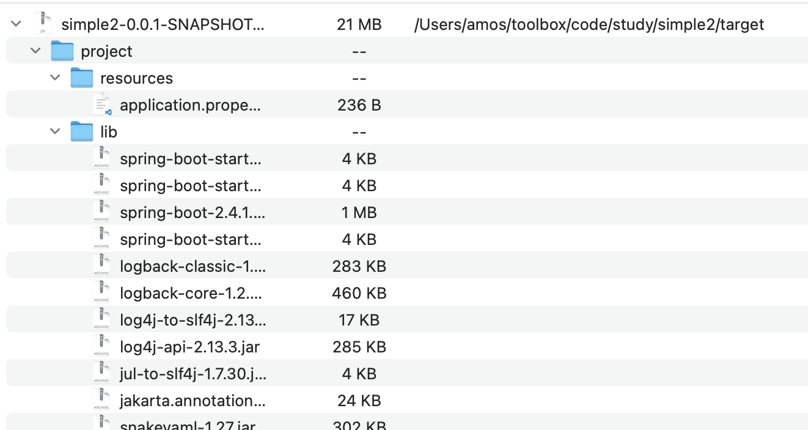
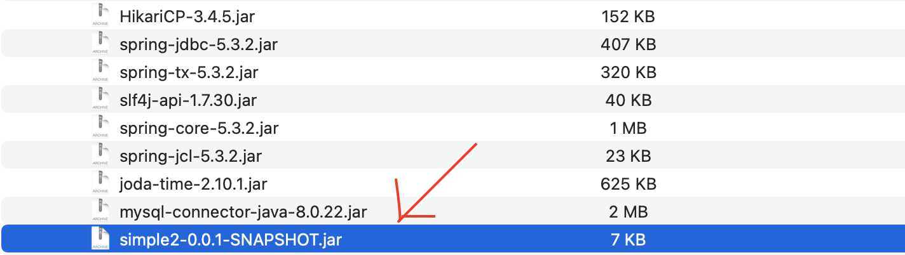
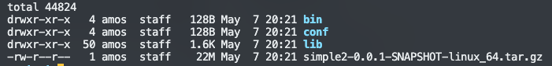
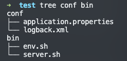

# maven打包与运行

## 打包maven-assembly-plugin
打包建议使用maven插件``maven-assembly-plugin``

用官网的话来介绍这个插件：
The Assembly Plugin for Maven is primarily intended to allow users to aggregate the project output along with its dependencies, modules, site documentation, and other files into a single distributable archive.

你有一堆文件，要搞到一个集合里面去，那就用这个插件就行了。
### 1.常用用法
将所有依赖打在一个jar包中，flink等流项目使用。
```java
<plugin>
    <groupId>org.apache.maven.plugins</groupId>
    <artifactId>maven-assembly-plugin</artifactId>
    <version>3.3.0</version>
    <configuration>
        <descriptorRefs>
            <descriptorRef>jar-with-dependencies</descriptorRef>
        </descriptorRefs>
    </configuration>
    <executions>
        <execution>
            <id>make-assembly</id>
            <phase>package</phase>
            <goals>
                <goal>single</goal>
            </goals>
        </execution>
    </executions>
</plugin>
```
### 2.其他用法
在pom.xml中添加该插件：
```xml
<plugin>
    <groupId>org.apache.maven.plugins</groupId>
    <artifactId>maven-assembly-plugin</artifactId>
    <version>3.3.0</version>
    <configuration>
        <!-- assembly.xml文件路径 -->
        <descriptors>
            <descriptor>src/assembly/assembly.xml</descriptor>
        </descriptors>
    </configuration>
    <executions>
        <execution>
            <id>make-assembly</id>
            <phase>package</phase>
            <goals>
                <goal>single</goal>
            </goals>
        </execution>
    </executions>
</plugin>
```

在对应的路径下放置assembly.xml文件：
```xml
<assembly xmlns="http://maven.apache.org/ASSEMBLY/2.1.0" xmlns:xsi="http://www.w3.org/2001/XMLSchema-instance"
          xsi:schemaLocation="http://maven.apache.org/ASSEMBLY/2.1.0 http://maven.apache.org/xsd/assembly-2.1.0.xsd">
    <!-- ID,它会是后面生成的集合的名称的一部分，应该是后缀，前面会用这个工程的名字和版本，两个拼接在一块-->
    <id>linux_64</id>
    <!--格式，目标集合的格式，这个可以放多个 -->
    <formats>
        <format>tar.gz</format>
    </formats>
    <!--不包含基本目录，基本目录是啥？就是当前工程的：artifactId-version
     如果包含的话，那会再最上面建一层目录，你下面定义的所有的输入，都会在这个目录里面
     一般都不会这样做，感觉那样的名字不好，一般会希望自定义一个名字，我的做法就是
     在下面所有的outputDirectory的路径前面加一个就行了。或者根本不需要
     -->
    <includeBaseDirectory>false</includeBaseDirectory>
    <!--文件集合，定义多个集合，这个指的是源文件的集合，然后拷贝到目录目录-->
    <fileSets>
        <fileSet>
            <directory>${project.basedir}/target/classes</directory>
            <outputDirectory>/conf</outputDirectory>
            <includes>
                <include>*.xml</include>
                <include>*.yml</include>
                <include>*.properties</include>
            </includes>
        </fileSet>

        <fileSet>
        <directory>src/scripts</directory>
        <outputDirectory>/bin</outputDirectory>
        <lineEnding>unix</lineEnding>
        <includes>
            <include>*.sh</include>
        </includes>
        </fileSet>
    </fileSets>
    <!--依赖的jar包，全部拷贝到指定目录中(包括该项目本身的jar包)-->
    <dependencySets>
        <dependencySet>
            <useProjectArtifact>true</useProjectArtifact>
            <outputDirectory>/lib</outputDirectory>
            <scope>runtime</scope>
        </dependencySet>
    </dependencySets>
</assembly>
```

打包后的结果：

项目本身的jar包也在里面


## 运行
使用shell脚本启动maven程序。我们关注assembly.xml文件。有一个拷贝``src/scripts/*.sh``的逻辑。我们的启动脚本就放在这里

一共有2个脚本
### 1.env.sh脚本
在这个脚本中，我们需要更改2个变量：
```sh
BASE_NAME="simple-project"   # 项目基本名称
STARTUP_CLASS="com.amos.simple2.Simple2Application"     # 启动类路径
```


完整脚本：
```sh
#!/bin/bash

if [ "$JAVA_HOME" != "" ]; then
  #echo "run java in $JAVA_HOME"
  JAVA_HOME=$JAVA_HOME
fi

if [ "$JAVA_HOME" = "" ]; then
  echo "Error: JAVA_HOME is not set."
  exit 1
fi

JAVA=$JAVA_HOME/bin/java
SERVER_HOME=$BASE_DIR
BASE_HOME=$BASE_DIR
BASE_NAME="simple-project"
STARTUP_CLASS="com.amos.simple2.Simple2Application"

#SERVER JMX port
export JMX_PORT=9232
HOST_NAME=`hostname`
SERVER_NAME=$BASE_NAME-$HOST_NAME-$JMX_PORT
#export CLASSPATH=$BASE_DIR/conf:$(ls $BASE_DIR/lib/*.jar | tr '\n' :)
export CLASSPATH=$BASE_DIR/conf:$BASE_DIR/lib/*

#SERVER jvm args
SERVER_JVM_ARGS="-Xmx2048m -Xms1024m"
SERVER_APP_ARGS="-DBASE_HOME=$BASE_HOME -DSERVER_NAME=$SERVER_NAME"
SERVER_JMX_ARGS="-Dcom.sun.management.jmxremote -Dcom.sun.management.jmxremote.authenticate=false -Dcom.sun.management.jmxremote.ssl=false -Dcom.sun.management.jmxremote.port=$JMX_PORT"
SERVER_JVM_ARGS="$SERVER_JVM_ARGS -cp $CLASSPATH $SERVER_JMX_ARGS $SERVER_APP_ARGS"
if [ -z "$SERVER_ARGS" ]; then
  export SERVER_ARGS="$SERVER_JVM_ARGS"
fi
```

### 2.server.sh脚本
这个脚本大多数情况下不需要更改，直接拷贝即可

```sh
#!/bin/bash

if [ -z "$BASE_DIR" ] ; then
  PRG="$0"

  # need this for relative symlinks
  while [ -h "$PRG" ] ; do
    ls=`ls -ld "$PRG"`
    link=`expr "$ls" : '.*-> \(.*\)$'`
    if expr "$link" : '/.*' > /dev/null; then
      PRG="$link"
    else
      PRG="`dirname "$PRG"`/$link"
    fi
  done
  BASE_DIR=`dirname "$PRG"`/..

  # make it fully qualified
  BASE_DIR=`cd "$BASE_DIR" && pwd`
  #echo "server is at $BASE_DIR"
fi

source $BASE_DIR/bin/env.sh

AS_USER=`whoami`
LOG_DIR="$BASE_DIR/logs"
LOG_FILE="$LOG_DIR/server.log"
PID_DIR="$BASE_DIR/logs"
PID_FILE="$PID_DIR/.run.pid"


function running(){
	if [ -f "$PID_FILE" ]; then
		pid=$(cat "$PID_FILE")
		process=`ps aux | grep " $pid " | grep -v grep`;
		if [ "$process" == "" ]; then
	    	return 1;
		else
			return 0;
		fi
	else
		return 1
	fi
}

function start_server() {
	if running; then
		echo "$SERVER_NAME is running."
		exit 1
	fi

    mkdir -p $PID_DIR
    touch $LOG_FILE
#    mkdir -p $LOG_DIR
    chown -R $AS_USER $PID_DIR
    chown -R $AS_USER $LOG_DIR

   	echo "starting $SERVER_NAME, the baseHome $BASE_HOME"
#    nohup nice -n 0  $JAVA $UEAP_JVM_ARGS $STARTUP_CLASS "$@" > $LOG_FILE 2>&1 < /dev/null &
    nohup nice -n 0  $JAVA $UEAP_JVM_ARGS $STARTUP_CLASS "$@"
    echo $! > $PID_FILE

    exit 0;
}

function stop_server() {
	if ! running; then
		echo "$SERVER_NAME is not running."
		exit 1
	fi
	count=0
	pid=$(cat $PID_FILE)
	while running;
	do
	  let count=$count+1
	  echo "Stopping $SERVER_NAME $count times"
	  if [ $count -gt 5 ]; then
	  	  echo "kill -9 $pid"
	      kill -9 $pid
	  else
	      kill $pid
	  fi
	  sleep 3;
	done
	echo "Stop $SERVER_NAME successfully."
	rm $PID_FILE
}

function status(){
    if running; then
       echo "$SERVER_NAME is running.";
       exit 0;
    else
       echo "$SERVER_NAME was stopped.";
       exit 1;
    fi
}

function reload_logback_config() {
	if ! running; then
		echo "$SERVER_NAME is not running."
		exit 1
	fi
	echo "Reloading $SERVER_NAME logback config, logging to $LOG_FILE"
}

function help() {
    echo "Usage: server.sh {start|status|stop|restart|reload}" >&2
    echo "       start:             start the $SERVER_NAME server"
    echo "       stop:              stop the $SERVER_NAME server"
    echo "       restart:           restart the $SERVER_NAME server"
    echo "       reload_logback:    reload logback config file"
    echo "       status:            get $SERVER_NAME current status,running or stopped."
}

command=$1
shift 1
case $command in
    start)
        start_server "$@";
        ;;
    stop)
        stop_server "$@";
        ;;
    reload_logback)
        reload_logback_config "$@";
        ;;
    status)
    	status ;
        ;;
    restart)
        $0 stop "$@"
        $0 start "$@"
        ;;
    help)
        help;
        ;;
    *)
        help;
        exit 1;
        ;;
esac
```

这一个压缩文件就包含我们整个要运行的文件和依赖



关注conf目录下的文件和assembly打包方式。结合prefile即可按环境打包

## appassembler-maven-plugin插件
appassembler-maven-plugin插件可以同时完成打包和运行2个工作，使用也比较方便。

官网介绍：
The Application Assembler Plugin is a Maven plugin for generating scripts for starting java applications.

**appassembler-maven-plugin和文档上面介绍的打包运行没有关系，可以自己成一套体系**

### 1.将resources配置文件不能全部排除
虽然打包发布用不上甚至产生误解。但是在开发阶段，idea默认还是拿jar中的配置文件
```xml
        <resources>
            <resource>
                <directory>src/main/resources</directory>
                <!-- https://maven.apache.org/plugins/maven-resources-plugin/examples/filter.html -->
                <filtering>true</filtering>
                <includes>
                    <include>**/*.properties</include>
                    <include>**/*.xml</include>
                </includes>
            </resource>
        </resources>
```


### 2.配置appassembler-maven-plugin
配置上面有注释，不做详细介绍。
```xml
<plugin>
    <groupId>org.codehaus.mojo</groupId>
    <artifactId>appassembler-maven-plugin</artifactId>
    <version>2.1.0</version>
    <configuration>
        <programs>
            <program>
                <mainClass>com.amos.simple2.Simple2Application</mainClass>
                <id>project.sh</id>
                <platforms>
                    <platform>unix</platform>
                </platforms>
            </program>
        </programs>
        <!-- lib目录中jar的存放规则，默认是${groupId}/${artifactId}的目录格式，flat表示直接把jar放到lib目录 -->
        <repositoryLayout>flat</repositoryLayout>
        <!-- 根目录 -->
        <assembleDirectory>release</assembleDirectory>
        <!-- 从哪里拷贝配置文件 (默认src/main/config) -->
        <configurationSourceDirectory>src/main/resources</configurationSourceDirectory>
        <!-- 配置文件的目标目录 -->
        <configurationDirectory>configuration</configurationDirectory>
        <!-- 拷贝配置文件到 configurationDirectory 指定的目录中 -->
        <copyConfigurationDirectory>true</copyConfigurationDirectory>
        <includeConfigurationDirectoryInClasspath>true</includeConfigurationDirectoryInClasspath>
        <!-- 拷贝配置文件时 替换变量 -->
        <filterConfigurationDirectory>true</filterConfigurationDirectory>
        <repositoryName>lib</repositoryName>
    </configuration>
    <executions>
        <execution>
            <phase>package</phase>
            <goals>
                <goal>assemble</goal>
            </goals>
        </execution>
    </executions>
</plugin>
```

### 3.掉坑记录
filterConfigurationDirectory配置可以实现配置文件中的变量替换。
如果使用maven的resources的filtering做替换，assembly插件指定的配置文件不会发生替换，它只替换jar包中的配置文件