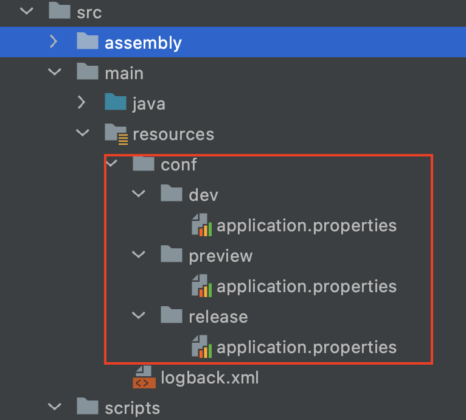

# Maven profile环境变量
需要了解：
- 1.maven基本使用
- 2.pom.xml文件结构
- 3.profiles相关概念

工作开发中我们要面对不同的环境，包括开发环境，测试环境，生产环境等。在不同的环境下需要不同的配置信息(比如，mysql连接的url和用户名密码)。
这时候我们需要使用maven的profiles机制，让项目在不同的环境下启用不同的配置。

```
java -jar -Dspring.profiles.active=prod appeal-0.0.1-SNAPSHOT.jar
```

## 1.修改pom.xml

### 1.1.添加profile 
我们设置dev为默认profile是为了保证idea或者开发环境下可以正常运行调试。
```xml
<profiles>
    <profile>
        <id>dev</id>
        <activation>
            <activeByDefault>true</activeByDefault>
        </activation>
        <properties>
            <profile.active>dev</profile.active>
        </properties>
    </profile>
    <profile>
        <id>preview</id>
        <properties>
            <profile.active>preview</profile.active>
        </properties>
    </profile>
    <profile>
        <id>release</id>
        <properties>
            <profile.active>release</profile.active>
        </properties>
    </profile>
</profiles>
```

### 1.2.编辑resources
我们打包时从2个地方查找配置文件，一个是默认src/main/resources另一个是根据profile自动变化的src/main/resources/conf/${profile}文件夹。
```xml
<build>
    <resources>
        <resource>
            <directory>${basedir}/src/main/resources</directory>
            <excludes>
                <exclude>conf/**</exclude>
            </excludes>
        </resource>
        <resource>
            <directory>${basedir}/src/main/resources/conf/${profile.active}</directory>
        </resource>
    </resources>
</build>
```

如下图显示

需要使用profile限定的配置文件放在conf下。共用配置放在外面

```
spring.profiles.active=dev
spring.datasource.driver-class-name=com.mysql.cj.jdbc.Driver
spring.datasource.url=jdbc:mysql://localhost:3306/sleeve?useSSL=false&serverTimezone=UTC&characterEncoding=UTF8
spring.datasource.username=root
spring.datasource.password=amos
```

## 2.项目打包
使用 ``- P`` 设置profile
```sh
mvn clean -U package -P preview -Dmaven.test.skip=true --settings ./settings.xml
```