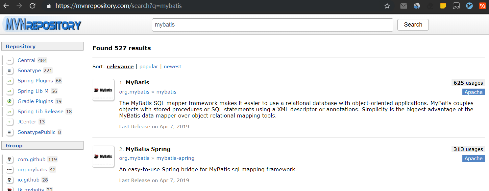

# Mybatis环境搭建

## 1.使用Maven工程搭建Mybatis

### 1.1.查找坐标
在如下网站查找目标依赖的坐标:<br>
[https://mvnrepository.com/](https://mvnrepository.com/)<br>
我们可以找到mybatis和mybatis-spring的坐标<br>
<br>

### 1.2.实例
在Maven的pom.xml文件中加入如下信息：<br>
```xml
<properties>
    <org.mybatis.version>3.4.1</org.mybatis.version>
    <org.mybatis.spring.version>1.3.0</org.mybatis.spring.version>
</properties>

<dependency>
    <groupId>org.mybatis</groupId>
    <artifactId>mybatis-spring</artifactId>
    <version>${org.mybatis.spring.version}</version>
</dependency>
<dependency>
    <groupId>org.mybatis</groupId>
    <artifactId>mybatis</artifactId>
    <version>${org.mybatis.version}</version>
</dependency>
```
成功加入以上信息就配置好了Mybatis<br>